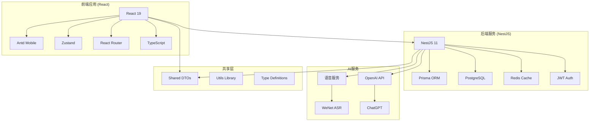
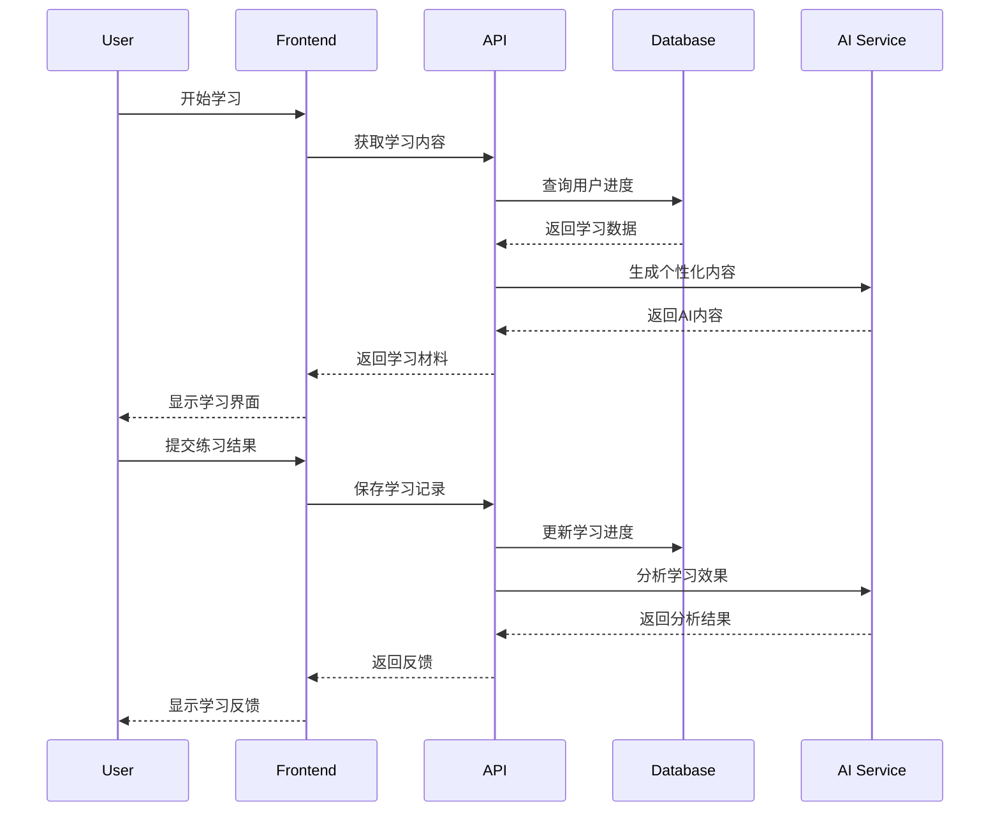
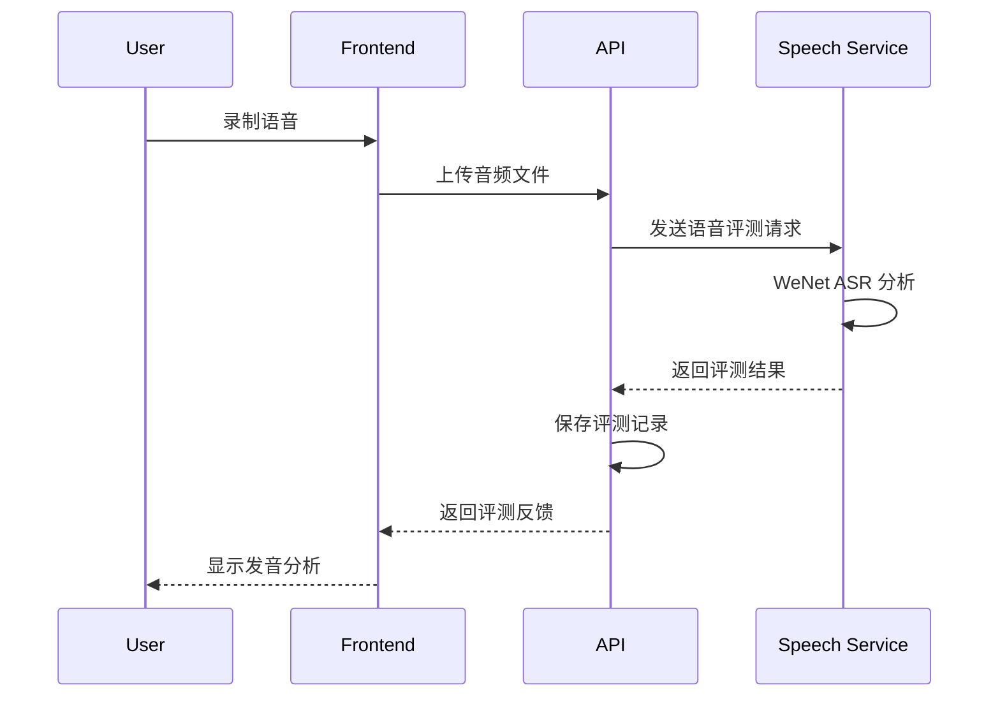

# 系统架构

Sylis采用现代化的**Monorepo架构**，实现前后端同构开发。

## 技术架构图



## 项目结构

```
sylis/
├── 📱 apps/
│   ├── web/                    # React前端应用
│   │   ├── src/
│   │   │   ├── components/     # 可复用组件
│   │   │   ├── pages/          # 页面组件
│   │   │   ├── hooks/          # 自定义Hooks
│   │   │   ├── router/         # 路由配置
│   │   │   └── sync-engine/    # 离线同步引擎
│   │   └── package.json
│   └── api/                    # NestJS后端API
│       ├── src/
│       │   ├── modules/        # 业务模块
│       │   ├── decorators/     # 装饰器
│       │   ├── interceptor/    # 拦截器
│       │   └── utils/          # 工具函数
│       ├── prisma/             # 数据库Schema
│       └── scripts/            # 自动化脚本
├── 📦 packages/
│   ├── shared/                 # 共享DTO和类型
│   └── utils/                  # 通用工具库
├── 🎙️ services/
│   └── speech-service/         # Python语音评测服务
├── 📖 docs/                    # 项目文档
│   ├── overview/               # API文档
│   └── components/             # 组件文档
└── 🛠️ scripts/                 # 开发脚本
```

## 技术栈详情

### 前端技术栈

- **框架**: React 19.1 + TypeScript 5.8
- **状态管理**: Zustand 5.0
- **路由**: React Router v7.6
- **UI组件**: Antd Mobile 5.40
- **图标**: React Icons 5.5
- **构建工具**: Vite 6.3
- **样式**: Less 4.3 Modules
- **HTTP客户端**: Axios 1.10
- **AI集成**: OpenAI SDK 5.16

### 后端技术栈

- **框架**: NestJS 11 + TypeScript 5.7
- **数据库**: PostgreSQL 16 + Prisma ORM 6.9
- **缓存**: Redis 7.2 (ioredis 5.6)
- **认证**: JWT + Passport
- **文档**: Swagger/OpenAPI 11.2
- **邮件**: Nodemailer 7.0 + Handlebars
- **日志**: Winston 3.17

### 开发工具

- **包管理**: pnpm Workspace
- **代码质量**: ESLint + Prettier
- **提交规范**: Commitizen + Commitlint
- **容器化**: Docker + Docker Compose
- **文档**: VitePress + Storybook

### 语音服务

- **框架**: Python 3.8+ + FastAPI
- **语音引擎**: WeNet ASR (自动语音识别)
- **音频处理**: librosa, soundfile
- **数学计算**: numpy, scipy

## 核心模块说明

### 前端架构

#### 状态管理

- 使用 Zustand 进行轻量级状态管理
- 按功能模块拆分 store (auth, learning, ui)
- 支持持久化存储和离线同步

#### 组件设计

- 基于 Antd Mobile 的组件库
- 自定义组件使用 Less Modules
- 支持主题切换 (浅色/深色)

#### 路由管理

- React Router v7.6 with lazy loading
- 路由守卫和权限控制
- 嵌套路由和动态路由

### 后端架构

#### 模块化设计

- 按业务领域拆分模块 (auth, learning, quiz, books)
- 每个模块包含 controller, service, repository
- 使用 NestJS 的依赖注入和装饰器

#### 数据库设计

- Prisma ORM 管理数据库 schema
- 文件拆分式 schema 管理
- 自动迁移和种子数据

#### 缓存策略

- Redis 缓存热点数据
- JWT token 管理
- 会话存储和分布式缓存

### AI 服务集成

#### 对话系统

- 支持多个 AI 提供商 (OpenAI, DeepSeek, Moonshot)
- 上下文管理和对话历史
- 角色扮演和场景对话

#### 语音评测

- WeNet ASR 语音识别
- 实时音频处理
- 详细发音反馈和建议

## 部署架构

### 开发环境

```
┌─────────────┐  ┌─────────────┐  ┌─────────────┐
│   Frontend  │  │   Backend   │  │   Speech    │
│   :5173     │  │   :3000     │  │   :8080     │
└─────────────┘  └─────────────┘  └─────────────┘
       │                │                │
       └────────────────┼────────────────┘
                        │
            ┌─────────────────────┐
            │    PostgreSQL       │
            │    Redis            │
            │    (Docker)         │
            └─────────────────────┘
```

### 生产环境

```
┌─────────────┐  ┌─────────────┐
│     CDN     │  │  Load       │
│  (Static)   │  │  Balancer   │
└─────────────┘  └─────────────┘
       │                │
       └────────────────┼────────────────┐
                        │                │
            ┌─────────────────────┐  ┌─────────────┐
            │    App Servers      │  │  Database   │
            │  (Docker Swarm)     │  │  Cluster    │
            └─────────────────────┘  └─────────────┘
```

## 数据流设计

### 学习数据流



### 语音评测流程



## 性能优化

### 前端优化

- 组件懒加载和代码分割
- 图片资源优化和懒加载
- 虚拟滚动长列表
- Service Worker 缓存策略

### 后端优化

- 数据库查询优化和索引
- Redis 缓存热点数据
- API 响应压缩
- 数据库连接池管理

### 语音服务优化

- 音频格式转换和压缩
- 批量处理请求
- 模型缓存和预加载
- 异步任务队列

## 安全设计

### 认证授权

- JWT token 认证
- 刷新 token 机制
- 角色权限控制
- API 访问限流

### 数据安全

- 敏感数据加密存储
- SQL 注入防护
- XSS 攻击防护
- CSRF 令牌验证

### 语音数据保护

- 音频文件临时存储
- 传输加密 (HTTPS)
- 数据脱敏处理
- 隐私数据清理
