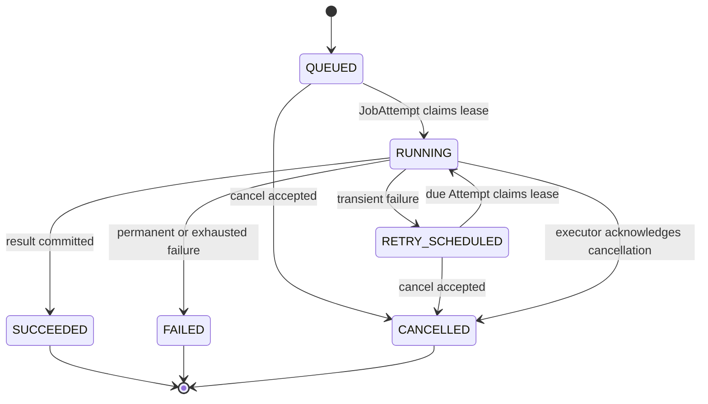

# Job 与执行协议

## 1. 两种状态不能混用

`AgentRun`、`BuildRun`、`PublishRun`、`DataExportRequest` 等描述领域流程；`Job` 只描述一次可调度执行激活。领域对象可以等待批准或用户输入，Job 不允许暂停。

PostgreSQL 保存全部执行真相。Redis 只发布可丢失、可重复的 wakeup 和短期进度 delta；数据库轮询负责补偿。实现无关契约归 `@sylis/job-contracts`，claim/lease/heartbeat/fencing 和 executor lifecycle 归 `@sylis/job-runtime`。

## 2. Job 状态机



Job 状态固定为 `QUEUED | RUNNING | RETRY_SCHEDULED | SUCCEEDED | FAILED | CANCELLED`。Terminal 行不可修改；人工重试或领域恢复创建新 Job。不存在 `PAUSED`、`resume Job` 或把 FAILED 改回 QUEUED 的操作。

## 3. JobAttempt

每次 claim 或瞬时重试创建不可变身份的 `JobAttempt`。Attempt 拥有：

- `attemptNumber`、handlerVersion 和 checkpointSchemaVersion；
- `leaseOwner`、`leaseToken`、`leaseExpiresAt` 和 `heartbeatAt`；
- 单调递增 `fencingToken`；
- started/completed time、failureClass、errorCode 和 redacted evidence；
- 该 Attempt 使用的 checkpoint/result refs。

只有数据库当前 fencing token 的持有者能写 checkpoint、progress 或 terminal result。旧 executor 即使网络恢复，也不能提交晚到结果。`Job` 保存最终状态、调度时间、幂等键和当前 Attempt 指针，不把 lease 字段复制到 Job。

## 4. 激活规则

| 领域事件                     | 执行事实                                                                     |
| ---------------------------- | ---------------------------------------------------------------------------- |
| AgentRun 初次启动            | 创建 activation Job                                                          |
| AgentRun 进入 WAITING        | 当前 Job 成功结束并记录 wait result                                          |
| WaitCondition 满足           | 为同一 Run 创建新 activation Job                                             |
| User retry 一个失败 Run      | 创建新 Job，并用 `supersedesJobId` 关联                                      |
| executor timeout/429/5xx     | 同一 Job 创建新 JobAttempt                                                   |
| unknown external side effect | 标记 `UNKNOWN_OUTCOME`，不盲目重试；先 reconcile，无法确认则 FAILED/人工处理 |

创建领域 request、Job 和 outbox wake event 必须在同一 PostgreSQL 事务中完成。相同 actor、operation、idempotency key 与 request hash 返回已有结果；同 key 不同 hash 返回 conflict。

## 5. Kind 注册表与控制策略

每个 Job kind 静态声明 owner、executor、input/result/checkpoint schema、timeout、retry policy、cancellation policy 和 side-effect policy。数据库字符串不能动态加载 handler。

```typescript
interface JobDefinition<InputRef, ResultRef, Checkpoint> {
  kind: JobKind;
  ownerContext: JobOwnerContext;
  executor: ExecutorKind;
  handlerVersion: string;
  checkpointSchemaVersion: string;
  maxAttempts: number;
  timeoutMs: number;
  retryPolicy: JobRetryPolicy;
  cancellationPolicy: JobCancellationPolicy;
  sideEffectPolicy: JobSideEffectPolicy;
  validateInputRef(value: unknown): InputRef;
  validateCheckpoint(value: unknown): Checkpoint;
  validateResultRef(value: unknown): ResultRef;
}
```

handler 注册表是 code-owned；每个 kind 必须显式声明重试、取消和副作用策略，遗漏任一项不能注册。Operator control 使用独立、版本化 `JobKindPolicy`，固定每种 kind 在哪些 Job/领域状态允许 cancel、retry、resume-domain-run 或 reconciliation，以及可重试 failure class、reconciliation rule 和 ANY/ALL 角色表达式。v0.0.1 seed 为全部 17 个 kind 写入确定性 policy 行，未知或未配置 kind 默认拒绝所有控制。Admin 不能编辑 input、checkpoint、Attempt 或 handler version。`resume` 只表示 owner 领域对象满足 wait 后创建新 activation Job，永远不是把 terminal Job 改回 RUNNING。

人工 retry 不修改 FAILED Job，而是原子创建一个新的 `QUEUED` Job，以唯一 `supersedesJobId` 指向旧 Job，并复用 typed `inputRef.requestId` 解析原领域 request。相同失败 Job 重复提交 retry 返回已存在 successor；retry chain 因而是一对一、可审计且幂等。`UNKNOWN_OUTCOME` 和要求 reconciliation 的 kind 返回 `JOB_RECONCILIATION_REQUIRED`，不得生成 successor。

Admin API 先校验 Operator 的领域角色与 JobKindPolicy，再让 transaction owner 执行状态转换。`UNKNOWN_OUTCOME` 只显示 reconciliation，不能显示 retry；未知 kind 默认没有任何控制按钮。

| Kind family                             | Executor              |
| --------------------------------------- | --------------------- |
| Agent Run activation、tool continuation | `agent-executor`      |
| 数据导出、来源同步、retention purge     | `automation-executor` |
| Lexicon candidate build                 | `lexicon-builder`     |
| Artifact publish 与 release validation  | `lexicon-publisher`   |

通用 Job 只保存 typed input/result reference 与 hash，不用任意 JSON 承载领域 request。

## 6. Claim、checkpoint 与关闭

Executor 用 `FOR UPDATE SKIP LOCKED` 或等价 CAS claim 到期 Job，在一个事务内创建 Attempt、递增 fencing token、写 lease 和 heartbeat。默认 lease 为 60 秒，heartbeat 不超过 15 秒；外部请求必须短于 lease 或主动续租。

lease 过期时先把旧 Attempt 记为 `UNKNOWN_OUTCOME`。只有 `IDEMPOTENT` 且 retry policy/attempt budget 允许的 kind 可以创建接管 Attempt；`RECONCILIATION_REQUIRED` kind 立即把 Job 终结为 FAILED 并写 `JOB_RECONCILIATION_REQUIRED`，不能把“不知道是否已经发生”的外部副作用重新播放。

Checkpoint 包含 handler/schema version、输入 hash、已提交边界、state hash 和对象引用。版本不兼容是永久失败或显式 migration，不创建暂停状态。副作用使用稳定 `jobId + stepKey` 幂等；数据库写与 checkpoint 尽量同事务。

收到 `SIGTERM` 后，executor 停止 claim，readiness 失败，当前 handler 在安全边界保存 checkpoint并继续续租，随后释放 lease 或终结 Attempt。不能先断开数据库再尝试保存进度。

## 7. 重试分类

- `TRANSIENT`：timeout、429、明确可重试的 5xx、临时连接错误；同一 Job 新建 Attempt，使用带 jitter 的指数退避。
- `PERMANENT`：schema、权限、rights、内容不变量或不兼容 checkpoint；Job 直接 FAILED。
- `CANCELLED`：User/Operator 请求且 handler 已在安全边界确认。
- `UNKNOWN_OUTCOME`：外部调用结果不明；先用 provider idempotency key/reconciliation 查询，无法证明时不得重放。

at-least-once 只描述 handler 可能再次执行，不表示副作用可以重复发生。每个有副作用的 step 必须有稳定幂等键或明确的不可自动重试策略。

## 8. 进度与 SSE

`JobProgressEvent` append-only，`sequence` 对 Job 单调递增。事件包含 stage、processed、total、rate、ETA reliability、warning、token/cost、attemptId 和 occurredAt；`processed` 在同一 `(attemptId, stage)` 内不得倒退，不同 stage 可以使用不同单位并从零开始。terminal progress 继承该 Attempt 最近一次有效 processed/total，不伪造新的计数；total 未知为 null。长阶段至少每 5 秒或每个明确批次边界写一次 progress，数据库 heartbeat 最长间隔 15 秒；无可靠 total/ETA 时显式使用 `null` 与 `estimating`，不能伪造百分比。

SSE 以 PostgreSQL cursor 为真相并支持 `Last-Event-ID`；Redis pub/sub 只降低延迟。heartbeat event 不推进业务 progress sequence。cursor 已超过在线 retention 时返回稳定 problem code，client 重新读取 Job snapshot 后继续。事件只含安全 projection，checkpoint 正文、provider payload、User 内容和 secret 不进入 SSE。

## 9. 验收

- Redis 消息丢失、重复、乱序和重启不丢 Job 或重复领域结果。
- 多 executor 竞争只产生一个有效 fencing token；旧 lease 不能提交晚到结果。
- crash、lease expiry、deploy drain 和兼容 checkpoint 能正确接管。
- 每个 Job kind 通过共享 contract suite、真实 PostgreSQL claim 竞争和幂等测试。
- JobKindPolicy 的 allow/deny、UNKNOWN_OUTCOME reconciliation、cancellation、最大 Attempt、terminal immutability、SSE reconnect 和 owner/audience 隔离均有自动化验证。
