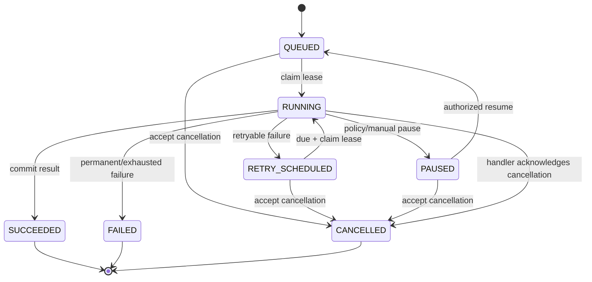

# BackgroundJob、Worker 与进度协议

## 1. 一个执行真相

`BackgroundJob` 是全系统唯一执行状态机。`ReadingGeneration`、`GrammarDiagnosis`、`DataExportRequest`、`BuildRun` 和 `ImportJob` 保存各领域的 typed request/result，并以 unique `jobId` 引用它；它们不复制 `status`、attempt、progress 或错误状态。

PostgreSQL 保存 Job 真相。Redis 只发布 `job.available { jobId }` 唤醒信号；消息丢失由数据库轮询补偿，重复消息由 lease claim 去重，Redis 清空不改变任何 Job 状态。API、Worker 和 Admin 不从 queue depth 推断业务进度。

实现无关契约唯一归 `@sylis/background-jobs`：`JobKind`、状态/转换、payload/progress/checkpoint/result schema、`BackgroundJobHandler`、`JobControl` 与纯 validator。该包不依赖 NestJS、Prisma、Redis、AI provider、Railway 或 app 源码。API `jobs` module 实现 enqueue/query/cancel/SSE adapter；Worker、Compiler Runner 与 Importer 分别实现 executor adapter。目录和依赖细则见 [后端目录与 NestJS 模块边界](../implementation/backend-structure.md)。

## 2. 状态机



- 非终态为 `QUEUED | RUNNING | RETRY_SCHEDULED | PAUSED`；终态为 `SUCCEEDED | FAILED | CANCELLED`。
- cancel request 先原子写 `cancelRequestedAt`。未运行 Job 可立即终结；运行中 handler 在安全边界检查后清理临时资源并终结，不使用进程强杀伪造成功清理。
- `PAUSED` 必须有稳定 `pauseReasonCode`，只允许 `BUDGET_APPROVAL_REQUIRED`、`CONTENT_REVIEW_REQUIRED`、`SOURCE_RIGHTS_BLOCKED`、`HANDLER_UPGRADE_REQUIRED`、`OPERATOR_PAUSED` 或注册表声明的领域原因。
- terminal 行禁止修改；需要重跑时创建一个有 `supersedesJobId` 的新 Job，不能把 FAILED 改回 QUEUED。

## 3. JobKind 注册表

每个 kind 必须静态注册，不从数据库字符串动态加载代码：

```typescript
interface JobKindDefinition<InputRef, ResultRef, Checkpoint> {
  kind: JobKind;
  ownerContext: "AI_TUTOR" | "IDENTITY" | "OPERATIONS" | "READING" | "LEXICON";
  executor: "WORKER" | "COMPILER_RUNNER" | "IMPORTER_RUNNER";
  handlerVersion: string;
  checkpointSchemaVersion: string;
  maxAttempts: number;
  timeoutMs: number;
  cancellable: boolean;
  validateInputRef(value: unknown): InputRef;
  validateCheckpoint(value: unknown): Checkpoint;
  validateResultRef(value: unknown): ResultRef;
}
```

| JobKind              | 领域请求                   | Executor        | 说明                                      |
| -------------------- | -------------------------- | --------------- | ----------------------------------------- |
| `TUTOR_RESPONSE`     | assistant `TutorMessage`   | WORKER          | 流式生成同一条 assistant message          |
| `READING_GENERATION` | `ReadingGeneration`        | WORKER          | 结构化生成、验证并发布 reading revision   |
| `GRAMMAR_DIAGNOSIS`  | `GrammarDiagnosis`         | WORKER          | 结构化 observation/evidence/suggestion    |
| `DATA_EXPORT`        | `DataExportRequest`        | WORKER          | owner-scoped 可审计导出                   |
| `SOURCE_SYNC`        | `SourceSynchronization`    | WORKER          | 只同步运行时允许的外部内容，不写词典      |
| `LEXICON_BUILD`      | `BuildRun`                 | COMPILER_RUNNER | 运行离线 Compiler，不在 API/Worker 内编译 |
| `LEXICON_IMPORT`     | `ImportJob`                | IMPORTER_RUNNER | 导入固定 artifact，不自动激活             |
| `LEXICON_VALIDATE`   | `LexiconValidationRequest` | IMPORTER_RUNNER | 全局验证 DRAFT，不自动激活                |

增加 kind 必须同时提交 registry、typed domain request、checkpoint schema、retry policy、权限、进度 stage 和 contract tests。通用 `BackgroundJob.input JSON` 不承载领域 payload，只保存 typed request reference 与 hash。

Registry definition、schema 和接口位于 `@sylis/background-jobs`；Nest provider registry/claim loop 位于各 executor。纯 contract 包不能通过动态 import 或 dependency injection 偷带某个 handler implementation。

## 4. Claim、lease 与 checkpoint

Executor 通过一条带 `FOR UPDATE SKIP LOCKED` 或等价 compare-and-swap 的事务 claim 到期 Job：校验 executor/kind、`nextAttemptAt`、未取消状态和 lease 过期条件，写入 `RUNNING`、`leaseOwner`、`leaseExpiresAt`、heartbeat，并递增 attempt。只有持有当前 lease token 的进程能写 checkpoint、progress 或 terminal result。

handler 每隔不超过 15 秒 heartbeat，lease 默认 60 秒；外部调用超时时间必须短于 lease 或主动续租。进程退出后 lease 到期，另一个 executor 从最新 `JobCheckpoint` 恢复。checkpoint 必须包含 handler/schema version、已提交边界和 state hash；版本不兼容时 Job 进入 `PAUSED/HANDLER_UPGRADE_REQUIRED`，不能猜测旧状态。

副作用以 Job ID + step key 做幂等：数据库写与 checkpoint 尽量同事务；外部 provider 调用先持久化 `ModelInvocation` 和 idempotency key，重启后先查询已存在结果。重试采用带 jitter 的指数退避，只有 registry 分类的 timeout、429、5xx 和临时连接错误可重试；schema、权限、rights 和不变量失败直接 FAILED 或 PAUSED。

## 5. Handler 接口与关闭

```typescript
interface BackgroundJobHandler<Context, Checkpoint> {
  readonly kind: JobKind;
  run(context: Context, control: JobControl<Checkpoint>): Promise<JobResultRef>;
}

interface JobControl<Checkpoint> {
  readonly jobId: string;
  readonly attempt: number;
  readonly checkpoint: Checkpoint | null;
  heartbeat(): Promise<void>;
  report(event: JobProgressInput): Promise<void>;
  checkpointAt(value: Checkpoint): Promise<void>;
  isCancellationRequested(): Promise<boolean>;
}
```

收到 `SIGTERM` 后 executor 立即停止 claim 新 Job，通知 handler 在 checkpoint 边界收敛，继续续租至 Railway grace deadline 前，然后释放 lease 或以明确错误终结；不能先断 DB 再尝试保存 checkpoint。readiness 在 draining 时失败，liveness 保持到收敛完成。

## 6. 进度与事件

`JobProgressEvent` 是 append-only，sequence 在数据库事务中按 Job 单调递增。`processed` 不得倒退，`total` 未知时为 null，ETA 无可靠样本时为 `estimating`；至少每 30 秒写 heartbeat/progress。SSE 从 PostgreSQL event cursor 读取，Redis pub/sub 只能降低延迟。

统一事件为 `job.started`、`job.progress`、`job.warning`、`job.paused`、`job.completed`、`job.failed`、`job.cancelled`。事件仅含安全 projection；checkpoint、输入正文、provider body 和 secret 不进入 SSE。

## 7. 创建与事务边界

API command 在一个 PostgreSQL 事务中创建领域 request、`BackgroundJob` 和 outbox wake event；commit 后 dispatcher 尝试发 Redis。相同 actor + operation + idempotency key + request hash 返回原 Job，不同 hash 返回 409。Executor 在自己的事务中提交领域结果引用与 `SUCCEEDED`，因此不会出现结果已发布而 Job 仍显示失败。

Lexicon activation 不是后台 handler 的隐式最后一步。`LEXICON_IMPORT` 与 `LEXICON_VALIDATE` 共同产生状态为 `VALIDATED`、尚未激活的 `LexiconRelease`，激活仍是独立、审批且可审计的同步 command。

## 8. 验收

- queue 消息丢失、重复、乱序和 Redis 重启不会丢 Job 或重复领域结果。
- crash、lease expiry、部署 draining 和 handler upgrade 能从合法 checkpoint 恢复。
- cancellation、pause/resume、最大重试和 terminal immutability 有状态机 property test。
- 每个 JobKind 有 fake handler、真实数据库 claim 竞争和幂等副作用测试。
- SSE 的 `Last-Event-ID`、过期 cursor、terminal reconnect 和 owner/audience 隔离通过。
