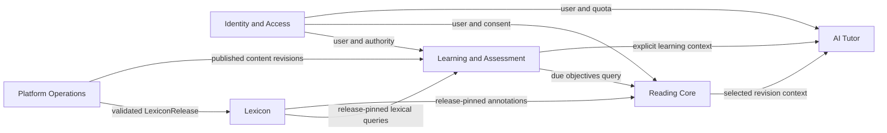

# Bounded Contexts 与集成边界

## 1. 目的

Sylis 保留一个在线 API 部署单元，但不是一个共享数据库模型的“大模块”。上下文通过稳定 application contract 交互；Prisma relation 只能保证引用完整性，不能绕过 owner service 直接写别的领域事实。

根目录 `CONTEXT-MAP.md` 是跨上下文入口，各上下文词汇表位于本目录的 `domain` 文档树。

## 2. 上下文地图

## 3. 所有权

| 上下文                  | 拥有                                                                                                                             | 不拥有                                       |
| ----------------------- | -------------------------------------------------------------------------------------------------------------------------------- | -------------------------------------------- |
| Identity and Access     | User、UserEmail、Credential、Consent、AuthSession、OperatorRole                                                                  | 学习状态、聊天正文、词典事实                 |
| Lexicon                 | Headword/Entry/Form/Sense/Concept 图、语言内容、来源证据、LexiconRelease                                                         | 用户收藏、复习状态、运行时翻译               |
| Learning and Assessment | BookEdition、Enrollment、Objective、PedagogicalMaterial、Stimulus、Exercise、Attempt、Review、Assessment、Notebook               | 登录会话、模型调用、阅读正文、词典事实       |
| Reading Core            | ReadingDocument/Revision、origin、annotation、activity、reading target、Reddit/AI Reading 来源 metadata 与 experience projection | 正式词典事实、FSRS 更新、provider secret     |
| AI Tutor                | TutorSession/Message、GrammarDiagnosis、ReadingGeneration、ModelInvocation、AIUsageLedger                                        | 正式词典、summative correctness、AuthSession |
| Platform Operations     | BuildRun、LexiconArtifact、ImportJob、ReviewBatch、activation、deployment/audit                                                  | 语言学语义、用户学习或聊天内容               |

## 4. 允许的同步依赖

1. Controller 只调用本上下文 application service。
2. 跨上下文同步读取只通过 query port，返回小型 DTO 或稳定 ID，不返回 Prisma model。
3. 一次用户写操作只能有一个事务 owner；其他上下文影响通过同库 outbox event 或幂等 command 完成。
4. 词典 release、BookEdition、ObjectiveRevision、PedagogicalMaterialRevision、ExerciseRevision 和 AssessmentBlueprintRevision 一经发布只读。
5. AI 和来源 adapter 不得处于用户 Attempt、ReviewEvent 或 AuthSession 的数据库事务中。

## 5. 关键契约

| Provider            | Consumer         | Contract                                                      |
| ------------------- | ---------------- | ------------------------------------------------------------- |
| Identity            | 所有用户域       | `ActorContext { userId, roles, consentPolicyVersion }`        |
| Lexicon             | Learning/Reading | release-pinned projection 与 typed target resolver            |
| Learning            | Reading/AI Tutor | 到期 Objective summary、表现摘要、显式选择的学习上下文        |
| Reading             | AI Tutor         | 固定 ReadingDocumentRevision、授权范围和 lexical annotations  |
| AI Tutor            | User Web/Admin   | streaming tutor event、Job status、usage/quota projection     |
| Platform Operations | Lexicon/Learning | active LexiconRelease ID 与已发布 revision，不暴露 staging 表 |

## 6. 事务和事件

- AuthSession 创建、轮换和撤销属于 Identity 事务。
- Attempt 提交、服务端评分和 terminal transition 属于 Learning 事务。
- ReviewEvent、before/after snapshot 和 MemoryState 更新属于一个 Learning 事务；失败时全部回滚。
- AI 领域请求只在完成验证后以显式 application command 创建用户内容；执行状态由 BackgroundJob 持有，provider 回调不能直接写正式表。
- ImportJob 在 staging 中可重复执行；LexiconRelease activation 是独立短事务。
- 所有跨上下文事件先写同库 outbox，Worker 至少一次投递，consumer 以 event ID 幂等。

## 7. 禁止的共享模型

- 不建立同时代表 Headword、Entry、Sense、学习状态和收藏状态的 `Word`。
- 不建立同时代表 Objective、Exercise、Attempt 和 FSRS state 的 `Card`。
- 不建立同时代表 AI 文章、Reddit post 和用户文稿的可变 `Article` blob。
- 删除 `packages/shared`；Prisma、provider、transport、artifact、Job 与 UI 类型分别由明确 owner package 导出，server secret 永不成为共享类型值。
- 不另建可与 `userId` 漂移的 Account/LearnerProfile identity；operator 行为仍以同一 User 加显式 role 表达。

## 8. 部署映射

边界首先由模块、schema、contract test 和 import rule 强制，而不是每个上下文一个服务。只有当独立扩缩容、故障隔离或团队所有权产生持续证据时，才允许把某个上下文从模块化单体拆出；拆分前必须保留相同 contract 和 outbox 语义。
