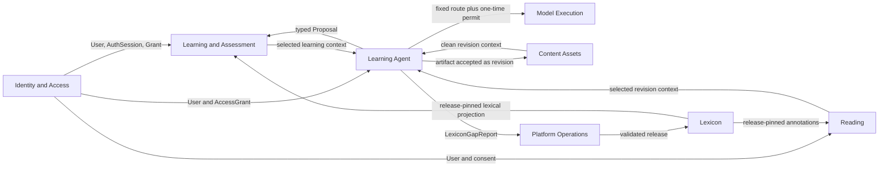

# Bounded Contexts 与集成边界

## 1. 上下文地图

仓库根目录的 `CONTEXT-MAP.md` 是领域词汇入口。部署应用不等于 Bounded Context：`api` 可以承载多个模块，`agent-api` 与 `agent-executor` 共同实现 Learning Agent 上下文，但只有 owner 能修改其关系真相。

## 2. 所有权

| 上下文                  | 拥有                                                                                                                                                          | 明确不拥有                                                         |
| ----------------------- | ------------------------------------------------------------------------------------------------------------------------------------------------------------- | ------------------------------------------------------------------ |
| Identity and Access     | User、Password/MFA Credential、Consent、AuthSession、AccessGrant、SupportGrant、OperatorRole                                                                  | Provider credential、学习状态、Agent 正文、词典事实                |
| Lexicon                 | Headword/Entry/Form/Sense/Concept 图、语言内容、来源证据、LexiconRelease                                                                                      | User 收藏、复习状态、在线生成                                      |
| Learning and Assessment | BookEdition、Enrollment、Objective、PedagogicalMaterial、Exercise、Attempt、Review、Assessment、Notebook                                                      | 登录会话、模型调用、阅读正文                                       |
| Reading                 | ReadingDocument/Revision、origin、annotation、activity、target 和来源体验 metadata                                                                            | 正式词典事实、FSRS 更新、模型密钥                                  |
| Learning Agent          | AgentSession/Message/MessageBlock/Run/RunStep/WaitCondition/Event/ToolCall/Proposal/Grant/Artifact/Memory/ContextSnapshot、Capability/Tool/Skill/Eval release | Model credential/invocation、正式词典、正式题库、测评、AuthSession |
| Model Execution         | ProviderRouteRelease、CredentialProfile/Revision、ModelExecutionPermit、ModelInvocation、ModelExchange/Part、usage 和 provider health                         | Agent loop、业务 Run、User 身份、正式内容                          |
| Content Assets          | ContentAsset/Revision、quarantine/clean 状态、派生文本/OCR/index、对象引用与删除请求                                                                          | Agent Run、模型路由、Reading/Lexicon 正式事实                      |
| Platform Operations     | Job/JobAttempt、BuildRun、PublishRun、LexiconArtifact、ReviewBatch、activation、DeploymentRelease、AuditEvent                                                 | 语言学语义、User 学习或 Agent 内容                                 |

## 3. 允许的同步依赖

1. Controller 只调用本上下文 application module 的公开 interface。
2. 跨上下文读取只通过 query interface，返回小型 projection 或稳定 ID，不返回 Prisma model。
3. 一次写操作只有一个事务 owner；其他上下文通过 outbox 或幂等 typed command 变化。
4. 发布后的 Lexicon、Book、Objective、PedagogicalMaterial、Exercise、Assessment 和 Capability revision 只读。
5. Provider adapter、Agent runtime 和 executor 不进入 Attempt、ReviewEvent、AuthSession 或 release activation 的事务。
6. `agent-executor` 只向 `agent-api` 提交完整 `AgentStepProposal`、typed MessageBlock delta 与有序 `AgentStepReceipt`；只有 Agent API 创建 `AgentRunStep`、`AgentToolCall`、`AgentMessageBlock` 和 `AgentEvent`，产品写入再由它以受限内部 command 调用 `api` 的 owner module。
7. Provider adapter 与凭证解密只存在于 Model Gateway；所有调用固定 route/credential revision 并消费一次性 permit。
8. 未通过 quarantine scan 的 Asset revision 不能进入 Agent、Reading、模型调用或下载 projection。
9. `admin-api` 直接拥有 Platform Operations command/projection；Identity、Agent 和 Model 操作分别调用 `api`、`agent-api` 和 `model-gateway` 的 typed internal interface，不跨 owner 写表。
10. DeploymentRelease 只由 CI service identity ingestion；ADMIN browser 只有 redacted read projection 和 workflow/deployment link。

## 4. 稳定集成契约

| Provider            | Consumer                                                       | Contract                                                                                                          |
| ------------------- | -------------------------------------------------------------- | ----------------------------------------------------------------------------------------------------------------- |
| Identity            | User Web、Admin API、Learning Agent                            | ActorContext、AuthSession/SupportGrant/OperatorRole typed command、AccessGrant、service grant                     |
| Lexicon             | Learning、Reading、Learning Agent                              | release-pinned target resolver 与只读 projection                                                                  |
| Learning            | Reading、Learning Agent                                        | Objective summary、表现摘要、显式 User context、typed command result                                              |
| Reading             | Learning Agent                                                 | 固定 ReadingDocumentRevision、授权范围和 lexical annotations                                                      |
| Learning Agent      | User Web、Admin API                                            | owner-scoped session/run/step/message-block/event/artifact/proposal projection、redacted operations 与 SSE cursor |
| Model Execution     | Agent Executor、Evaluator、Builder、Asset Processor、Admin API | typed permit、ordered content-block invocation stream/result、credential/route control 与 usage settlement        |
| Content Assets      | Learning Agent、Reading                                        | immutable clean `ContentAssetRevision` reference 与安全 download intent                                           |
| Platform Operations | 所有 executor/Admin                                            | Job/Attempt、progress、approval 与 immutable release reference                                                    |

## 5. 事务和事件

- AuthSession、Grant 和认证 Credential 变更属于 Identity 事务；Provider Credential 变更属于 Model Execution 事务。
- Attempt 提交、评分和 ReviewEvent/MemoryState 更新属于 Learning 事务。
- Agent API 在任何副作用前验证完整 Step 的 Run/Invocation/fencing token、Grant、schema、预算、action digest 和组合策略，再写 Step/action/call 关系与 `AgentEvent`；单个 ToolCall 结果独立提交。
- Model Gateway 原子 claim permit、创建 Invocation 并结算 usage；不能同时修改 AgentRun。
- Asset Processor 只推进文件处理状态；Artifact 接受为 ContentAssetRevision 和下游领域写入仍由各自 owner command 完成。
- `AgentEvent` 是 timeline/SSE/audit，不代替关系表当前真相；跨上下文事件先写同库 outbox。
- Job 与领域 request 在同一事务创建，但 JobAttempt 在 executor claim 事务创建。
- LexiconArtifact 发布只产生未激活 release；activation 是单独的 Admin 审批事务。

## 6. 禁止的共享模型

- 不用 `Word` 同时代表 Headword、Entry、Sense、学习状态和收藏。
- 不用 `Card` 同时代表 Objective、Exercise、Attempt 或 UI renderer。
- 不用 `Article` blob 同时代表 Agent Artifact、Reading revision 和来源 metadata。
- 不把 AgentRun、BuildRun 和 Job 合并成一张通用任务表。
- 不建立 `shared/common/core` 聚合包；contract、database、model、UI、crypto 和纯函数分别有 owner。
- 不建立可与 `userId` 漂移的 LearnerProfile 或儿童/家长关系；每个学习者就是独立 User。

## 7. 模块深度

每个模块通过一个小型 interface 隐藏领域不变量、事务、审计和 adapter 选择。调用者只学习 command/query/result/error，不学习表结构、provider DTO 或 checkpoint 格式。只有实际存在两个 adapter 时才引入 seam；框架目录本身不是领域模块。
