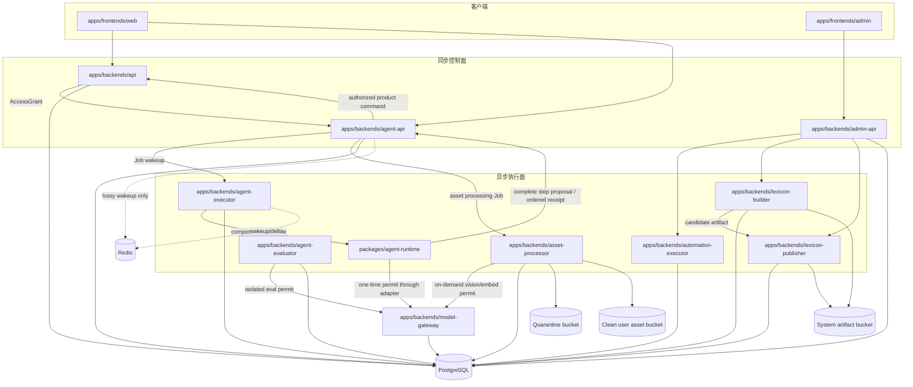
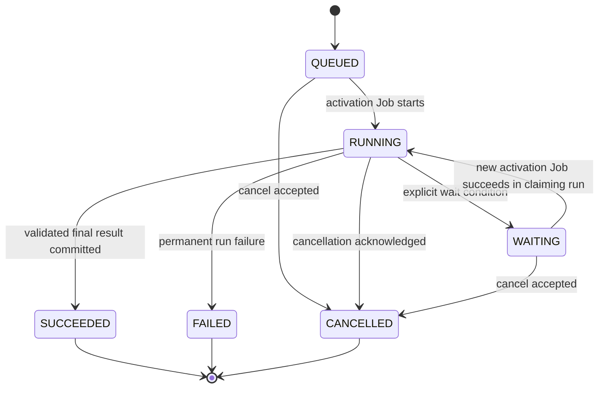

# Learning Agent 系统架构

> 状态：`0.0.1` 目标架构。本文是 Learning Agent、异步执行、权限、记忆、工具和生成内容的权威设计；详细表结构、目录和交付规则分别由本文链接的专项文档展开。Runtime 的 Step 与多工具语义依据 [DeepSeek Harness 与 Codex 调研](./agent-runtime-harness-research.md) 固化；User 可见的 typed Block、流式生命周期和前端投影由 [Agent 会话 Block](./agent-conversation-blocks.md) 固化。调研报告本身不是运行时契约。

## 1. 目标与边界

Learning Agent 是 Sylis 面向每个独立 User 的通用学习代理。它可以对话，也可以解释词汇、分析语法与翻译、生成阅读材料和练习、制定学习建议。Tutor 只是 Capability，不是单独产品或上下文。v1 是服务端 Agent：Agent Runtime 运行在 Railway 的 `agent-executor`，浏览器只提交 User command 并消费 Session SSE；模型可以运行在远程 Provider，但模型不等于 Agent Runtime。

Learning Agent 不拥有正式词典、正式题库、测评结论、FSRS 状态或用户身份。模型输出永远先成为可追踪的消息、Artifact 或 Proposal；只有通过类型、授权、审批和领域不变量后，才可由拥有目标数据的模块提交正式写入。

首期明确不支持本地 Agent、本地 Connector、任意 MCP、shell、任意代码执行、第三方写操作和语音输入。公共 Web 只读搜索、Sylis 学习域的受控读写工具，以及经过 quarantine/scan 的文档和图片上传属于 v1；因此部署 `asset-processor`，但不部署 `sandbox-broker`。未来需要访问 User 本机资源时，只能增加显式安装、逐能力授权的 Connector adapter，不能让网页或服务端 Runtime直接获得本地文件系统权限。

## 2. 系统拓扑



PostgreSQL 是关系、运行状态、AgentEvent、消息正文引用和审计真相。Redis 只传递可丢失的“某 Session 已有新事件”唤醒信号，不承载 delta、cursor 或最终结果；三类对象存储分别隔离 quarantine、clean user asset 和 system artifact。任何消费者都不得从 Redis queue depth、Pub/Sub 消息或 Bucket listing 推断领域状态。

### 2.1 运行位置与信任模型

“服务端 Agent”描述 Runtime 和工具的执行位置，不表示模型必须由 Sylis 自托管。一次交互分成三个不同角色：浏览器提供界面和 User command；Railway 上的 Agent Runtime 负责模型循环、工具调度、取消和恢复；DeepSeek、OpenAI、Anthropic 或 Gemini 只提供模型推理。无论模型在哪里运行，所有工具都由服务端 Runtime 通过已授权 adapter 执行。

| 角色           | 可做                                                                  | 不可做                                                      |
| -------------- | --------------------------------------------------------------------- | ----------------------------------------------------------- |
| Browser        | 提交 instruction/cancel/approval，消费一个 Session SSE                | 调用模型、执行工具、持有 service credential 或 Provider key |
| Agent API      | 持久化 Run/Step/Call/Event，授权、预算、fencing、SSE projection       | 运行模型循环、直接执行任意工具                              |
| Agent Executor | claim activation Job，装配 Runtime 与 adapter，管理进程生命周期       | 拥有 User cookie、Provider SDK/key、Agent 或产品 repository |
| Agent Runtime  | Turn/Step loop、block 组装、已授权 plan 调度、取消与结果排序          | HTTP controller、数据库、Provider SDK、动态插件宿主         |
| Model Gateway  | Provider adapter、Credential、Permit、Invocation、attempt、usage/cost | Agent action 路由、产品领域写入                             |
| Domain API     | 校验并提交学习、阅读、Notebook 等 typed command                       | 接收 Raw 模型 JSON 或绕过 Agent 授权                        |

Agent Runtime 是框架无关的纯 TypeScript 深模块，不依赖 NestJS 或 Cordis。NestJS 继续用于有 HTTP、认证、Guard、OpenAPI 和事务入口的 backend；`agent-executor` 是普通 Node 后台应用，只通过 composition root 装配 Runtime。Cordis 仅保留为 DeepSeek Harness 的调研对象，v1 不引入第二套依赖容器、事件总线或插件生命周期。

## 3. 可部署应用

| 应用                           | 唯一职责                                                                                      | 明确不拥有                                            |
| ------------------------------ | --------------------------------------------------------------------------------------------- | ----------------------------------------------------- |
| `frontends/web`                | 用户学习应用、Agent workspace 与上下文入口                                                    | 权限判定、模型密钥、正式评分                          |
| `frontends/admin`              | 运营、审核、发布和支持授权界面                                                                | 业务真相、用户普通会话                                |
| `backends/api`                 | User、登录凭据、AuthSession、AccessGrant 和学习域同步 command/query                           | Provider credential、Agent loop、长任务执行           |
| `backends/admin-api`           | Admin audience、运营查询、审批和 release command                                              | 通用用户 API、后台执行                                |
| `backends/agent-api`           | Agent 聚合、消息、Run、RunStep、WaitCondition、Event、ToolGrant、Proposal、Artifact 和 Memory | 模型循环、无授权产品写入                              |
| `backends/model-gateway`       | ProviderRoute、Credential、Invocation、Exchange、usage 和 Provider adapter                    | Agent loop、业务 Run、领域写入                        |
| `backends/agent-executor`      | 运行 Learning Agent loop、执行已授权 Step plan 并调度受控工具                                 | Provider key/SDK、HTTP 用户会话、Agent/产品表直接写入 |
| `backends/agent-evaluator`     | 隔离运行 offline Eval 与 independent Judge，输出 release evidence                             | production Session、release activation                |
| `backends/asset-processor`     | quarantine scan、解析/OCR/index 和按需 vision/embedding                                       | 未扫描内容发布、Agent loop、用户会话                  |
| `backends/automation-executor` | 导出、同步、清理等非 Agent 后台自动化                                                         | Agent 推理、词典编译                                  |
| `backends/lexicon-builder`     | 来源解析、归并、AI 候选、验证并输出候选 artifact                                              | 生产词典写入、激活                                    |
| `backends/lexicon-publisher`   | 校验候选 artifact、构建 versioned release 与发布报告                                          | 来源解析、AI 生成、隐式激活                           |

每个 `apps/**` 项目都必须产生可独立部署的容器或静态站点。不可部署的领域逻辑、契约和运行时适配器只能放在 `packages/**`；工程 harness 放在 `tools/engineering-harness`。

## 4. Learning Agent 聚合

### 4.1 核心对象

| 对象                     | 含义与不变量                                                                                              |
| ------------------------ | --------------------------------------------------------------------------------------------------------- |
| `AgentSession`           | 一个 User 的连续交互空间；可有多个 QUEUED Root Run，但至多一个 RUNNING/WAITING Root Run                   |
| `AgentMessage`           | Session 中按 sequence 追加的可见发言 envelope；拥有 typed Block 树，完成后不原地覆盖                      |
| `AgentMessageBlock`      | Message 内稳定、有序、可流式的 typed 内容/引用；Agent API 拥有，正文仍引用 Gateway 加密 body              |
| `AgentRun`               | 一次有明确目标、CapabilityRelease、ProviderRouteRelease 和 CredentialRevision 的领域流程                  |
| `AgentRunStep`           | Run 内一次逻辑模型决策、完整有序 Assistant 输出和其全部 action 的持久父对象；恰好关联一个 ModelInvocation |
| `AgentWaitCondition`     | Run 等待批准、用户输入、ChildRun 或外部事件的显式原因                                                     |
| `AgentEvent`             | append-only 时间线、SSE cursor 和审计投影；不是完整 event sourcing                                        |
| `AgentToolCall`          | Step 内一次具有独立 call identity、模型顺序、schema、授权、状态和结果的工具调用事实                       |
| `AgentProposal`          | 尚未提交的 typed write；记录目标 command、风险摘要、批准要求和 digest                                     |
| `AgentToolGrant`         | 对工具、资源范围、有效期、调用次数和 side-effect class 的授权                                             |
| `AgentArtifact`          | Agent 产生的文章、分析、练习集或缺词解释的稳定身份                                                        |
| `AgentArtifactRevision`  | immutable 内容 revision；正文引用 Gateway content body 或对象存储，关系表保存当前 truth                   |
| `AgentMemoryCard`        | User 可查看、可纠正、可抑制的长期记忆单元；claim 引用 Gateway content body，不保存隐藏推理                |
| `MemorySuppression`      | 阻止某个记忆继续进入上下文的 append-only 用户决定                                                         |
| `ContextSnapshot`        | 某次 Run 实际使用的消息、学习事实、文档和记忆引用的不可变清单                                             |
| `CapabilityRelease`      | Capability、prompt、工具策略、输出 schema 和路由策略的不可变发布版本                                      |
| `ModelExecutionPermit`   | Gateway 拥有的一次性调用许可；绑定 Run、route、credential、input digest 和预算                            |
| `ModelInvocation`        | Gateway 拥有的一次逻辑模型调用；固定 route、credential、permit、usage/cost 与最终状态                     |
| `ModelInvocationAttempt` | ModelInvocation 内一次实际 Provider transport 尝试；重试只增加 attempt，不创建新 Step                     |

`AgentEvent` 负责时间线和可恢复 SSE，关系表负责当前真相。重建状态不依赖回放所有 Provider token；Session snapshot 直接返回当前 Message/Block 树和 cursor，这避免为了“事件驱动”而把可查询关系降级成昂贵的日志投影。

Session SSE 是浏览器的唯一实时同步接口。无 cursor 的新连接先订阅 Redis，再发送包含 `cursor + session + messages + runs` 的 `SESSION_SNAPSHOT` 首帧，随后从 PostgreSQL 补齐快照期间提交的 typed events；带 `Last-Event-ID` 的重连只回放该 cursor 之后的持久事件。Snapshot cursor 必须来自同一 Session 在 PostgreSQL 中持久化的 `nextEventSequence` 高水位且始终为有限整数；该内部序列不进入公开 Session projection，Controller 在查询事件或写 SSE frame 前再次 fail closed 校验 cursor。Redis 通知丢失不会丢数据，Redis 断线则关闭 SSE，由浏览器携带 `Last-Event-ID` 重连。普通学习 UI 不轮询 Run、Message、Artifact 或 Proposal，也不公开 Run 作为用户操作对象；`runId` 仅用于事件关联、取消、恢复和 Admin 排障。

执行层级固定为 `AgentSession -> AgentRun -> AgentRunStep -> AgentToolCall`，模型调用侧为 `AgentRunStep -> ModelInvocation -> ModelInvocationAttempt`；呈现层级为 `AgentSession -> AgentMessage -> AgentMessageBlock`。Message Block 可用 typed reference 指向 Step、ToolCall、Artifact、Proposal、Plan、WaitCondition 或 Asset，但不能复制这些对象的状态机。一个 Run 可包含多个 Step；一个 Step 只表示一次逻辑模型决策及其直接产生的 action，不引入具有整批成功语义的 `AgentToolBatch`。每个被接受的 ToolCall 都必须独立到达终态；Step 只负责有序分组，不能用整步状态掩盖单个调用结果。

### 4.2 Run 状态机



Run 状态固定为 `QUEUED | RUNNING | WAITING | SUCCEEDED | FAILED | CANCELLED`。`WAITING` 只属于 AgentRun，不属于 Job。WaitCondition 固定为：

- `APPROVAL`：等待 Proposal 或高风险工具批准；
- `USER_INPUT`：缺少会改变结果的用户信息；
- `CHILD_RUN`：等待受限并行子任务；
- `EXTERNAL_EVENT`：等待具有稳定 correlation key 的外部事实。

每个已接受的 Instruction 都在同一事务中创建自己的 Root Run，并立即返回稳定 `instructionId + runId + eventCursor + Run projection`。Session 可同时保存多个 `QUEUED` Root Run，但只有最早可执行者拥有 activation Job，数据库只允许至多一个 Root Run 处于 `RUNNING | WAITING`。新指令不会复用当前 Run，也不会静默修改正在执行的目标；User 可显式 cancel 当前 Root Run 后调度下一 Run。ChildRun 默认禁用；CapabilityRelease 明确允许时，一个 Root Run 最多启动 3 个 ChildRun，层级深度严格为 1，ChildRun 不得继续创建子任务。

### 4.3 Step 状态与调用身份

`AgentRunStepStatus` 固定为：

- `STREAMING`：对应 ModelInvocation 正在产生有序 block；
- `TOOL_EXECUTION`：完整 Step 已通过 preflight，action 正在排队或执行；
- `WAITING`：Step 产生的批准、User input、ChildRun 或外部事件尚未满足；
- `COMPLETED | FAILED | CANCELLED | UNKNOWN_OUTCOME`：终态或需要 reconciliation 的不确定终态。

`AgentToolCallStatus` 固定为 `PROPOSED | APPROVED | QUEUED | RUNNING | SUCCEEDED | FAILED | REJECTED | CANCELLED | UNKNOWN_OUTCOME`；并发模式固定为 `PARALLEL_SAFE | EXCLUSIVE`。`PARALLEL_SAFE` 只能由 immutable ToolRelease 的实现声明，默认值和任何分类异常都必须 fail closed 为 `EXCLUSIVE`。

每个 ToolCall 使用自己的 `id` 作为领域身份，并保存 `stepId + modelPosition + providerCallId?`。`actionDigest` 只绑定 `toolKey + schemaVersion + input` 以防批准后参数漂移，不能充当调用身份或去重键；同一步中两个参数完全相同的调用仍是两个事实。

Provider transport retry 不等于新的模型决策。`ModelInvocationAttemptStatus` 固定为 `STARTED | SUCCEEDED | FAILED | CANCELLED | UNKNOWN_OUTCOME`；同一路由的 timeout、429 或可重试 5xx 只有在前一 attempt 尚未产生任何 accepted normalized block、visible fragment、tool call 或 usage 时，才可在当前 ModelInvocation 下追加 attempt，并保持同一 permit claim 和 input digest。v1 不实现 Provider stream resume；一旦输出已被接受，失败必须终止 Invocation 并把当前 Message/Block 标记为 interrupted。只有当前 Step 的全部工具结果已经进入模型上下文并发起下一次逻辑请求时，才创建下一个 AgentRunStep。切换 ProviderRoute、Credential 或 User 主动 retry 必须创建新的领域流程，不得伪装成 transport retry。

### 4.4 Capability

v1 只发布七项 Capability：

| key                   | 输出                                                             |
| --------------------- | ---------------------------------------------------------------- |
| `learning.chat`       | 对话回答与可选 Artifact/Proposal                                 |
| `lexicon.explain`     | 绑定 Entry/Sense/Form 的结构化解释                               |
| `grammar.analyze`     | observation、evidence、suggestion 与修订建议                     |
| `translation.analyze` | 源文、候选译文、对齐、取舍和错误说明                             |
| `reading.compose`     | 版本化阅读 Artifact、目标词和难度约束                            |
| `practice.generate`   | 符合 Agent candidate schema 和正式 Exercise 语义矩阵的私人练习集 |
| `study.coach`         | 基于显式学习事实的计划或复习建议                                 |

默认路由为 `AUTO`，由 Runtime 根据输入、上下文和工具需求选择 Capability；User 可显式覆盖。每个 Run 固定一个 `CapabilityRelease`，执行中不得热切 prompt、schema、工具策略或执行模式。`SINGLE_CALL` 可省略 plan；`WORKFLOW` 与 `AGENT_LOOP` 必须在执行前生成 User 可见且固定到 Run 的 immutable plan，后续状态只能推进或通过新 revision 显式修订。

## 5. Agent Runtime、Step 协议与 Model Gateway

`@sylis/agent-runtime` 是拥有代理循环的深模块：目标解析、Capability 路由、plan、上下文预算、模型 block 组装、完整 Step proposal、有界工具调度、结果回灌、WaitCondition、ChildRun 限制、终止条件与输出验证都隐藏在同一小型 interface 后。Provider adapter 只存在于 `model-gateway`，Runtime 只能使用固定 route/credential 的一次性 `ModelExecutionPermit` 调用它。Gateway 不解释 Agent tool name，也不把 tool call 转成 Proposal、Artifact、Memory、ChildRun 或 Wait；control routing 属于 Runtime 与 Agent API。

Runtime 的外部 interface 只暴露一次 activation。模型流、可见 delta、完整 Step preflight、工具执行和 receipt 提交通过构造时注入的三个 port 隐藏在模块内部；生产 adapter 由 Agent Executor 装配，测试使用确定性内存 adapter。调用者不需要理解模型 block、调度器或双向 generator 驱动细节。

```typescript
interface AgentRuntime {
  activate(
    input: AgentActivation,
    options: { signal: AbortSignal },
  ): Promise<AgentActivationResult>;
}

interface AgentModelPort {
  stream(
    request: AgentModelRequest,
    signal: AbortSignal,
  ): AsyncIterable<ModelStreamEvent>;
  persistVisibleFragment(
    input: ModelContentFragmentInput,
    signal: AbortSignal,
  ): Promise<ModelContentFragmentRef>;
}

interface AgentStepPort {
  appendVisibleDelta(
    fragment: AgentVisibleMessageFragment,
    signal: AbortSignal,
  ): Promise<void>;
  preflight(
    proposal: AgentStepProposal,
    signal: AbortSignal,
  ): Promise<AgentStepExecutionPlan>;
  startToolCall(input: AgentToolCallStart, signal: AbortSignal): Promise<void>;
  recordToolOutcome(
    input: AgentToolOutcomeRecord,
    signal: AbortSignal,
  ): Promise<void>;
  commit(
    receipt: AgentStepReceipt,
    signal: AbortSignal,
  ): Promise<AgentStepCommitResult>;
}

interface AgentToolPort {
  execute(
    directive: AgentToolExecutionInput,
    signal: AbortSignal,
  ): Promise<Readonly<Record<string, unknown>>>;
}

enum AgentActivationResultStatus {
  COMPLETED = "COMPLETED",
  WAITING = "WAITING",
  FAILED = "FAILED",
  CANCELLED = "CANCELLED",
}

interface AgentStepProposal {
  runId: string;
  stepId: string;
  invocationId: string;
  ordinal: number;
  assistantMessageId: string;
  messageBlocks: readonly AgentMessageBlockProposal[];
  actions: readonly AgentStepAction[];
}
```

`AgentStepAction` 是闭合、版本化的 discriminated union，只包含 `DOMAIN_TOOL | PROPOSAL | ARTIFACT | CHILD_RUN | MEMORY | WAIT`；每项保存唯一 position 和对应 typed payload。不存在 generic `/actions`、任意 action name 或“收到第一个 tool call 就 return”的路径。Runtime 内部 `BlockAssembler` 通过 `AgentStepPort.appendVisibleDelta()` 流式提交带稳定 message/block identity、model position/sub-position、fragment sequence 和 opaque content ref 的可见 Block fragment；裸字符串和任意 Block JSON 不是合法 interface。Runtime 必须等 Model Gateway 发出唯一 terminal frame 后才组装完整 proposal，并调用 `AgentStepPort.preflight()`。

`ModelContentBlock`、`AgentMessageBlock` 与 `AgentArtifactDocument` 是三个不同层次。Runtime 只负责从第一种组装第二种 proposal；结构化长内容先成为 immutable Artifact revision，聊天只保存 exact revision reference Block。完整 Block kind、树约束、流式状态和前端 reducer 见 [Agent 会话 Block 与流式投影](./agent-conversation-blocks.md)。

Agent API 在任何副作用发生前以一个事务 preflight 完整 Step：核对 Run/Step/Invocation/fencing token、CapabilityRelease、ToolRelease、schema、provider call identity、Grant、scope、expiry、action digest、目标 revision、组合策略和 Run 剩余预算；随后创建所有 Step/action/call 事实并返回闭合的 `AgentStepExecutionPlan`。schema 或授权 preflight 失败时整步零副作用，并保留逐项拒绝原因。Executor 不接收任意模型 JSON，只执行该 plan 中已授权 directive。每个 `EXECUTE` directive 在调用 Tool adapter 前必须通过 `startToolCall()` 原子绑定当前 JobAttempt 与 fencing token，并从 `QUEUED` 进入 `RUNNING`；adapter 返回后立即通过 `recordToolOutcome()` 独立持久化终态和结果 body，不能等整步 commit。

Runtime 完成或暂停 plan 后通过 `AgentStepPort.commit()` 提交 `AgentStepReceipt`。Receipt 必须覆盖每个已接受 action，按 `modelPosition` 排序，并包含独立 success/failure/cancelled/unknown outcome；Tool body 的普通失败只失败该调用，不取消无关 sibling。Commit 只核对已持久化 Tool receipt 并推进 Step/Run，不能再次创建结果 body 或覆盖终态 ToolCall。Runtime 只有收到完整 commit result 才可构造下一次模型请求；结果返回模型时使用原 provider call identity，完成顺序不得改变模型顺序。进入 `WAITING` 时当前 activation 结束，后续 activation 从关系真相恢复，不重新执行已终态调用。

## 6. 工具、Proposal 与批准

工具注册表至少记录 `toolKey`、schemaVersion、input/output schema、owner、sideEffectClass、concurrencyMode、requiredScopes、timeout、idempotency policy、cancellation policy 和 redaction policy。v1 的 side-effect class 为：

- `READ_PUBLIC`：公共 Web 搜索与读取；
- `READ_PRIVATE`：读取当前 User 已授权的 Sylis 学习数据；
- `WRITE_PRIVATE_REVERSIBLE`：写 Notebook、私人 Artifact 或私人练习等可撤销内容；
- `WRITE_FORMAL`：正式题库、词典 release、测评或运营状态，Agent 永不直接执行；
- `EXTERNAL_SIDE_EFFECT`：向第三方写入，v1 禁用。

工具调用先经确定性 policy 判定。只读工具可在有效 Grant 内直接执行；私人写入先产生 `AgentProposal`，根据风险策略自动批准或进入 `WAITING/APPROVAL`；正式写入只能走 Admin/领域审核流程。Approval 绑定不可变 action digest、actor、scope、expiry 和目标 revision，任何参数变化都会使旧批准失效。

Raw Agent 输出不能直接成为领域 truth。Typed command 必须经过：schema 校验、当前 User/Session/Run 校验、Grant 校验、目标 revision 校验、领域不变量校验、幂等校验和安全审计。

Runtime 按 `modelPosition` 扫描 Agent API 返回的 execution plan。连续 `PARALLEL_SAFE` 调用进入配置为 `maxParallelToolCalls` 的有界滚动池；`EXCLUSIVE` 调用先排空池、独占执行，再允许后续调用开始。超过并发度的调用只排队，不拒绝整步；不存在单独的“每批最多 N 个调用”限制，调用总量仍受 Run 级 `maxToolCalls`、token、成本、时间和权限预算约束。所有写入、审批、Memory、ChildRun、Wait 和 control action 固定为 `EXCLUSIVE`。Tool adapter 在 dispatch 前只能把调用从 `PARALLEL_SAFE` 降级为 `EXCLUSIVE`，不能扩大 Agent API 已批准的并发权限。

Tool body 可以乱序完成，但 policy 判定、持久结果与传回模型的 receipt 必须保持模型顺序。取消时停止启动新调用、向已启动调用传播 `AbortSignal` 并等待收敛；未启动项记为 `CANCELLED`，无法确定副作用结果的已启动项记为 `UNKNOWN_OUTCOME`。每个已接受调用必须恰好有一个终态结果事件。

Approval、Wait 和其他使 Run 进入 `WAITING` 的 action 是独占暂停屏障：先排空在飞调用，提交该 action 后停止 dispatch 后续 action。尚未启动的 action 必须以原 step/call identity 保留为可恢复 `QUEUED`，或由明确 policy 记为 `CANCELLED` 并产生结果；不得静默丢弃。恢复 activation 先重新校验 fencing、Grant、expiry 与 cancellation，只执行仍有效的 queued action，不重放已终态 sibling。

## 7. 记忆与上下文

上下文由显式 `ContextSnapshot` 构建，不默认索引完整聊天。输入来源可包含本 Session 的选定消息、User 明确选取的 Reading revision、release-pinned Lexicon projection、Learning summary、有效 MemoryCard 和当前工具结果。

- 上下文预算由 CapabilityRelease 固定 tokenizer、输出/工具 reserve、证据优先级和 compaction policy；不得把固定 80% 当作跨模型永久阈值，也不使用无限 sliding window。
- Compaction 产物记录 source refs、摘要版本和内容 hash；原始来源仍按 retention policy 独立保存。
- 不持久化隐藏 chain-of-thought；只保存对 User 有用的回答、可审核理由、工具证据和决策摘要。
- MemoryCard 必须有 `subject`、`claim`、confidence、source refs、created/updated time 和 visibility；User 可查看、更正、删除或 suppression。
- 向量只用于候选召回，不能替代 owner/release/scope 过滤。embedding 固定到经过评测的 ProviderRouteRelease、维度、distance 和 chunk policy；更换任一项必须建立新 embedding space，不能混算。

## 8. 模型、平台额度与 BYOK

Run 创建时由 `CapabilityRelease` 的允许范围解析并固定精确 `providerRouteReleaseId` 与 `credentialRevisionId`：

- `PLATFORM`：消费 Sylis quota 和平台密钥；
- `USER`：消费该 User 明确选择的 BYOK CredentialProfile 当前 immutable revision。

Platform credential 和 BYOK 都只由 Model Gateway envelope-encrypt、版本化和短暂解密；Executor、API、数据库 projection、日志、事件、Artifact 和前端永不获得明文。BYOK 必须由 User 显式选择；失败时返回明确 provider/credential 错误，绝不静默回退到平台 key 造成意外收费。每次调用消费一次性 permit，详情见 [Model Gateway](./model-gateway.md) 与 [凭证管理](./credential-management.md)。

常规 PR/main CI 只用 fake model adapter 和固定 fixture，不进行付费模型调用。完整 DeepSeek 词典生成只能由 User 在代码和 200 词 pilot 验证通过后手动触发。

## 9. Job 与激活关系

`AgentRun`、`BuildRun` 等是领域流程；`Job` 是一次可执行激活。它们不能共用状态字段：

1. Root Run 初次启动创建一个 activation Job。
2. Run 进入 `WAITING` 时当前 activation 结束，不保留占用 lease 的“暂停 Job”。
3. 批准、用户输入、ChildRun 或外部事件满足后，创建新的 activation Job 恢复同一 Run。
4. User 对失败 Run 选择 retry 时创建新的 Instruction 与 Root Run，并以事件关联原失败 Run；旧 Run、Job 和失败证据保持不可变。
5. 同一次 activation 的临时故障只新增 `JobAttempt`，继续使用同一 Job。
6. activation 恢复时从最后一个 durable Step、每个 ToolCall 终态和 ModelInvocation 事实继续；SSE replay、Redis wakeup 或页面刷新都不能触发工具执行。

完整 lease、heartbeat、retry 和 fencing 规则见 [Job 与执行协议](./background-jobs.md)。

## 10. 词典与练习接入

`lexicon-builder` 消费 ECDICT、Kaikki/Wiktextract、OEWN、有道制品和经批准的 AI candidate，经过解析、去重、词形归并、Sense 对齐、结构转换和验证，输出一个完整 `sylis-lexicon-v1.json.zst`。`lexicon-publisher` 只消费这个标准 Artifact，构建未激活的 versioned release；Admin 显式批准后才切换 active release。

Agent 遇到正式词典缺词时，只生成 User 私有的 `AgentArtifact`，并追加去重的 `LexiconGapReport`；不会在线补写 Lexicon。进入全局候选集必须同时满足公开使用同意、Admin 审核、versioned candidate dataset、compiler validation，并随下一次完整 JSON release 发布。

Agent 私人练习的 runtime-neutral candidate schema 由 `agent-contracts` 持有，只允许 `PRACTICE_ONLY`，不得依赖 Node-only 的 Lexicon Artifact 包。它与正式 Exercise 共用 13 个题型和四种 response 的领域语义，但进入正式题库必须经过显式转换、校验、审核和 release，不得直接提升私人数据。`MATCHING`、`TOKEN_ASSEMBLY`、`AUDIO_RECORDING` 继续延后。UI renderer 不是题型，领域中不得重新引入 `Card`。

## 11. 身份、安全与留存

`api` 独占 User、认证凭据、AuthSession 和 Grant 签发；Provider credential 只属于 Model Gateway。浏览器通过 HttpOnly cookie 获得短期、签名、audience-restricted `AccessGrant`：普通只读请求可容忍约 2 分钟撤销延迟；写入、Admin、批准、release 与外部副作用必须在线检查 AuthSession/security version。

内部应用使用 Ed25519 `private_key_jwt` 向 `api` 换取短期 service grant；每个 grant 限定 audience、scope 和 expiry。共享静态 service secret 不作为默认服务身份。

用户内容保留至 User 删除：删除后立即从产品查询隐藏，并在 30 天内完成 hard purge。Admin 默认只能看到 redacted 状态、成本、hash 和安全摘要。Agent 排障不允许 Support 打开 AgentSession/Message/Exchange；User 必须生成可预览、编辑和自动脱敏的 DiagnosticBundleRevision，再以绑定指定 SUPPORT Operator、exact revision、purpose 和 expiry 的 SupportGrant 授权读取。

用户可上传经过严格白名单的文档和图片。所有字节先进入 quarantine，经本地 ClamAV、类型/结构校验后才能进入 clean Bucket；OCR 与 lexical indexing 可自动运行，vision/embedding 只有在 User 明确请求并取得 permit 后运行。消息正文、完整模型交换 consent、Artifact 接受为文件和 revision pinning 见 [Agent 文件与模型交换](./agent-files-and-exchanges.md)。

## 12. Release 与离线评测

Agent API 拥有 Capability、Tool、Skill 和 Eval release；Model Gateway 独占 ProviderRouteRelease。Admin 可在线编辑 Capability declaration 和 Skill Markdown 草稿，但 Tool implementation/schema 与 ProviderRoute 只能由 Git + CI 发布。

发布链固定为 `Draft -> immutable Candidate -> deterministic validators -> offline Eval -> independent Judge -> AGENT_RELEASE_MANAGER approval -> staging -> 同一不可变 release 提升 production`。`agent-evaluator` 与 production Session 隔离且没有 activation 权限。v1 不进行在线 A/B，不允许 production 自修改 prompt/tool/skill。普通 rollback 由 `AGENT_RELEASE_MANAGER` 执行且只影响新 Run；`SECURITY_ADMIN` 可单独 security revoke 并在安全边界终止受影响的非终态 Run，恢复要求同时持有两种角色。

## 13. 前端体验

User Web 删除孤立的 Tutor、Grammar 和 AI Reading 页面，新增：

- `/agent`：新会话或最近会话；
- `/agent/sessions/:id`：稳定可分享给本人设备的会话 URL。

桌面端是三栏工作区：Session 列表、事件/消息/输入流、Artifact/Approval inspector。全局 Agent 入口从词典、阅读、练习等页面打开带当前上下文的侧栏；移动端使用全屏工作区。一个 Step 的文本 preamble 与多个 ToolCall 按 `stepId + callId` 投影在同一时间线中，每个调用独立显示 queued/running/succeeded/failed/cancelled。Artifact、ToolCall、Proposal、WaitCondition 和错误都有独立可访问状态，断线后以 SSE cursor 恢复，不靠页面猜测进度。前端不执行或重放工具，不直接访问 Model Gateway/Executor，也不轮询 Run。

## 14. 可观察性与隐私

所有长任务必须输出 stage、processed/total、速率、可靠性标记、预计时间、token/cost、heartbeat 和最后安全 checkpoint。每个工具调用额外记录 `invocationId + stepId + callId + toolKey`、queue/handler/total duration、terminal status 和稳定错误码。`AgentEvent` 与 `JobProgressEvent` 的 sequence 单调递增，SSE 支持 `Last-Event-ID`。User Job SSE 的 owner projection 同时覆盖 User 自己的数据导出 Job 和其 `ContentAssetRevision` 的处理 Job；该可观察权限不自动授予通用取消权限。

日志和普通 telemetry 禁止记录密钥、Authorization、cookie、完整 prompt、完整聊天、User 原始答案和 provider raw body。可关联事实只使用 requestId、runId、jobId、invocationId、hash 和 redacted error code。

## 15. 验收不变量

1. Executor 即使持有数据库连接，也没有直接写 Agent 或产品领域表的权限。
2. 一个 Session 可有多个 QUEUED Root Run，但不会并行出现两个 RUNNING/WAITING Root Run；每个 Instruction 始终有自己的 Run，ChildRun 数量和深度由数据库与 application policy 双重限制。
3. Run 等待期间没有运行中的 activation Job；恢复总会产生新 Job。
4. Redis 丢失、重复、乱序或重启不丢 Run、Job、Proposal、Artifact 或最终结果。
5. BYOK 失败不会使用平台 key；任何 provider 都可用 fake adapter 完成业务测试。
6. 未批准 Proposal、过期 Grant、变化后的 action digest 和越权 tool input 都被拒绝。
7. 删除请求立即隐藏正文并可证明在 30 天内完成 hard purge。
8. Agent 生成内容不会直接写 LexiconRelease、正式 ExerciseRevision、AssessmentResult 或 FSRS 状态。
9. 未扫描文件、optional exchange 正文和被撤回 consent 的内容不能进入 Agent context 或 Admin projection。
10. Railway staging 与 production 使用相互隔离的 PostgreSQL、Redis、三类 Bucket 和十二个应用；production 使用 staging 已验证的同一镜像 digest。
11. 新 Session SSE snapshot 的 cursor 始终为有限整数并与 PostgreSQL 查询游标一致；公开 Session projection 不泄露内部 sequence。
12. 一个 ModelInvocation 可产生文本、推理和任意多个交错 tool-call block；Gateway 与 Runtime 不把 mixed text/tool 或多个调用视为异常。
13. 每个 AgentRunStep 恰好关联一个 ModelInvocation；transport retry 仅在没有 accepted normalized block、visible fragment、tool call 或 usage 时新增 ModelInvocationAttempt，不新增 Step；每个已接受 ToolCall 恰好有一个终态结果，相同输入的两次调用不会被 action digest 合并。
14. 只有显式 `PARALLEL_SAFE` 的调用可并发；exclusive barrier、部分失败、取消和 crash recovery 均保持每个调用独立且按模型顺序提交结果。
15. Gateway 在 headers 发出后只写一个 in-band terminal failure frame，不再尝试第二次 Problem Details HTTP 响应；Invocation、permit 和 usage reservation 不永久停留在运行态。
16. Browser 只提交 User command 并消费单一 Session SSE；v1 没有本地 Agent、Connector、Cordis、前端工具执行或 Run polling 路径。
17. AgentMessage 的内容只由 closed `AgentMessageBlock` tree 表达；Block identity、parent、tree position 和 `modelPosition + modelSubPosition` 稳定，sealed/interrupted 后不可改写，引用块只指向 typed relation truth。
18. SSE 重连以 snapshot + cursor 恢复相同 Block tree；不会重复 fragment、创建新 Block/Run/Invocation 或重放 ToolCall。
