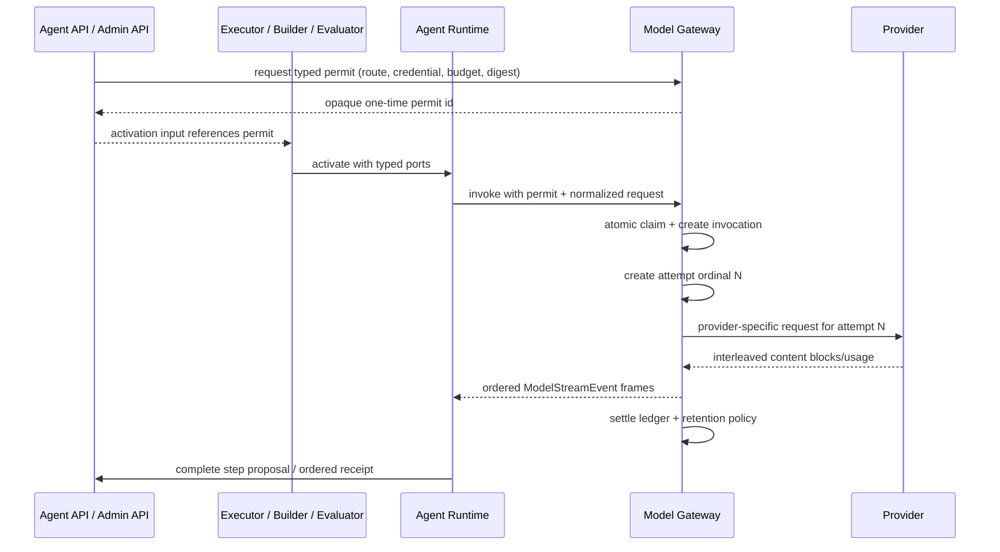

# Model Gateway 架构

> 状态：`0.0.1` 目标架构。本文是模型路由、调用许可、Provider 适配、调用账本和健康状态的权威设计。凭证密文见 [凭证管理](./credential-management.md)，模型正文与文件见 [文件与模型交换](./agent-files-and-exchanges.md)，Agent Step 与工具调度见 [Learning Agent 系统架构](./learning-agent-system.md)。

## 1. 为什么是独立服务

所有付费模型调用统一经过 `apps/backends/model-gateway`。Agent Executor、Lexicon Builder、Agent Evaluator 和 Asset Processor 不直接加载 Provider SDK 或读取 Provider key；`@sylis/model-runtime` 被删除，Provider adapter 只存在于 Model Gateway 的私有实现中。

这条边界解决四个问题：

1. 一个位置执行路由固定、预算、限流、重试、脱敏和用量结算；
2. Provider 凭证不会复制到 executor、Redis、Job payload 或普通业务对象；
3. 每次调用都能追溯到不可变 release、明确 purpose 和一次性许可；
4. Provider 的协议变化不会扩散到 Agent、Compiler 或产品领域。

Model Gateway 不拥有 Agent loop、Capability 选择、Agent control routing、词典事实、Exercise、文件业务关系或用户身份。它只执行已经被上游领域授权且完全固定的模型操作，并把 Provider wire protocol 转换为有序、provider-neutral 的模型事件。

## 2. 所有权

| 对象                                       | 含义与不变量                                                                                                      |
| ------------------------------------------ | ----------------------------------------------------------------------------------------------------------------- |
| `ProviderRouteRelease`                     | 不可变 Provider endpoint、model、能力、请求/响应 adapter、timeout、重试、价格和数据处理政策；只能由 Git + CI 发布 |
| `CredentialProfile` / `CredentialRevision` | 平台或 User 的稳定凭证身份与不可变密文版本；严格 owner XOR                                                        |
| `ModelExecutionPermit`                     | 一次性、短有效期、绑定调用目的与预算的执行许可；成功 claim 后不可重放                                             |
| `ModelInvocation`                          | 一次逻辑模型调用的状态、固定 route/credential revision、usage、cost、latency、错误分类和幂等事实                  |
| `ModelInvocationAttempt`                   | 同一 Invocation 下的一次实际 Provider transport 尝试；保存 ordinal、request id、状态、usage/cost 和 retry 原因    |
| `ModelContentFragment`                     | visible content body 在 sealed 前的有序加密 fragment；按 invocation/modelPosition/sequence 幂等且有界合并         |
| `ModelExchange` / `ModelExchangePart`      | 规范化输入输出的引用、可见性和留存状态；不保存隐藏推理或 Provider 原始 body                                       |
| `ModelUsageLedger`                         | reservation、settlement 和 correction 的 append-only 账本                                                         |
| `ProviderHealthObservation`                | 按 route release 记录的健康、限流和熔断观测；不能静默改变已固定 Run 的路由                                        |
| `BudgetPolicy` / `QuotaPolicy`             | `MODEL_OPERATOR` 发布的不可变版本，按 purpose/capability/scope 约束 reservation 和窗口用量                        |

Agent API 仍拥有 `AgentSession`、`AgentRun`、`AgentMessage`、`AgentMessageBlock` 和 `AgentEvent`。Model Gateway 是模型调用与加密模型正文/fragment 的唯一 owner；两边通过 typed ID 和内部 API 关联，不共享 repository。

## 3. 固定路由，不静默故障转移

`ProviderRouteRelease` 至少固定：

- `providerKey`、`modelId`、`endpointClass` 和 adapter version；
- `TEXT_GENERATION | STRUCTURED_GENERATION | EMBEDDING | VISION` 能力；
- context/output 限制、streaming/tool/schema 支持；
- timeout、可重试错误、最大 attempt 和 backoff policy；
- tokenizer/usage mapping、价格表版本和预算单位；
- region、retention/训练政策与允许的数据分类；
- release digest、评测证据、状态和撤销时间。

Capability Release 只声明需要的能力与允许的 route releases。创建 Run 时解析出精确 `providerRouteReleaseId` 和 `credentialRevisionId`，之后不得因 429、故障或余额不足切换 Provider、模型或 PLATFORM/BYOK 来源。普通重试只能使用同一路由、credential revision、permit claim 和 input digest，并在同一 `ModelInvocation` 下创建新的 `ModelInvocationAttempt`；它不会创建新的 AgentRunStep。自动 retry 仅允许前一 attempt 尚未产生 accepted normalized block、visible fragment、tool call 或 usage；v1 不续传已开始的 Provider stream，任何输出后的失败都结束 Invocation。要切换或重新生成必须创建新的 Run/Build activation，并向用户明确展示。

平台额度是默认来源。BYOK 只有在 User 明确选择某个 ACTIVE `CredentialProfile` 时使用；BYOK 失败不会消费平台额度。DeepSeek 文本路由不被标记为 vision，图片理解必须走单独发布和评测过的 route。

## 4. 一次性执行许可

每次模型调用必须消费一个 typed `ModelExecutionPermit`：

```text
ModelExecutionPermit
  id
  callerServiceId
  purposeKind
  ownerUserId?
  agentRunId? | buildRunId? | evaluationRunId? | assetRevisionId?
  providerRouteReleaseId
  credentialRevisionId
  capabilityReleaseId?
  operationKind
  inputDigest
  maxInputTokens / maxOutputTokens / maxCost
  retentionMode
  expiresAt
  status = ISSUED | CLAIMED | SETTLED | FAILED | EXPIRED | REVOKED
```

关联目标严格按 `purposeKind` XOR。Agent API、Admin API 或拥有业务 Run 的服务先证明 owner、release、consent 和预算，再向 Gateway 请求许可；Gateway 创建 reservation 并返回 opaque permit ID。调用时 Gateway 同时验证 executor 的短期 service grant 与 `callerServiceId`，原子 claim permit 并创建 `ModelInvocation`。同一 permit 的重放返回原 invocation，而不会产生第二次付费请求。

permit 不是通用 API key：它绑定 caller、精确 route、精确 credential revision、输入 digest、预算和几分钟级 expiry，不能改写模型、扩大 token 或跨 Run 使用。permit、Job fencing token、request idempotency key 是三个不同约束，缺一不可。

## 5. 内部接口

Gateway 只接受 service grant，v1 不提供面向用户的长期 Sylis API Key：

```text
POST /internal/v1/model-execution-permits
POST /internal/v1/model-invocations
GET  /internal/v1/model-invocations/:id
GET  /internal/v1/model-invocations/:id/events
GET  /internal/v1/model-invocations/:id/attempts
POST /internal/v1/model-content-bodies
POST /internal/v1/model-content-bodies/:id/fragments
POST /internal/v1/model-content-bodies/:id/seal
GET  /internal/v1/model-content-bodies/:id
POST /internal/v1/model-content-bodies/:id/hide
POST /internal/v1/credential-profiles
POST /internal/v1/credential-profiles/:id/revisions
POST /internal/v1/credential-profiles/:id/revoke
POST /internal/v1/credential-profiles/:id/quarantines
POST /internal/v1/credential-profiles/:id/restorations
POST /internal/v1/provider-routes/:id/health-probes
POST /internal/v1/provider-routes/:id/security-revocations
POST /internal/v1/provider-routes/:id/restorations
GET  /internal/v1/model-usage
POST /internal/v1/budget-policies
POST /internal/v1/quota-policies
```

`model-invocations` 使用按 `operationKind` 区分的 request schema，而不是一个任意 JSON 代理端点。Agent streaming 分为两个明确边界：Provider adapter 向 Gateway execution layer 发出内部 `StreamingGenerationChunk`，Gateway 再向 Runtime 发出公开 `ModelStreamEvent`。Authorization header、Provider request/response body、SDK 对象和隐藏推理永不越过 Gateway 边界或进入 User SSE。

内部 Adapter 契约是闭合判别联合：

```typescript
enum StreamingGenerationChunkType {
  BLOCK_STARTED = "BLOCK_STARTED",
  TEXT_DELTA = "TEXT_DELTA",
  REASONING_DELTA = "REASONING_DELTA",
  TOOL_CALL_DELTA = "TOOL_CALL_DELTA",
  BLOCK_COMPLETED = "BLOCK_COMPLETED",
  USAGE = "USAGE",
  RESPONSE_COMPLETED = "RESPONSE_COMPLETED",
}
```

每个内容事件都携带稳定 `providerBlockId + providerBlockIndex`。Index 是 Adapter 按 Provider 原生内容顺序归一出的连续序号，不等同于 Runtime 后续拆分 Markdown 使用的 `modelSubPosition`；OpenAI output item、Anthropic content block、Gemini part 与 DeepSeek `tool_calls[index]` 都必须映射到这一身份。Tool name/arguments 以 delta 保留，只有 `BLOCK_COMPLETED` 才携带经过 allowlist/schema 校验的完整 ToolCall。内部流不伪造 failure terminal：transport/schema/settlement 错误抛给 execution layer，由 Gateway 生成公开 `RESPONSE_FAILED`。

闭合事件类型为：

```typescript
enum ModelStreamEventType {
  INVOCATION_STARTED = "INVOCATION_STARTED",
  BLOCK_STARTED = "BLOCK_STARTED",
  TEXT_DELTA = "TEXT_DELTA",
  REASONING_DELTA = "REASONING_DELTA",
  TOOL_CALL_DELTA = "TOOL_CALL_DELTA",
  BLOCK_COMPLETED = "BLOCK_COMPLETED",
  USAGE = "USAGE",
  RESPONSE_COMPLETED = "RESPONSE_COMPLETED",
  RESPONSE_FAILED = "RESPONSE_FAILED",
}
```

Gateway 校验内部 block index 从 0 连续、id/index/kind 始终一致、完成后不可继续追加，并将其投影成公开 `modelPosition`；delta 可按不同 position 交错到达。Tool call block 保存独立 `providerCallId`、name 和增量 arguments。Adapter 必须按 Provider identity 分别聚合，不得按到达顺序拼成一个调用，也不得在检测到 mixed text/tool 或多个调用时抛歧义错误。Provider `RESPONSE_COMPLETED` 先由 execution layer 暂存，只有 Attempt、Invocation、permit 与 usage settlement 成功后才向 Runtime 释放；公开 `RESPONSE_COMPLETED | RESPONSE_FAILED` 因而互斥且唯一，之后不得再产生 frame。

内部 `REASONING_DELTA` 可携带 Provider reasoning bytes，但 Gateway 的公开同名事件只保留 block identity/order，不携带正文；它只用于 Provider 要求的受控 passback 和调用内组装，不作为 User 可见消息、普通日志、Invocation output 或长期 hidden chain-of-thought 保存。`STRUCTURED_GENERATION` 继续使用独立 strict-result 契约；当 forced tool call 只是 JSON transport 时，恰好一个结果调用仍是合法约束，不能与 Agent 多工具循环混用。

Content body ingress 绑定 `USER | SYSTEM` owner、purpose、retention class、content hash 和 idempotency key；User 内容强制 `ownerUserId`，系统 build/eval 内容禁止冒充 User。流式可见正文先按 `(invocationId, modelPosition, modelSubPosition, fragmentSequence)` 追加有界加密 `ModelContentFragment`，terminal 后封口为 immutable body/hash；`modelSubPosition` 由 Runtime parser 为同一 Provider block 拆出的展示 Block 分配，相同四元组不同 hash 冲突，封口后禁止追加。Agent Event 只保存 opaque fragment/body ref，不保存明文。Agent API 再在自己的事务中追加只含 `contentBodyId` 的 MessageBlock 关系行；未被关系行认领的 orphan body/fragment 由短期 retention job 清理。读取时 Agent API 先校验 User/Session/Message/Block owner，再以 scoped service grant 代理 Gateway 的单 body 响应，不能列表或批量导出其他正文。Block lifecycle 与 SSE 恢复见 [Agent 会话 Block](./agent-conversation-blocks.md)。

## 6. 调用流程



Executor 和 Runtime 都不能把 Gateway event 直接持久化成 `AgentEvent`。Runtime 只把 User 可见 text delta 通过 `AgentStepPort` 投影为 typed ingress，并在收到 terminal frame 后组装一个包含全部 ordered action 的 `AgentStepProposal`；只有 Agent API 能创建 `AgentRunStep`、执行完整 preflight、追加事件并推进 Run。Gateway 不识别 Proposal、Artifact、Memory、ChildRun 或 Wait tool name。

## 7. Provider 适配与发布

Provider route 和 adapter 都是 Git + CI 管理的代码，不允许 Admin 在线粘贴任意 endpoint、脚本或转换模板。发布流程为：

```text
Git change
  -> schema/adapter contract tests
  -> fake-provider streaming tests
  -> offline eval + independent judge
  -> maintainer approval
  -> immutable Candidate
  -> staging
  -> same digest promoted to production
```

Admin 可以查看 route health、成本和 release 证据；不能读取凭证明文或创建未经 CI 评测的 Provider endpoint。`MODEL_OPERATOR` 管 Platform Credential 正常 revision 和 BudgetPolicy/QuotaPolicy；`SECURITY_ADMIN` 可单独紧急 quarantine Credential 或 revoke Route。恢复 Credential/Route 要求同一 Operator 同时持有 `MODEL_OPERATOR + SECURITY_ADMIN`。普通 rollback 只影响新 Run；安全撤销会在安全边界终止引用该 release 的非终态 Run。

## 8. 失败语义

| 情况                                    | 处理                                                                             |
| --------------------------------------- | -------------------------------------------------------------------------------- |
| permit 过期、重放或 digest 不同         | 拒绝，不调用 Provider                                                            |
| BYOK invalid/expired/insufficient quota | 明确失败，不回退 PLATFORM                                                        |
| Provider 429/5xx/timeout                | 仅按固定 route policy 新增 Attempt；保持同一 Invocation/permit/input；超限后失败 |
| stream 中断且调用状态未知               | 保留 `UNKNOWN_OUTCOME`，按 Provider 幂等能力决定是否可重试                       |
| headers 发出后的 adapter/runtime 异常   | 写唯一 `RESPONSE_FAILED` frame 并结束 stream；禁止二次 HTTP Problem Details      |
| consumer disconnect / cancel            | 传播 abort，原子结算 Invocation、permit 和 usage reservation；不得永久 `RUNNING` |
| usage 缺失                              | 使用保守估算结算并标记 provenance，不伪造 Provider usage                         |
| route/credential 被安全撤销             | 阻止新 permit，并在安全边界终止受影响调用                                        |

## 9. 可观察性与验收

日志和 OpenTelemetry 只记录 invocation/attempt/route/credential profile 的 opaque ID、attempt ordinal、状态、token、成本、延迟和稳定错误码。禁止记录 prompt、响应正文、Provider raw body、header、secret 或 ciphertext。

必须验证：permit 原子单次消费、幂等恢复、route/credential 固定、BYOK no-fallback、预算 reservation/settlement、stream abort、Provider 错误分类、正常 revoke/security quarantine 分离、restore role conjunction、响应脱敏、owner isolation 和 fake-provider streaming。Provider contract suite 至少覆盖三个 interleaved tool-call index、mixed text/reasoning/tool、arguments fragment、空首帧、usage trailer、`[DONE]`、截断、disconnect、唯一 terminal frame 与 structured strict-result 单调用规则。真实付费 Provider 调用只允许人工触发，不进入普通 CI。
