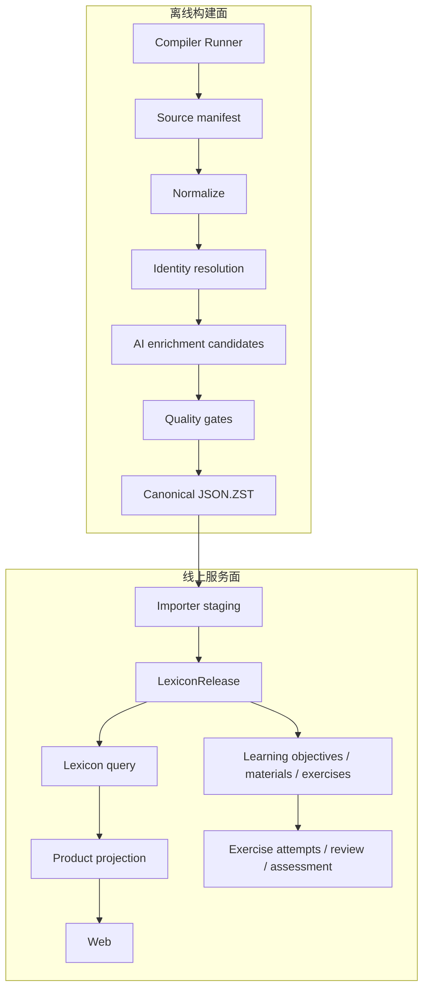
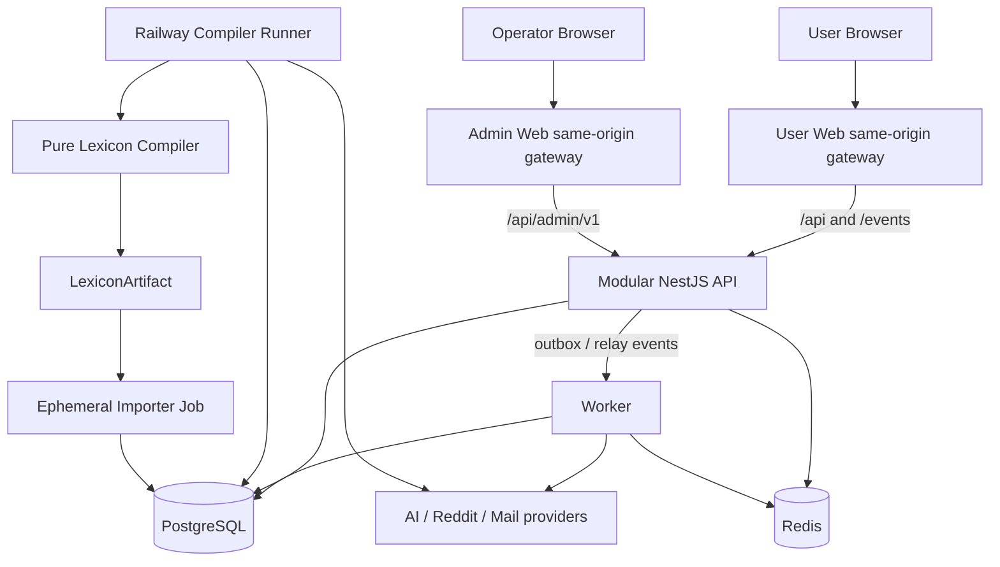

# 目标系统架构

## 1. 边界与所有权

| 组件                             | 拥有                                                                                                                 | 明确不拥有                                 |
| -------------------------------- | -------------------------------------------------------------------------------------------------------------------- | ------------------------------------------ |
| `@sylis/lexicon-contracts`       | artifact JSON Schema、生成 TypeScript 类型、受控词表类型、纯结构/引用验证器                                          | source adapter、AI、Prisma、页面 DTO       |
| `@sylis/lexicon-compiler`        | source adapters、candidate schema、identity resolver、词典/教学材料/题目 AI tasks、语义 validators、标准 JSON writer | Prisma client、用户数据、线上 release 激活 |
| `@sylis/lexicon-compiler-runner` | Railway `LEXICON_BUILD` claim/lease、AI/来源/存储装配、checkpoint/progress、artifact upload                          | 编译规则、import、release 激活             |
| `@sylis/lexicon-importer`        | artifact preflight、staging、COPY、release build、数据库全局验证、activation command                                 | 原始来源解析、AI 调用、页面 DTO            |
| `@sylis/api`                     | User/Admin application contract、身份、词典查询、学习、阅读和任务命令                                                | 长任务执行、运行时词典补写、全量 JSON 生成 |
| `@sylis/worker`                  | runtime AI、导出、来源同步、outbox/job 消费与 checkpoint                                                             | HTTP session、正式词典合并、release 激活   |
| `@sylis/ai-provider`             | `StructuredGenerationPort`、`StreamingGenerationPort`、DeepSeek adapter 与 provider DTO 隔离                         | prompt policy、领域 Job、词典事实          |
| `@sylis/database`                | Prisma schema/migration/generated client/connection factory 的唯一 owner                                             | 业务 repository、HTTP DTO、浏览器类型      |
| `@sylis/background-jobs`         | JobKind、状态机、progress/checkpoint/result schema、handler/control interface                                        | Nest/Prisma/Redis/provider executor        |
| `@sylis/components`              | tokens、icons、styles、无领域 React primitives                                                                       | Web/Admin 业务 module、API/query           |
| `@sylis/utils`                   | 跨 runtime 的确定性纯函数                                                                                            | 领域归一化、框架/I/O、secret               |
| `@sylis/web`                     | User Web 查询状态、展示、学习、阅读和 AI 交互                                                                        | 业务密钥、FSRS 真相、离线答案事实          |
| `@sylis/admin`                   | 独立运营 UI、Admin query cache、审批和进度交互                                                                       | 权限判定、用户 session、secret value       |
| PostgreSQL                       | release-scoped 正式事实、用户状态、审计                                                                              | 原始大文件仓库、AI prompt 临时工作目录     |
| GitHub Release                   | 以 hash 寻址且禁止覆盖的标准 `.json.zst` 制品                                                                        | 生产数据库凭据、AI key                     |

边界直接消除当前两个问题：API 读取时不再生成内容；Railway importer 不再同时承担下载 ECDICT、解析有道、合并词义和写生产库。

compiler 和 importer 都依赖 `lexicon-contracts`，两者互不依赖。这样 importer 不会为了读取 JSON 顺带安装 source adapter、AI SDK 或 compiler 工作流，第三方也可只使用 JSON Schema。纯 compiler 不连接生产数据库；独立 Compiler Runner 负责把 Railway executor、AI provider、对象存储和 BackgroundJob 接到 compiler public API。

## 2. 构建面与服务面



构建面可以失败、重试或等待人工抽检而不影响线上 active release。服务面只读取已验证 release，并允许用户域持续写入学习事件。

## 3. 数据生命周期

1. `SourceDatasetVersion` 固定来源 URI、版本、checksum、rights policy 和获取时间。
2. adapter 将每条原始记录转换为 `SourceRecord` 与 typed candidate，不创建正式 ID。
3. resolver 依次处理 Headword、Entry、Form、Sense、Concept、内容和关系。
4. AI 只针对明确 target/kind 生成 candidate-local nodes；词典、PedagogicalMaterial 和 Exercise 各走自己的 schema、引用、事实边界和抽检门禁。
5. validator 生成 profile coverage 和问题列表；任何 ERROR 阻止 artifact 发布。
6. writer 以稳定业务键排序，流式写出一个 JSON object 并 zstd 压缩，计算物理文件和 canonical payload 两种 hash。
7. importer 流式解压并校验 schema/hash/source manifest 后 COPY 到 unlogged staging。
8. set-based SQL 构建 DRAFT release；开始全局校验时转为 VALIDATING，通过后转为 VALIDATED。
9. activation 在短事务中追加审计并切换 active pointer；旧 release 保持可回滚。

## 4. 运行时请求原则

- `GET /lexicon/**` 只读一个请求开始时固定的 active release。
- 需要跨语言 relation 时，每端都携带明确 release ID，不临时读取目标语言最新 release。
- 页面聚合由 query service 完成，不建立重复的“聚合事实表”。必要的物化视图只做可重建缓存。
- 缺失值使用 `PRESENT / MISSING / NOT_APPLICABLE / REJECTED`，不能都显示成“暂无数据”。
- PedagogicalMaterial 是 release-scoped 教学内容，不是词典事实；临时翻译、Tutor、语法诊断和 AI Reading generation 属于运行时 AI 能力，也不得伪装成词典事实。

## 5. 一致性策略

- 词典实体使用跨 release 稳定 UUID，事实 revision 使用 `(releaseId, entityId)` 复合身份。
- API 每个响应回显 `releaseId`，支持 `ETag`；一次响应不能混用两个 source release。
- objective、exercise、book edition 与 assessment blueprint 都固定到 release 或明确的稳定身份 + revision。
- 发布后 revision 不更新；内容改变创建新 revision，split/merge 通过 typed lineage 表表达。
- 删除受限来源时创建新 release，不在 active release 中逐行修改。

## 6. 故障隔离

| 故障                       | 处理                                                   |
| -------------------------- | ------------------------------------------------------ |
| 来源下载中断/checksum 不符 | 构建 run 失败，不产生 artifact                         |
| AI 超时、429 或预算耗尽    | candidate 队列可恢复；已有 active release 不受影响     |
| 单词无法对齐 Sense         | 保留 unresolved candidate 和 QA issue，不挂首义项      |
| artifact 引用断裂          | importer preflight 失败，数据库零写入                  |
| staging/构建中断           | BackgroundJob 按 retry policy 恢复或终结；DRAFT 不可见 |
| 新 release 验证失败        | 不激活，线上继续使用旧 active release                  |
| 新 release 上线后异常      | 原子切回上一 VALIDATED release                         |

## 7. 可观察性

所有长任务每 30 秒输出一条结构化 progress event：

```json
{
  "runId": "run_...",
  "stage": "sense_alignment",
  "status": "running",
  "processed": 12500,
  "succeeded": 12180,
  "failed": 44,
  "pending": 776,
  "ratePerSecond": 38.4,
  "etaSeconds": 1210,
  "inputTokens": 1200000,
  "outputTokens": 240000,
  "cost": { "currency": "USD", "amount": "0.24" },
  "heartbeatAt": "2026-08-04T10:00:00Z"
}
```

日志不输出 raw Authorization header、连接串、用户原始答案或完整 prompt 中可能存在的受限原文。

## 8. 全产品运行拓扑



User Web、Admin Web、API、Worker 和 Compiler Runner 是独立 Railway service；PostgreSQL/Redis 是独立托管 service；纯 Compiler 可在本地/CI pilot 运行，全量长构建由 Runner 执行；Importer 按 artifact 启动专用 job。用户请求不等待词典构建、批量导入或长内容生成。

PostgreSQL 的 `BackgroundJob` 是全部异步执行的唯一状态机，Redis 只发送可丢失、可重复的 wake-up。Worker、受保护的 Compiler runner 和一次性 Importer runner 各自只 claim 注册给自己的 JobKind，详见 [BackgroundJob、Worker 与进度协议](./background-jobs.md)。

## 9. 模块化单体边界

API 内部按 [Bounded Contexts](./bounded-contexts.md) 分 Nest module。Controller 只处理 HTTP/auth/DTO，use-case service 持有流程/事务，repository 位于拥有它的业务 module；跨 module 只通过显式 exported provider token/interface 或 outbox event，不 deep import 实现。一次事务只能有一个 owner，Worker consumer 按 event/job ID 幂等。精确结构见 [后端目录与 NestJS 模块边界](../implementation/backend-structure.md)。

模块化单体是当前规模的部署选择，不是取消边界。任何未来服务拆分都必须先证明独立扩缩容、故障隔离或团队所有权需求，并保持既有 contract 与事件语义。

## 10. 应用与数据 release

`DeploymentRelease` 由 commit、构建证明和 Railway deployment 标识；`LexiconRelease` 由 artifact hash、source manifest 和 validation report 标识。两者独立发布，但应用声明可读取的 schema/release compatibility range；activation preflight 在切换前验证兼容。

回滚应用不得隐式回滚数据，回滚数据也不得回写用户事件。若旧应用不支持当前 LexiconRelease，Railway 不得把它设为 production active；需选择兼容 deployment 或先显式激活兼容数据 release。

## 11. 外部边界

- DeepSeek、Reddit、邮件和未来 provider 统一通过 adapter，响应先进入 provider DTO，再转换为领域 contract。
- 外部正文、prompt 和 tool output 都是不可信输入，必须限制大小、校验 schema、转义展示并隔离日志。
- provider 超时或额度不足只影响对应 capability；Lexicon、Study、Assessment 和本地已发布阅读内容继续可用。
- sealed secrets 只注入拥有该 provider adapter 的 service；Web、Admin、artifact、build arg 和 OpenAPI 不包含 secret。
