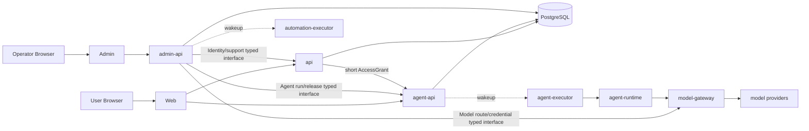
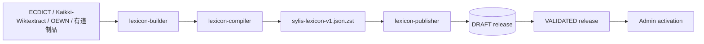

# Sylis 目标系统架构

## 1. 架构原则

Sylis `0.0.1` 采用一个 pnpm + Turborepo monorepo、两个 frontend、十个 backend、若干深模块和隔离的数据基础设施。十二个应用都可独立部署。当前没有生产用户，因此直接迁到最终契约，不建立旧 DTO、旧表或旧路由兼容层。

核心规则：

1. PostgreSQL 是在线事实源；标准 JSON 是离线交换与重建制品。
2. 同步应用只鉴权、校验并提交 command/query；长执行由专用 executor 完成。
3. 每个领域关系只有一个 owner；模型、executor、Publisher 和页面都不能绕过 owner 写表。
4. Redis 只负责唤醒与短期 delta；Bucket 保存不可变大对象；两者都不是关系真相。
5. `apps/**` 必须可部署，`packages/**` 必须隐藏复杂实现并暴露小型 interface。
6. 应用 DeploymentRelease 与词典 LexiconRelease 独立演进。

## 2. Workspace 顶层

```text
apps/
  frontends/
    web/
    admin/
  backends/
    api/
    admin-api/
    agent-api/
    model-gateway/
    agent-executor/
    agent-evaluator/
    asset-processor/
    automation-executor/
    lexicon-builder/
    lexicon-publisher/
packages/
  api-client/
  agent-contracts/
  agent-runtime/
  components/
  content-crypto/
  database/
  job-contracts/
  job-runtime/
  lexicon-artifact/
  lexicon-compiler/
  test-support/
  utils/
tools/
  engineering-harness/
```

不再使用 `services/`、generic `worker`、`user-api`、`admin-web`、`compiler-runner`、`lexicon-importer`、Nx、tsup、tsdown 或 `packages/shared`。TypeScript 源码导入省略 `.js` 后缀；可执行应用由 Vite、Nest/SWC 或 `tsc` 直接构建。

## 3. 应用和包所有权

| 模块                  | 拥有                                                                                                 | 明确不拥有                                                            |
| --------------------- | ---------------------------------------------------------------------------------------------------- | --------------------------------------------------------------------- |
| `api`                 | Identity、User、AuthSession、Credential、Grant；学习/阅读同步 command/query                          | Agent loop、后台执行                                                  |
| `admin-api`           | ADMIN audience、Platform Operations command/projection、跨 owner 控制面编排                          | Identity/Agent/Model owner 表、executor implementation、deploy secret |
| `agent-api`           | Learning Agent Run/Step/Call/MessageBlock 关系真相、完整 Step preflight、SSE 与 typed action ingress | 模型 loop、产品表直接写入                                             |
| `model-gateway`       | ProviderRoute/Credential/Invocation/Exchange/usage 与 Provider adapter                               | Agent loop、业务 Run、任意领域写入                                    |
| `agent-executor`      | Agent activation Job、Runtime composition root、Model/Step/Tool adapter 与进程生命周期               | Provider key/SDK、User session、Agent loop、领域表直接写入            |
| `agent-evaluator`     | 隔离的 offline Eval、independent Judge 和 release evidence                                           | production Session、release activation                                |
| `asset-processor`     | quarantine scan、文件解析/OCR/index 与按需 vision/embedding                                          | Agent loop、用户会话、任意未扫描内容发布                              |
| `automation-executor` | 导出、同步、清理等后台 Job                                                                           | Agent、Lexicon compile                                                |
| `lexicon-builder`     | BuildRun 装配、来源/AI/storage/progress                                                              | 正式 release 写入                                                     |
| `lexicon-publisher`   | Artifact preflight、staging、release validation                                                      | 来源解析、AI、隐式 activation                                         |
| `api-client`          | Web/Admin 所需的生成 transport clients                                                               | 领域逻辑                                                              |
| `agent-contracts`     | Agent Step/action/receipt、MessageBlock/event、tool 与 artifact schema                               | persistence、provider adapter                                         |
| `agent-runtime`       | Capability 路由、Turn/Step loop、ordered block 组装、有界工具调度与上下文预算                        | HTTP、数据库、Provider SDK、Cordis                                    |
| `components`          | 无领域 React primitives、tokens、icons、styles                                                       | 页面和业务 module                                                     |
| `content-crypto`      | envelope encryption、key version、redaction interface                                                | Credential 业务策略                                                   |
| `database`            | Prisma schema/SQL-only invariants/client/connection                                                  | 业务 repository 和 DTO                                                |
| `job-contracts`       | Job kind/state/progress/checkpoint/result schema                                                     | claim loop、Nest/Redis                                                |
| `job-runtime`         | claim、lease、heartbeat、fencing、drain lifecycle                                                    | 领域 handler                                                          |
| `lexicon-artifact`    | 标准 JSON Schema、类型、受控词表和纯验证                                                             | source adapter、AI、DB import                                         |
| `lexicon-compiler`    | 解析、去重、词形归并、Sense 对齐、候选与 JSON writer                                                 | Railway、生产 DB、activation                                          |
| `test-support`        | E2E 环境、覆盖矩阵、OpenAPI 覆盖和确定性测试运行时                                                   | 生产业务逻辑、部署产物                                                |
| `utils`               | 跨 runtime、确定性、无 I/O 纯函数                                                                    | 领域归一化、框架、secret                                              |

详细 Learning Agent 所有权见 [Learning Agent 系统架构](./learning-agent-system.md)，目录和依赖图见 [Workspace 项目图](../implementation/workspace-projects.md)。

## 4. 在线请求面



`api` 独占 User、认证、AuthSession、SupportGrant 和 OperatorRole transaction；`agent-api` 独占 AgentRun/Release；`model-gateway` 独占 ProviderRoute/Credential/Invocation/usage。`admin-api` 只直接写 Platform Operations owner 数据，跨上下文操作使用 service grant 与 typed internal command/query，不通过共享 Prisma repository 绕过 owner。

普通 User、Agent 和 Admin browser 路由使用不同 audience。浏览器不持有 service credential、provider key 或 GitHub/Railway deploy token；executor 不接收 browser cookie。DeploymentRelease 由 CI service identity 写 internal ingestion，Admin browser projection 只读。

GET 请求只读请求开始时固定的 release 和 projection，不因缺字段触发 AI 或写入。跨上下文写入使用 typed command，跨上下文读取使用 release/scope 限定的 query interface。

## 5. Learning Agent 面

Learning Agent 用 `AgentSession -> AgentRun -> AgentRunStep -> AgentToolCall` 表达模型循环，以 `AgentSession -> AgentMessage -> AgentMessageBlock` 表达 Notion-inspired 的可见内容树，以 `AgentEvent/Artifact/Proposal` 表达时间线和结果，用 activation `Job -> JobAttempt` 表达执行。Executor 装配框架无关的 `@sylis/agent-runtime`，并且只用一次性 `ModelExecutionPermit` 访问 `model-gateway`；它既不加载 Provider adapter，也不读取 key。Runtime 内部 BlockAssembler 把 Provider-neutral output block 转成 closed Message Block proposal，在模型 terminal frame 后提交完整 `AgentStepProposal`；Agent API 先整步 preflight 再返回 execution plan。只有 Agent API 能创建 Step、ToolCall、MessageBlock 和 AgentEvent。每个调用独立终止，结果按模型顺序回到下一次 ModelInvocation；Provider transport retry 只新增 ModelInvocationAttempt。

模型输出首先是 User 内容或 Proposal，不是词典事实、正式题目、评分或 FSRS 状态。详情见 [Learning Agent 系统架构](./learning-agent-system.md)、[Agent 会话 Block](./agent-conversation-blocks.md)、[Model Gateway](./model-gateway.md)、[文件与模型交换](./agent-files-and-exchanges.md) 和 [Job 与执行协议](./background-jobs.md)。

## 6. 词典构建与发布面



1. `SourceDatasetVersion` 固定 URI、版本、checksum、rights policy 与获取时间。
2. Adapter 转为 immutable source record 和 typed candidate，不直接创建正式关系。
3. Compiler 解析、归一化、去重、判断 Form 与独立 Entry、对齐 Sense/Concept 并合并来源。
4. AI 只补明确 schema 的 candidate；来源型事实没有证据时不得由模型伪造。
5. Writer 稳定排序后流式输出一个逻辑 JSON 并 zstd 压缩，计算 compressed/content hash。
6. Publisher 流式 preflight、COPY staging、set-based build 和全局验证，得到未激活 release。
7. Admin 单独批准 activation；旧 VALIDATED release 始终可原子回滚。

Builder 失败、AI 限流或 Publisher 校验失败都不影响当前 active release。缺失数据使用 `PRESENT | MISSING | NOT_APPLICABLE | REJECTED`，不能都折叠为“暂无数据”。

## 7. 数据与一致性

- 词典实体使用跨 release 稳定 ID，事实 revision 用 release-scoped 身份。
- Objective、Exercise、BookEdition、Reading annotation 和 Assessment blueprint 引用明确 release/revision。
- 发布后的 revision 不更新；变化创建新 revision，split/merge 使用 typed lineage。
- 一次响应不混用两个 release，并回显 `releaseId`/ETag。
- 页面聚合由 query module 组装；物化视图只能是可重建缓存，不建立第二份领域真相。
- User、Attempt、Review、Agent、Job、Audit 和密钥永不进入公开 lexicon artifact。

关系表设计见 [关系模型](../data/relational-schema.md)，标准 Artifact 见 [标准 JSON](../data/standard-json.md)。

## 8. 故障隔离

| 故障                             | 结果                                                                     |
| -------------------------------- | ------------------------------------------------------------------------ |
| 来源下载/checksum 错误           | BuildRun 失败，不发布 Artifact                                           |
| 模型 timeout、429、额度耗尽      | 当前 activation 按 policy 重试/失败；已发布内容可用                      |
| Model Gateway 或 Provider 不可用 | 不改变固定 route/credential；调用明确失败或按同一路由重试，不静默切换    |
| 文件恶意、类型错误或解析超限     | 保持 REJECTED/QUARANTINED，不进入 clean Bucket、Agent context 或领域数据 |
| Agent 等待批准或 User 输入       | Run WAITING，当前 Job 结束；满足条件后新建 Job                           |
| Agent 一个 ToolCall 失败         | 只失败该调用；无关 sibling 继续，完整有序结果返回下一模型 Step           |
| Agent executor 在副作用中断      | started call 按证据收敛或进入 UNKNOWN_OUTCOME；未启动 call 为 CANCELLED  |
| Redis 丢失/重启                  | PostgreSQL polling 恢复，不改变领域状态                                  |
| executor 崩溃或 deploy           | lease 过期后用新 Attempt/fencing token 接管                              |
| Artifact 引用断裂                | Publisher preflight 失败，正式 release 零写入                            |
| release 全局验证失败             | 不激活，线上继续读取旧 release                                           |
| 新数据异常                       | 原子切回上一 VALIDATED release                                           |

## 9. 可观察性

长任务至少每 30 秒追加安全进度：runId/jobId、stage、processed/total、吞吐、ETA reliability、token/cost、warning 和 heartbeat。AgentEvent 与 JobProgressEvent 都有单调 sequence 和 SSE `Last-Event-ID`。

日志禁止输出 Authorization、cookie、连接串、密钥、完整 prompt、完整聊天、User 原始答案和 provider raw body。Admin 默认只看到状态、成本、hash 和 redacted error；明文支持访问需要 User 的短期 SupportGrant。

## 10. Railway 拓扑

staging 与 production 完全隔离。每个环境均包含：

- 十二个应用：Web、Admin、API、Admin API、Agent API、Model Gateway、Agent Executor、Agent Evaluator、Asset Processor、Automation Executor、Lexicon Builder、Lexicon Publisher；
- 一个 PostgreSQL；
- 一个 Redis；
- 三类 private S3-compatible Bucket：quarantine、clean user assets 和 system artifacts。

Railway GitHub source autodeploy 关闭。GitHub Actions 构建 Docker image 并推送 GHCR，staging 和 production 通过 digest 拉取；production 只提升 staging 已验证的同一 digest，不重新构建。完整流程见 [CI/CD、Railway 与密钥](../delivery/cicd-security.md)。

## 11. 完成定义

- 十二个 app 均可独立 build/deploy，package graph 没有 app-to-app deep import。
- Web/Admin bundle 不包含 database、crypto implementation、executor、compiler 或 provider adapter。
- Executor 数据库角色不能直接写 Agent/产品领域表。
- Provider key 只由 Model Gateway 解密；每次调用固定 route/credential revision 并消费一次性 permit。
- 未扫描文件无法离开 quarantine；所有正文、文件和交换内容遵守 owner、consent、revision pinning 与删除期限。
- 空数据库可由 Prisma schema + SQL-only invariants + 固定 LexiconArtifact 构建同一 active release。
- Agent、练习、阅读、词典和学习状态使用明确实体，不存在 `Word/Card/Article/Task` 聚合模型。
- CI 无业务 secret、无付费模型调用即可完成 lint、typecheck、test、build、contract 与 docs。
- protected `main` 自动部署 staging；production 从手工受保护 release 提升不可变 digest。
