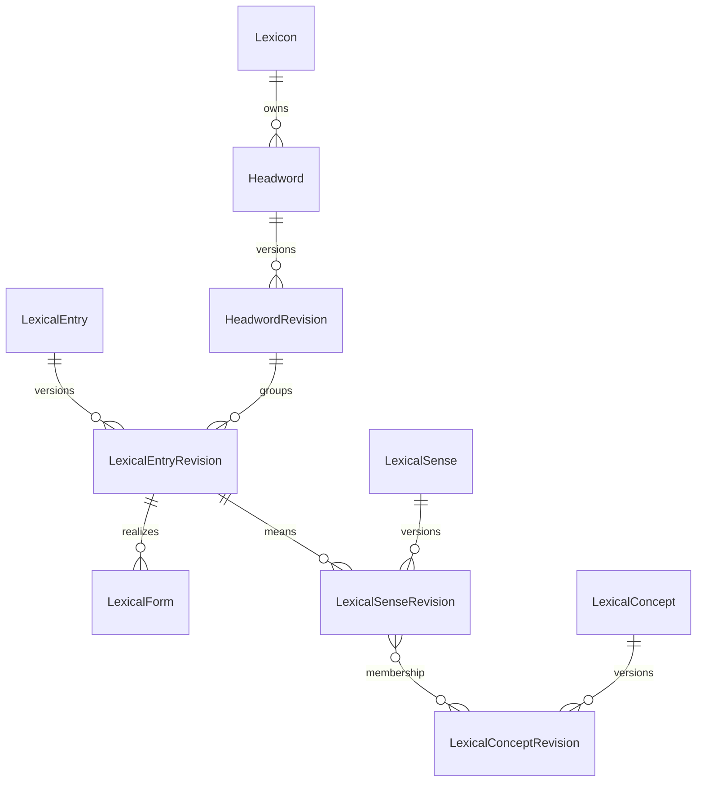

# 最终关系表结构

本章定义目标 PostgreSQL/Prisma 语义。实际 Prisma 文件按领域拆分，但数据库约束是最终真相；Prisma 无法表达的 deferred constraint trigger、partial unique index、check constraint 和 exclusion rule 必须写进 migration SQL 并有测试。

## 1. 全局规则

- 主键统一 UUID；外部来源 ID 只进入 external identifier 或 source record。
- 所有时间为 `timestamptz`，所有自然语言文本携带 BCP 47 `languageTag`。
- stable identity 与 release fact 分离。事实表的唯一键和外键包含 `releaseId`。
- money 使用 `numeric` + currency，hash 使用带算法前缀的 lowercase string。
- 枚举存受控 vocabulary code；可升级语言学代码通过 `VocabularyTerm` 外键，不散落自由字符串。
- 只在算法参数、不可变 raw payload 和版本化 contract 明确允许时使用 JSONB。
- 正式表不允许 unresolved target；未解析数据留在 candidate 表。

## 2. Release 与受控词表

| 表                               | 核心字段                                                                                                                                                                       | 约束与索引                                                                                                  |
| -------------------------------- | ------------------------------------------------------------------------------------------------------------------------------------------------------------------------------ | ----------------------------------------------------------------------------------------------------------- |
| `Lexicon`                        | `id`, `key`, `sourceLanguageTag`, `activeReleaseId`                                                                                                                            | `key` 唯一；active release 必须属于本 Lexicon 且为 VALIDATED                                                |
| `LexiconRelease`                 | `id`, `lexiconId`, `version`, `status`, `textProfileId`, `vocabularyBundleId`, `artifactHash`, `canonicalizerVersion`, `createdAt`, `validatedAt`                              | `(lexiconId, version)`、`artifactHash` 唯一；PUBLISHED facts 不可更新                                       |
| `LexiconReleaseBuildMetadata`    | `releaseId`, artifact/compiler Git/profile/validator/source-manifest 版本，headword/rich-target version+checksum，AI prompt/schema/policy 与 requested/resolved provider/model | `releaseId` 唯一；AI disabled 时全部 AI identity 字段为 null；selection version/checksum 成组为空或成组存在 |
| `LexiconReleaseSourceInput`      | `releaseId`, `sourceDatasetVersionId`, `sourceKey`, `adapter`, `checksum`                                                                                                      | `(releaseId, sourceKey)` 唯一；version/checksum 必须与同 release 的 `SourceDatasetVersion` 一致             |
| `LexiconReleaseLearningLanguage` | `releaseId`, `languageTag`, `displayOrder`                                                                                                                                     | `(releaseId, languageTag)` 与 `(releaseId, displayOrder)` 唯一                                              |
| `LexiconReleaseActivation`       | `id`, `lexiconId`, `fromReleaseId`, `toReleaseId`, `actorUserId`, `reason`, `createdAt`                                                                                        | append-only；同事务更新 active pointer                                                                      |
| `TextProcessingProfile`          | Unicode/CLDR/ICU/UCA 版本、normalization、segmentation、locale、collation 配置                                                                                                 | `contentHash` 唯一；profile 不可变                                                                          |
| `VocabularyBundle`               | `id`, `version`, `contentHash`                                                                                                                                                 | release 固定一个 bundle                                                                                     |
| `VocabularyNamespaceVersion`     | `bundleId`, `namespaceUri`, `version`, `sourceUri`, `checksum`                                                                                                                 | `(bundleId, namespaceUri)` 唯一                                                                             |
| `VocabularyTerm`                 | `namespaceVersionId`, `code`, `uri`, `label`, `deprecated`, `replacedById`                                                                                                     | `(namespaceVersionId, code)` 唯一；正式 code 外键到精确版本                                                 |

`LexiconRelease.status` 只允许 `DRAFT -> VALIDATING -> VALIDATED -> RETIRED`。激活不是 status，是否在线由 `Lexicon.activeReleaseId` 决定。

## 3. 词典身份主轴



| 表                                                       | 核心字段                                                                                                                              | 约束与索引                                                                                                    |
| -------------------------------------------------------- | ------------------------------------------------------------------------------------------------------------------------------------- | ------------------------------------------------------------------------------------------------------------- |
| `Headword`                                               | `id`, `lexiconId`, `identityKey`, `createdAt`, `retiredAt`                                                                            | `(lexiconId, identityKey)` 唯一；仅是产品检索入口                                                             |
| `HeadwordRevision`                                       | `releaseId`, `headwordId`, `displayText`, `normalizedText`, `searchKey`, `sortKey`                                                    | `(releaseId, headwordId)` 唯一；NFC identity 与 search normalization 分开                                     |
| `LexicalEntry`                                           | `id`, `lexiconId`, `identityKey`                                                                                                      | stable identity；split/merge 不复用 ID                                                                        |
| `LexicalEntryRevision`                                   | `releaseId`, `entryId`, `headwordId`, `entryType`, `partOfSpeechTermId`, `homographNo`, `displayOrder`, `status`                      | 同 release 复合外键到 HeadwordRevision；Entry 至少一个 canonical Form 和 Sense                                |
| `LexicalForm`                                            | `id`, `releaseId`, `entryId`, `formType`, `displayOrder`                                                                              | 同 Entry 每组 feature 只能有一个相同 normalized representation                                                |
| `FormRepresentation`                                     | `id`, `releaseId`, `formId`, `representationType`, `languageTag`, `regionTag`, `scriptTag`, `text`, `normalizedText`, `provenanceId`  | representation type 包括 WRITTEN、PHONETIC、ROMANIZED；IPA 不由无来源 AI 生成                                 |
| `FormFeature`                                            | `releaseId`, `formId`, `featureTermId`, `valueTermId`                                                                                 | `(releaseId, formId, featureTermId)` 唯一；如 Tense=Past、VerbForm=Part                                       |
| `MediaAsset`                                             | `id`, `releaseId`, `mediaType`, `mimeType`, `contentUri`, `contentHash`, `byteLength`, `durationMs`, `rightsPolicyId`, `provenanceId` | 内容寻址；公开 URI/hash/rights 必须可服务且可撤回；v1 主要是 AUDIO                                            |
| `FormMedia`                                              | `releaseId`, `formId`, `mediaAssetId`, `roleTermId`, `regionTag`, `displayOrder`                                                      | 发音音频绑定具体 Form/region；不通过 headword 文本在客户端拼第三方 URL                                        |
| `LexicalSense`                                           | `id`, `lexiconId`, `identityKey`                                                                                                      | stable sense identity                                                                                         |
| `LexicalSenseRevision`                                   | `releaseId`, `senseId`, `entryId`, `parentSenseId`, `displayOrder`, `status`                                                          | parent 必须同 release、同 Entry；递归无环；每 Entry display order 唯一                                        |
| `SenseDefinition`                                        | `id`, `releaseId`, `senseId`, `languageTag`, `definitionType`, `text`, `displayOrder`, `provenanceId`                                 | 同 release Sense 外键；原文定义与学习定义分类型                                                               |
| `SenseTranslationText`                                   | `id`, `releaseId`, `senseId`, `languageTag`, `text`, `registerTermId`, `displayOrder`, `provenanceId`                                 | 允许只有文本而没有目标语言 Sense                                                                              |
| `SenseTranslationRelation`                               | source/target `releaseId`, source/target `senseId`, `relationType`, `provenanceId`                                                    | 两端均复合外键；语言必须不同；方向显式                                                                        |
| `SenseUsage`                                             | `id`, `releaseId`, `senseId`, `usageTypeTermId`, `valueTermId`, `text`, `displayOrder`, `provenanceId`                                | domain、register、region、temporal 等受控类型；value/text 至少一个存在                                        |
| `LexicalConcept`                                         | `id`, `lexiconId`, `identityKey`                                                                                                      | stable Concept/Synset identity                                                                                |
| `LexicalConceptRevision`                                 | `releaseId`, `conceptId`, `conceptType`, `status`                                                                                     | release-scoped concept facts                                                                                  |
| `SenseConceptMembership`                                 | `releaseId`, `senseId`, `conceptId`, `membershipType`, `canonical`, `provenanceId`                                                    | canonical membership 每 Sense 恰好一个；同 Concept 表示语义等价而非仅近义                                     |
| `ConceptDefinition`                                      | `id`, `releaseId`, `conceptId`, `languageTag`, `text`, `displayOrder`, `provenanceId`                                                 | Concept 级定义可被多个 Sense 复用                                                                             |
| `ExternalIdentifier`                                     | id、typed owner table ID、`namespaceVersionId`, `externalId`, `uri`, `provenanceId`                                                   | 实现时按 Entry/Sense/Concept 分表保持强外键                                                                   |
| typed `EntryLineage` / `SenseLineage` / `ConceptLineage` | effective release、source stable entity、target stable entity、lineageType、provenanceId                                              | 表达 SPLIT_FROM、MERGED_FROM、SUPERSEDES；两端强 FK 且不能同一节点自连；不要求旧 revision 随当前 release 复制 |

`Headword` 不是聚合事实层。它只让搜索、词书、收藏和“学习 bank”拥有稳定入口；详情内容始终从 Entry/Sense 读取。

## 4. 关系、例句和搭配

| 表                     | 核心字段                                                                                           | 约束与索引                                                           |
| ---------------------- | -------------------------------------------------------------------------------------------------- | -------------------------------------------------------------------- |
| `EntryRelation`        | `releaseId`, `sourceEntryId`, `targetEntryId`, `typeTermId`, `provenanceId`                        | 仅 ENTRY 关系，如 ABBREVIATION_OF、VARIANT_OF                        |
| `SenseRelation`        | `releaseId`, `sourceSenseId`, `targetSenseId`, `typeTermId`, `provenanceId`                        | 同义候选、反义、usage-related 等精确到 Sense                         |
| `ConceptRelation`      | `releaseId`, `sourceConceptId`, `targetConceptId`, `typeTermId`, `provenanceId`                    | hypernym、hyponym、meronym 等 Concept 关系                           |
| `ExampleSentence`      | `id`, `releaseId`, `languageTag`, `text`, `normalizedHash`, `qualityStatus`, `provenanceId`        | `(releaseId, languageTag, normalizedHash)` 唯一，可跨 Sense/题目复用 |
| `ExampleTranslation`   | `id`, `releaseId`, `exampleId`, `languageTag`, `text`, `provenanceId`                              | 同一句可有多条翻译                                                   |
| `SenseExample`         | `id`, `releaseId`, `senseId`, `exampleId`, `displayOrder`, `role`, `provenanceId`                  | 例句必须明确 Sense；同义项不重复绑定                                 |
| `ExampleCitation`      | `id`, `exampleId`, `sourceRecordId`, `workTitle`, `location`, `year`, `examType`, `verified`       | 真题标识必须有可验证来源                                             |
| `Collocation`          | `id`, `releaseId`, `languageTag`, `canonicalText`, `normalizedText`, `headEntryId`, `provenanceId` | 可复用 lexical unit，不等同自由 phrase string                        |
| `SenseCollocation`     | `id`, `releaseId`, `senseId`, `collocationId`, `relationType`, `displayOrder`                      | 搭配绑定正确 Sense                                                   |
| `CollocationComponent` | `collocationId`, `position`, `surfaceText`, `roleTermId`, nullable typed Entry/Morpheme target     | 需要分解时给有序组件；固定 slot 不伪造 Entry                         |

对称 relation 只存按 UUID 排序的一条边；非对称 relation 禁止同时生成无证据的逆边。所有 target 删除受 FK 保护。

## 5. Syntax-Semantics

| 表                  | 核心字段                                                                                                      | 约束与索引                                                   |
| ------------------- | ------------------------------------------------------------------------------------------------------------- | ------------------------------------------------------------ |
| `SyntacticFrame`    | `id`, `releaseId`, `entryId`, `frameKey`, `frameTypeTermId`, `languageTag`, `displayTemplate`, `provenanceId` | 属于一个 Entry；template 仅展示                              |
| `SyntacticArgument` | `id`, `releaseId`, `frameId`, `position`, `functionTermId`, `phraseTypeTermId`, `marker`, `optional`          | `(frameId, position)` 唯一                                   |
| `SemanticPredicate` | `id`, `releaseId`, `senseId`, `predicateKey`, `predicateTypeTermId`, `label`, `provenanceId`                  | 属于一个 Sense                                               |
| `SemanticArgument`  | `id`, `releaseId`, `predicateId`, `position`, `roleTermId`                                                    | `(predicateId, position)` 唯一                               |
| `SenseFrame`        | `id`, `releaseId`, `senseId`, `frameId`, `predicateId`, `provenanceId`                                        | Frame 的 Entry 必须是 Sense 所属 Entry                       |
| `ArgumentMapping`   | `senseFrameId`, `syntacticArgumentId`, `semanticArgumentId`                                                   | 两个 argument 必须分别属于同一 SenseFrame 的 frame/predicate |

`prevent <object> from <event-ing>` 的槽位真相来自 arguments 和 mapping，不来自不可校验的 `slots JSON`。

## 6. 形态、构词与词源

| 表                          | 核心字段                                                                                    | 约束与索引                                                |
| --------------------------- | ------------------------------------------------------------------------------------------- | --------------------------------------------------------- |
| `Morph`, `Morpheme`         | stable identity、language、allomorph group                                                  | 表面片段与抽象语素分开                                    |
| `MorphologicalAnalysis`     | `id`, `releaseId`, `formRepresentationId`, `analysisType`, `provenanceId`                   | 分析明确绑定 representation，不只绑定词头                 |
| `MorphologicalSegment`      | `analysisId`, `position`, `startOffset`, `endOffset`, `morphId`, `morphemeId`, `roleTermId` | offset 基于 NFC code point/grapheme profile；段不重叠越界 |
| `InflectionRule`            | stable/versioned rule identity、language、rule code                                         | 规则版本化                                                |
| `InflectionGeneration`      | `releaseId`, `entryId`, `baseFormId`, `outputFormId`, `ruleId`, `provenanceId`              | `run -> ran` 是 inflection，不是词族或 synonym            |
| `WordFormation`             | `id`, `releaseId`, `targetEntryId`, `formationTypeTermId`, `provenanceId`                   | 一条 n-ary 构词分析只有一个 target                        |
| `WordFormationInput`        | `formationId`, `inputEntryId`/`morphemeId`, `position`, `roleTermId`                        | 有序 input；每行 XOR Entry/Morpheme                       |
| `WordFormationRule`         | stable/versioned rule identity                                                              | derivation/compound rule                                  |
| `WordFormationApplication`  | `formationId`, `ruleId`, `stepOrder`                                                        | 多步分析显式排序                                          |
| `EtymologyHypothesis`       | `id`, `releaseId`, `subjectEntryId`, `hypothesisType`, `status`, `provenanceId`             | 可保留竞争假说，不允许无来源 AI 正式发布                  |
| `EtymologyLink`             | `hypothesisId`, source/target typed Entry/Etymon, `linkType`, `position`                    | 历时端点与现代 Entry 分型；支持跨语言固定 release         |
| `Etymon` / `EtymonRevision` | historical/reconstructed form、language、period                                             | 重建形式不是现代 LexicalEntry                             |

过去分词解析结果保存在 candidate 决策中，正式投影只有四种结果：`INFLECTED_ONLY` 只建 Form；`INDEPENDENT_ONLY` 只建 Entry；`BOTH` 两者都建并以 relation 连接；`UNRESOLVED` 不 promotion。

## 7. 语料与频率

| 表                                      | 核心字段                                                                                                         | 约束与索引                                      |
| --------------------------------------- | ---------------------------------------------------------------------------------------------------------------- | ----------------------------------------------- |
| `CorpusDataset`, `CorpusDatasetVersion` | key、版本、语言、规模、unit、checksum、rights                                                                    | dataset version 不可变                          |
| `FrequencyObservation`                  | corpusVersionId、typed Entry/Form/Sense target、count、normalizedFrequency、rank、algorithmVersion、provenanceId | 按 target 类型分表；一个 rank 不覆盖另一 corpus |
| `Attestation`                           | corpusVersionId、typed target、documentRef、offset、surfaceText、provenanceId                                    | offset unit/profile 显式                        |
| `CollocationObservation`                | corpusVersionId、collocationId、measureTermId、score、window、algorithmVersion                                   | PMI/t-score 等不能共用无类型 score              |

## 8. 来源与构建运行

| 表                                              | 核心字段                                                                                  | 约束与索引                                         |
| ----------------------------------------------- | ----------------------------------------------------------------------------------------- | -------------------------------------------------- |
| `SourceDataset` / `SourceDatasetVersion`        | key、version、URI、checksum、rightsPolicyId、retrievedAt                                  | 版本不可变                                         |
| `SourceRecord`                                  | datasetVersionId、sourceKey、sourceOrder、rawPayloadHash、rawPayloadUri/JSONB             | `(datasetVersionId, sourceKey)` 唯一               |
| `ContentProvenance`                             | id、method、createdByRunId、contentHash                                                   | 一个正式 fact 引用一个 provenance bundle           |
| `ContentEvidence`                               | provenanceId、role、sourceRecordId 或 upstreamProvenanceId                                | XOR；DIRECT/DERIVED/SUPPORTING/CONTRADICTING       |
| `ProcessingRun`                                 | type、status、inputManifestHash、codeCommit、startedAt、heartbeatAt、completedAt、metrics | append/update operational state                    |
| `Candidate`                                     | runId、candidateKey、taskType、schemaVersion、payload、status、validationSummary          | `(runId, candidateKey)` 唯一；payload 版本化 JSONB |
| `CandidatePromotionMap`                         | candidateId、localId、entityType、finalId                                                 | retry 复用同一 mapping                             |
| `ValidationIssue`                               | run/release/candidate target、severity、ruleCode、message、evidence                       | ruleCode 受控；ERROR 阻止发布                      |
| `SourceRightsPolicy` / `SourceRestrictionEvent` | serving/build/export policy、effectiveAt、reason                                          | restriction 可沿 evidence 图影响分析               |

## 9. 内容质量与适用性

| 表                                      | 核心字段                                                                                                         | 约束与索引                                                                        |
| --------------------------------------- | ---------------------------------------------------------------------------------------------------------------- | --------------------------------------------------------------------------------- |
| `ContentProfile`                        | `id`, `key`, `targetKind`, `createdAt`, `retiredAt`                                                              | stable profile identity，如 LEXICON_PUBLISHABLE/LEARNER_CORE/STUDY_READY          |
| `ContentProfileVersion`                 | `id`, `profileId`, `version`, `ruleSchemaVersion`, `rulesHash`, `rules`, `createdAt`                             | immutable；rules 是通过版本 schema 的构建 contract JSON，不由 API 任意解释        |
| `ContentProfileEvaluation`              | `id`, `releaseId`, `profileVersionId`, `status`, `summaryHash`, `evaluatedAt`, `validatorVersion`                | status 为 PRESENT/MISSING/NOT_APPLICABLE/REJECTED；同 target/profile/release 唯一 |
| typed `ContentProfileEvaluation*Target` | evaluation + Headword/Entry/Form/Sense/Concept/LearningObjective/PedagogicalMaterial/Exercise/BookEdition target | 每 evaluation 恰好一个强 FK target；禁止通用 polymorphic ID                       |
| `ContentRequirementEvaluation`          | `evaluationId`, `requirementCode`, `status`, `reasonCode`, `evidenceCount`, `detailsHash`                        | `(evaluationId, requirementCode)` 唯一；无空文本占位                              |

`PRESENT` 表示该 profile requirement 已被可靠事实满足，不表示“某来源字段非空”；`NOT_APPLICABLE` 必须由 versioned rule 给出 reason。API 从这些表投影 completeness，不在请求时临时猜测。

## 10. 词书与能力等级

| 表                                           | 核心字段                                                                          | 约束与索引                                                           |
| -------------------------------------------- | --------------------------------------------------------------------------------- | -------------------------------------------------------------------- |
| `VocabularyBook`                             | id、lexiconId、key、languageTag、title、publisherKey                              | `(lexiconId, key)` stable product identity                           |
| `VocabularyBookEdition`                      | id、bookId、editionKey、version、sourceDatasetVersionId、contentHash、publishedAt | 发布后 item/顺序不可变；相同 contentHash 可跨 release 复用           |
| `LexiconReleaseBookEdition`                  | releaseId、bookEditionId                                                          | `(releaseId, bookEditionId)` 唯一；定义该 release 原子包含的 edition |
| `VocabularyBookItem`                         | id、editionId、rank、provenanceId                                                 | `(editionId, rank)` 唯一；本表不放 polymorphic FK                    |
| typed `VocabularyBookItem*Target`            | itemId + Headword 或 LexicalEntry ID                                              | 两张 target 表恰好一行；Multiword 是 Entry                           |
| `ProficiencyFramework` / `Version` / `Level` | framework key、version、namespace、level code/order、sourceDatasetVersionId       | CEFR 与考试词表严格分开，必须可追到来源                              |
| typed `ProficiencyClaim`                     | releaseId、Headword/Entry/Sense ID、levelId、`SOURCE_ASSERTED`、provenanceId      | 按粒度分三表；不得由答题表现或 AI 推断                               |

## 11. 学习目标、题库与用户状态

完整行为见 [学习、题库与测试](../product/learning-assessment.md)。核心表如下：

| 表组                                                                                          | 作用                                                                                            |
| --------------------------------------------------------------------------------------------- | ----------------------------------------------------------------------------------------------- |
| `LearningObjective`, `LearningObjectiveRevision`, 五类 `LearningObjective*Subject`            | 稳定学习目标、knowledge facet、接受/产出方向、同 release typed subject；不存题面/答案           |
| `PedagogicalMaterial`, revision、七类 typed target、typed block/mention/citation 表           | 可独立消费的讲解、构词说明、文化背景、助记和微故事；解释正式事实但不成为词典证据                |
| `AssessmentStimulus`, `AssessmentStimulusRevision`, typed stimulus block/ref 表               | 多题可复用的 passage、例句、教学材料引用和语境；与题干分开版本化                                |
| `ExerciseItem`, `ExerciseRevision`, typed response-config/choice/correct-response/feedback 表 | 可复用且不可变的题目内容；含 NO_CAPTURE reveal/self-report；task/evidence/response/grading 分开 |
| `AssessmentBlueprint`, `AssessmentBlueprintRevision`, `AssessmentSection`, selection rule 表  | 按 facet/direction/task/evidence/response/difficulty/scope 组织动态组卷规则                     |
| `ExerciseAttempt` 及 typed presented/selected/text 表                                         | 学习和测试共用的实际呈现、作答和服务端评分事实；终态不可变                                      |
| `AssessmentSession`, `AssessmentSessionItem`, `AssessmentResult`                              | 某次正式测试的固定题目快照与聚合结果                                                            |
| `FSRSParameterSet`, `UserObjectiveMemoryState`, `ReviewEvent`, `ReviewStateSnapshot`          | 参数快照、当前状态和可重放事件                                                                  |
| `UserBookEnrollment`, `DailyStudyPlan`, `DailyStudyPlanItem`                                  | 固定 book edition、每日 typed objective 计划，不存 word ID JSON 数组                            |
| `Notebook`, `CollectedLexicalItem`, typed collection target 表                                | 用户收藏容器与强 FK lexical target；不复制学习状态                                              |

用户侧关键字段：

| 表                                    | 核心字段                                                                                                                                                                                                                            | 约束与索引                                                                              |
| ------------------------------------- | ----------------------------------------------------------------------------------------------------------------------------------------------------------------------------------------------------------------------------------- | --------------------------------------------------------------------------------------- |
| `UserBookEnrollment`                  | `id`, `userId`, `bookEditionId`, `status`, `dailyNewLimit`, `dailyReviewLimit`, `timezone`, `startedAt`, `endedAt`                                                                                                                  | 同一 user/book 只允许一个 ACTIVE；edition 不随 latest 漂移                              |
| `DailyStudyPlan`                      | `id`, `userId`, `enrollmentId`, `localDate`, `timezone`, `status`, `createdAt`, `completedAt`                                                                                                                                       | `(userId, localDate, enrollmentId)` 唯一；localDate 与 IANA timezone 同存               |
| `DailyStudyPlanItem`                  | `id`, `planId`, `objectiveId`, `learningObjectiveRevisionId`, `itemKind`, `position`, `status`, `completedAt`                                                                                                                       | `(planId, position)`、`(planId, objectiveId)` 唯一；NEW/REVIEW typed row，不存 ID JSON  |
| `FSRSParameterSet`                    | `id`, `algorithmVersion`, `parameters`, `desiredRetention`, `maximumInterval`, `contentHash`, `createdAt`                                                                                                                           | immutable；parameters 通过版本 schema；独立于 lexicon release                           |
| `UserObjectiveMemoryState`            | `id`, `userId`, `objectiveId`, `currentRevisionId`, `parameterSetId`, `state`, `due`, `stability`, `difficulty`, `reps`, `lapses`, `lastReviewAt`                                                                                   | `(userId, objectiveId)` 唯一；当前快照可由事件重放                                      |
| `ExerciseAttempt`                     | `id`, `userId`, `exerciseRevisionId`, `contextKind`, `dailyPlanItemId?`, `assessmentSessionItemId?`, `attemptNo`, `status`, `outcome`, `score`, `maxScore`, hint/reveal/input/duration/scoring/idempotency/presented/submitted time | STUDY/ASSESSMENT context XOR；PRESENTED 单向终结且终态不可变；同 context attemptNo 唯一 |
| typed `ExerciseAttempt*`              | presented/selected choices、可选或必填加密文本、self report + key/retention/consent                                                                                                                                                 | 选择属于同 revision；捕获文本必须加密；NO_CAPTURE 只写 self report，不建 text/audio row |
| `ReviewEvent` / `ReviewStateSnapshot` | memoryStateId、attemptId、learningObjectiveRevisionId、parameterSetId、schedulerVersion、rating/time + before/after state                                                                                                           | 只引用 STUDY attempt；correctness 与 FSRS rating 分开                                   |
| `Notebook`                            | `id`, `userId`, `name`, `description`, `isDefault`, `sortOrder`, `createdAt`, `updatedAt`                                                                                                                                           | user 只能一个 default（partial unique）；不经 UserLearning umbrella                     |
| `CollectedLexicalItem`                | `id`, `notebookId`, `source`, `context`, `note`, `tags`, `addedAt`, `updatedAt`                                                                                                                                                     | 不存 isLearned/reviewCount；学习事实来自 UserObjectiveMemoryState/ReviewEvent           |
| typed `Collected*Target`              | `collectedItemId`, `notebookId`, Headword/Entry/Sense/Collocation target                                                                                                                                                            | 恰好一个 target；每类 `(notebookId, targetId)` 唯一；复合 FK 保证 notebook 一致         |

## 12. Identity 与独立 User

每个 User 同时是认证与学习主体；凭据、会话、同意和运营角色分表，但不得创建第二个 learner identity：

| 表组                      | 核心字段与约束                                                                                                                                                                |
| ------------------------- | ----------------------------------------------------------------------------------------------------------------------------------------------------------------------------- |
| `User`                    | id、status、displayName、timezone、securityVersion、created/disabled time；所有产品事实的 owner                                                                               |
| `UserEmail`               | userId、normalizedEmail、displayEmail、verifiedAt、isPrimary；normalizedEmail 唯一                                                                                            |
| `PasswordCredential`      | userId、hash、algorithm、parameters、changedAt；Argon2id，禁止可逆密码                                                                                                        |
| `VerificationChallenge`   | purpose、destinationHash、codeHash、expires/consumed time、attemptCount；不存明文 code                                                                                        |
| `AuthenticationChallenge` | userId、audience、deviceNonceHash、allowedMfaKinds、passwordVerifiedAt、expires/consumed time、attemptCount；ADMIN 登录/re-auth 一次性 challenge                              |
| `MfaCredential`           | id、userId、kind、status、label、verifiedAt、lastUsedAt、disabledAt                                                                                                           |
| `WebAuthnCredential`      | mfaCredentialId、credentialId、publicKey、signCount、aaguid、transports                                                                                                       |
| `TotpCredential`          | mfaCredentialId、secretCiphertext、keyVersion、algorithm、digits、period                                                                                                      |
| `MfaRecoveryCode`         | mfaCredentialId、codeHash、usedAt；单次使用且不可恢复明文                                                                                                                     |
| `AuthSession`             | userId、tokenHash、csrfTokenHash、audience、authStrength、securityVersion、mfaAuthenticatedAt、reAuthenticatedAt、device label、expires/idle/revoked/lastSeen；tokenHash 唯一 |
| `ConsentRecord`           | userId、purpose、categories、policyVersion、decision、occurredAt；append-only                                                                                                 |
| `OperatorRoleAssignment`  | userId、role、grantedByUserId、expiresAt；固定 RBAC，不用 `isAdmin`                                                                                                           |
| `SecurityAuditEvent`      | actorUserId/session/role、action、target、result、requestId、digest、createdAt；append-only                                                                                   |

详细行为见 [身份与独立用户](../product/identity-user.md)。

## 13. Reading Core 与内容 Experience

| 表组                             | 核心字段与约束                                                                                             |
| -------------------------------- | ---------------------------------------------------------------------------------------------------------- |
| `DocumentOrigin`                 | kind、sourceKey、rightsPolicy、retentionPolicy、attribution；source-specific config 不混入正文             |
| `ReadingDocument`                | originId、externalKey?、createdAt、retiredAt；`(originId, externalKey)` conditional unique                 |
| `ReadingDocumentRevision`        | documentId、languageTag、title/content encrypted-or-public projection、contentHash、publishedAt；immutable |
| typed `ReadingOriginMetadata*`   | Reddit post/comment、AI generation、user-authored metadata；按 origin kind 强 FK 拆表                      |
| `LexicalAnnotation` + selector   | revisionId、exact/prefix/suffix/position、releaseId、confidence；selector 必须在固定 revision 中成立       |
| typed `LexicalAnnotation*Target` | Headword/Entry/Sense/Collocation/Objective target；恰好一个                                                |
| `ReadingActivity`                | userId、revisionId、kind、position、occurredAt；append-only，进度由 projection 重建                        |
| `ReadingProgress`                | userId、documentId、revisionId、position、completedAt、eventVersion；可重建 snapshot                       |
| `ReadingCollectionItem`          | userId、documentId、note、tags、createdAt；同 user/document 唯一                                           |
| `ReadingTarget`                  | userId、revisionId、objectiveRevisionId、policyVersion、rank、reason；只引用真实 annotation                |
| `ExternalSourceSubscription`     | userId、originId、externalCollectionKey、settings；Reddit subreddit 等来源订阅                             |

Reddit、AI 阅读和未来来源保留独立 metadata 与页面；阅读进度、查词、收藏和学习目标使用统一 Reading Core，详见 [Reading Core 与独立内容体验](../product/reading-experiences.md)。

## 14. AI Tutor 与私人内容

| 表组                        | 核心字段与约束                                                                                             |
| --------------------------- | ---------------------------------------------------------------------------------------------------------- |
| `TutorSession`              | userId、title、policyVersion、status；owner 强 FK                                                          |
| `TutorMessage`              | sessionId、role、sequence、jobId?、createdAt；assistant message 的 jobId unique                            |
| `TutorMessageRevision`      | messageId、contentCiphertext、keyVersion、languageTag、contentHash、createdAt；append-only                 |
| typed `TutorContextRef*`    | Objective/Sense/ReadingDocumentRevision/Attempt target；owner、consent、release 同时校验                   |
| `GrammarDiagnosis`          | userId、jobId、inputCiphertext/keyVersion、schemaVersion、resultCiphertext、created/completed time         |
| `ReadingGeneration`         | userId、jobId、policyVersion、requestCiphertext/keyVersion、publishedRevisionId?                           |
| `PromptTemplate/Version`    | key、version、schemaVersion、contentHash、status；发布后不可变                                             |
| `ModelInvocation`           | jobId、provider、model、responseId、promptVersion、token/cost/latency、status、idempotencyKey；不存 secret |
| typed `ModelInputEvidence*` | source record、lexical fact、objective、document、user artifact reference；恰好一个                        |
| `AIUsageLedger`             | userId、capability、window、reservation/settlement、units/cost、idempotencyKey；append-only                |
| `AIQuotaPolicy/Assignment`  | scope、capability、window、limit、effective time；版本化                                                   |

用户选择完整保留原文，因此捕获的 SHORT_TEXT/EXTENDED_TEXT、TutorMessage、GrammarDiagnosis 和 generation input/output 使用字段级 envelope encryption、key version、purpose/consent 与逐次读取审计；这些内容不得复制进普通日志或 artifact。公开启用受 ADR 0009 的法律门禁约束。

## 15. Job、Outbox、审批与发布运维

| 表组                         | 核心字段与约束                                                                                                                                                                                                                                                                                                                   |
| ---------------------------- | -------------------------------------------------------------------------------------------------------------------------------------------------------------------------------------------------------------------------------------------------------------------------------------------------------------------------------- |
| `BackgroundJob`              | id、kind、requestedByUserId?、subjectUserId?、audience、status、inputHash、idempotencyKey、priority、attempt/maxAttempts、nextAttemptAt、leaseOwner/leaseToken/leaseExpiresAt、heartbeatAt、cancelRequestedAt、pauseReasonCode、errorCode、supersedesJobId?、created/started/completed time；唯一执行状态机且 terminal immutable |
| `JobProgressEvent`           | jobId、sequence、stage、processed/total/rate/eta/warning、occurredAt；sequence 唯一且计数不倒退                                                                                                                                                                                                                                  |
| `JobCheckpoint`              | jobId、sequence、handlerVersion、checkpointSchemaVersion、stateCiphertext、stateHash、createdAt；恢复输入必须一致；每 Job 只读取最新有效 checkpoint                                                                                                                                                                              |
| domain request rows          | BuildRun、ImportJob、LexiconValidationRequest、ReadingGeneration、GrammarDiagnosis、DataExportRequest 各自 `jobId` unique；领域输入/结果归所属上下文，不塞进通用 Job JSON                                                                                                                                                        |
| `OutboxEvent`                | eventId、aggregate、type/version、payload、occurred/published time、attempts；consumer 按 eventId 幂等                                                                                                                                                                                                                           |
| `IdempotencyRecord`          | actor、operation、key、requestHash、responseRef、expiresAt；同 key 不同 payload 返回 conflict                                                                                                                                                                                                                                    |
| `ReviewBatch/ReviewDecision` | risk policy、candidate set hash、sample plan、operator decision、failure rate、status                                                                                                                                                                                                                                            |
| `ApprovalRequest/Decision`   | action digest、required role、requester、approver、re-auth time；高风险动作双人且不能同 actor                                                                                                                                                                                                                                    |
| `DeploymentRelease`          | version、gitSha、imageDigest/build proof、environment、status、deployedAt                                                                                                                                                                                                                                                        |
| `LexiconReleaseActivation`   | releaseId、previousReleaseId、approvalId、actorUserId、reason、activatedAt；append-only                                                                                                                                                                                                                                          |

这些表不进入 lexicon artifact。它们的 migration 与 API contract 在同一绿地发布中完成，但不能反向依赖 compiler/importer。

`BackgroundJob.status` 只允许 `QUEUED | RUNNING | RETRY_SCHEDULED | PAUSED | SUCCEEDED | FAILED | CANCELLED`。只有当前 lease token 能追加 checkpoint/progress 或终结 Job；Redis 只 wake executor。完整 transition、JobKind registry、graceful shutdown 和恢复协议见 [BackgroundJob、Worker 与进度协议](../architecture/background-jobs.md)。

## 16. 强制数据库约束

以下规则不能只写在 service：

1. 每个 `LearningObjectiveRevision` 恰好一个 primary typed subject，并有受控 `knowledgeFacet + retrievalDirection + subjectKind` 合法组合。
2. 每个可调度的 PUBLISHED ObjectiveRevision 至少存在一个同 release 的 PUBLISHED ExerciseRevision。
3. 每个 `PedagogicalMaterialRevision` 恰好一个 PRIMARY typed target；所有 target、block reference 和 material-as-stimulus reference 必须在同一 release。
4. `CULTURAL_CONTEXT` 的每个事实 block 至少引用一条 source-backed ContentEvidence；GENERATED material 不得成为 Lexicon fact 的 provenance evidence。
5. `ExerciseRevision.learningObjectiveRevisionId` 与自身 `releaseId` 相同，且一个题目只测一个 primary Objective；StimulusRevision reference 也必须同 release。
6. 每个 ExerciseRevision 恰好一个匹配的 typed response config；`exerciseTaskKind + facet + direction + evidenceKind + responseKind + cardinality + placement + gradingMode + validationLevel` 必须通过版本化允许矩阵。
7. `SELF_REPORT`、`NO_CAPTURE`、开放翻译/造句和 AI-only scoring 不得标记为 `SUMMATIVE_VERIFIED`。
8. 每个 ExerciseAttempt 恰好关联 DailyStudyPlanItem 或 AssessmentSessionItem 之一；choice 必须属于同 revision，selected choice 必须已 presented；状态只允许 PRESENTED -> SUBMITTED/ABANDONED/EXPIRED。
9. ReviewEvent 只能引用同 ObjectiveRevision 的 STUDY attempt；ASSESSMENT attempt 不得自动改变 FSRS 状态。
10. 所有 release-scoped FK 同时包含 `releaseId`。
11. Sense parent 无环且同 Entry；Concept canonical membership 每 Sense 一个。
12. relation source/target 不相同；对称边 canonical order；非对称边按方向唯一。
13. published revision、book edition、parameter set 和 release fact 禁止 UPDATE/DELETE。
14. activation target 必须 VALIDATED 且无 active restriction。
15. choice 正确答案引用 stable `choiceId`；运行时 shuffle 不能改变 correctness。
16. candidate evidence 和正式 provenance 的 XOR、完整性及 source rights 均受约束。
17. 用户 attempt/review event append-only，before/after snapshot 每事件各一条。
18. 每个 ContentProfileEvaluation 恰好一个 typed target；NOT_APPLICABLE 必须有 profile rule reason。
19. 每个 CollectedLexicalItem 恰好一个 typed target；notebook 学习计数不得与 ReviewEvent 形成第二事实源。
20. credential/challenge/session 只保存不可逆 hash 或加密受控值；所有 user-owned 表使用真实 FK 和明确删除策略。
21. 所有学习、阅读、AI、Notebook 和测评 owner FK 必须引用同一 `User.id`；不得出现 Account/Profile 双 ID。
22. AuthSession tokenHash 全局唯一，revoked/expired session 不能恢复；ADMIN 与 USER audience 不能互换。
23. ACTIVE OperatorRoleAssignment 必须对应至少一个 VERIFIED MFA credential；ADMIN session 必须记录 MFA auth strength，MFA/密码/角色变化立即撤销。
24. ReadingDocumentRevision、TutorMessageRevision、PromptTemplateVersion 和 Job terminal state 禁止原地改写。
25. LexicalAnnotation selector 必须命中对应 revision，typed target 恰好一个且 release compatible。
26. 捕获的 SHORT_TEXT/EXTENDED_TEXT 必须有加密原始响应；ciphertext、keyVersion、purpose/consent 和 owner 必须同时存在。
27. AI quota reserve/settle 使用同一 idempotency key；ledger 不可 UPDATE/DELETE，projection 可重建。
28. OutboxEvent、SecurityAuditEvent、ReviewDecision、ApprovalDecision 和 JobProgressEvent append-only。
29. 双人审批 requester 与 approver 不同，且两者在 action time 都持有要求角色和有效 MFA re-auth。
30. BackgroundJob 是唯一执行状态机；每个领域 request 的 `jobId` 唯一，lease 过期才可被另一 Worker 接管，Redis 消息不得成为状态真相。
31. `SPOKEN_FORM_PRODUCTION` 只允许 `NO_CAPTURE + SINGLE + BLOCK + SELF_REPORT + PRACTICE_ONLY`，必须引用 `REVEAL` stimulus；不得建立录音、上传、ASR 或自动发音评分行。

## 17. Prisma 文件目标拆分

```text
packages/database/
  prisma/schema/
    platform.prisma
    lexicon-core.prisma
    lexicon-content.prisma
    lexicon-synsem.prisma
    lexicon-morphology.prisma
    provenance.prisma
    corpus.prisma
    books.prisma
    study.prisma
    exercises.prisma
    assessments.prisma
    identity.prisma
    notebooks.prisma
    reading-core.prisma
    reddit.prisma
    ai-tutor.prisma
    ai-operations.prisma
    jobs.prisma
    outbox.prisma
    audit.prisma
    operations.prisma
```

`@sylis/database` 是 Prisma schema、migration、generated client 与 connection factory 的唯一 owner，但不拥有业务 repository；API/Worker/Runner/Importer 通过 server-only public exports 使用它。旧 `users.prisma`、`chat.prisma`、`articles.prisma`、`reddit.prisma` 只作为迁移输入，不原样保留；`words.prisma`、`imports.prisma`、`quiz.prisma`、`vocabulary-test.prisma` 和拼写错误的 `leaning.prisma` 在切换后删除。精确 package 边界见 [后端目录与 NestJS 模块边界](../implementation/backend-structure.md)。
