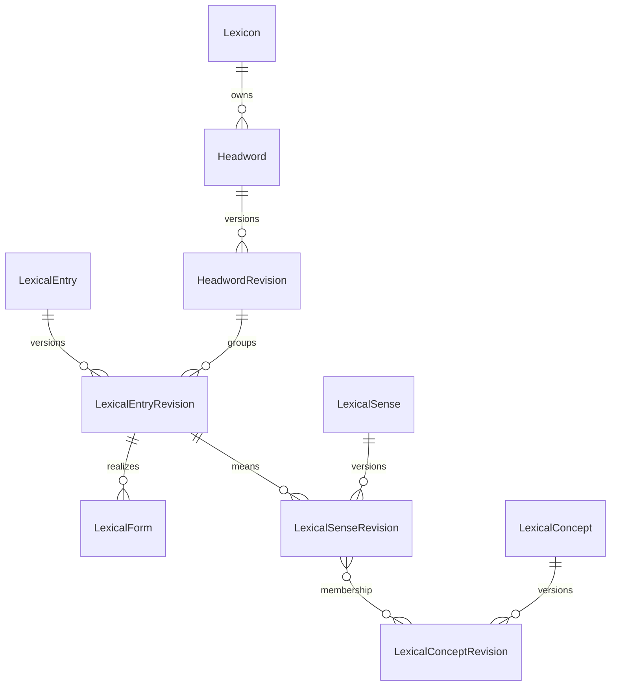

# 最终关系表结构

本章定义目标 PostgreSQL/Prisma 语义。实际 Prisma 文件按领域拆分：表、enum、关系和 Prisma 支持的索引只写在 Prisma Schema；Prisma 无法表达的 deferred constraint trigger、check constraint、expression index、function、role 和 grant 写进 `prisma/invariants.sql` 并有测试。两者由 database installer 从空库顺序加载，不维护 migration history。

## 1. 全局规则

- 主键统一 UUID；外部来源 ID 只进入 external identifier 或 source record。
- 所有时间为 `timestamptz`，所有自然语言文本携带 BCP 47 `languageTag`。
- stable identity 与 release fact 分离。事实表的唯一键和外键包含 `releaseId`。
- money 使用 `numeric` + currency，hash 使用带算法前缀的 lowercase string。
- 仓库自身定义且随代码发布的闭合集合使用 Prisma enum；可独立升级的语言学术语通过 `VocabularyTerm` 外键；source adapter、版本号和外部 actor reference 保持带版本的开放 code，不伪装成数据库 enum。
- 只在算法参数、不可变 raw payload 和版本化 contract 明确允许时使用 JSONB。
- 正式表不允许 unresolved target；未解析数据留在 candidate 表。

## 2. Release 与受控词表

| 表                               | 核心字段                                                                                                                                                                       | 约束与索引                                                                                                                                                                        |
| -------------------------------- | ------------------------------------------------------------------------------------------------------------------------------------------------------------------------------ | --------------------------------------------------------------------------------------------------------------------------------------------------------------------------------- |
| `Lexicon`                        | `id`, `key`, `sourceLanguageTag`, `activeReleaseId`                                                                                                                            | `key` 唯一；active release 必须属于本 Lexicon 且为 VALIDATED                                                                                                                      |
| `LexiconRelease`                 | `id`, `lexiconId`, `version`, `status`, `textProfileId`, `vocabularyBundleId`, `artifactHash`, `canonicalizerVersion`, `createdAt`, `validatedAt`                              | `(lexiconId, version)`、`artifactHash` 唯一；PUBLISHED facts 不可更新                                                                                                             |
| `LexiconReleaseBuildMetadata`    | `releaseId`, artifact/compiler Git/profile/validator/source-manifest 版本，headword/rich-target version+checksum，AI prompt/schema/policy 与 requested/resolved provider/model | `compileProfile` 为 `FIXTURE/PILOT_200/CORE_20000/DEPLOYMENT_CANARY`；`releaseId` 唯一；AI disabled 时全部 AI identity 字段为 null；selection version/checksum 成组为空或成组存在 |
| `LexiconReleaseSourceInput`      | `releaseId`, `sourceDatasetVersionId`, `sourceKey`, `adapter`, `checksum`                                                                                                      | `(releaseId, sourceKey)` 唯一；version/checksum 必须与同 release 的 `SourceDatasetVersion` 一致                                                                                   |
| `LexiconReleaseLearningLanguage` | `releaseId`, `languageTag`, `displayOrder`                                                                                                                                     | `(releaseId, languageTag)` 与 `(releaseId, displayOrder)` 唯一                                                                                                                    |
| `LexiconReleaseActivation`       | `id`, `lexiconId`, `fromReleaseId`, `toReleaseId`, `actorUserId`, `reason`, `createdAt`                                                                                        | append-only；同事务更新 active pointer                                                                                                                                            |
| `TextProcessingProfile`          | Unicode/CLDR/ICU/UCA 版本、normalization、segmentation、locale、collation 配置                                                                                                 | normalization 为 `NFC/NFD/NFKC/NFKD`；Artifact v1 固定 `NFC`；`contentHash` 唯一；profile 不可变                                                                                  |
| `VocabularyBundle`               | `id`, `version`, `contentHash`                                                                                                                                                 | release 固定一个 bundle                                                                                                                                                           |
| `VocabularyNamespaceVersion`     | `bundleId`, `namespaceUri`, `version`, `sourceUri`, `checksum`                                                                                                                 | `(bundleId, namespaceUri)` 唯一                                                                                                                                                   |
| `VocabularyTerm`                 | `namespaceVersionId`, `code`, `uri`, `label`, `deprecated`, `replacedById`                                                                                                     | `(namespaceVersionId, code)` 唯一；正式 code 外键到精确版本                                                                                                                       |

`LexiconRelease.status` 只允许 `DRAFT -> VALIDATING -> VALIDATED -> RETIRED`。激活不是 status，是否在线由 `Lexicon.activeReleaseId` 决定。

## 3. 词典身份主轴



| 表                                                       | 核心字段                                                                                                                              | 约束与索引                                                                                                    |
| -------------------------------------------------------- | ------------------------------------------------------------------------------------------------------------------------------------- | ------------------------------------------------------------------------------------------------------------- |
| `Headword`                                               | `id`, `lexiconId`, `identityKey`, `createdAt`, `retiredAt`                                                                            | `(lexiconId, identityKey)` 唯一；仅是产品检索入口                                                             |
| `HeadwordRevision`                                       | `releaseId`, `headwordId`, `displayText`, `normalizedText`, `searchKey`, `sortKey`                                                    | `(releaseId, headwordId)` 唯一；NFC identity 与 search normalization 分开                                     |
| `LexicalEntry`                                           | `id`, `lexiconId`, `identityKey`                                                                                                      | stable identity；split/merge 不复用 ID                                                                        |
| `LexicalEntryRevision`                                   | `releaseId`, `entryId`, `headwordId`, `entryType`, `partOfSpeechTermId`, `homographNo`, `displayOrder`, `status`                      | 同 release 复合外键到 HeadwordRevision；Entry 至少一个 canonical Form 和 Sense                                |
| `LexicalForm`                                            | `id`, `releaseId`, `entryId`, `formType`, `displayOrder`                                                                              | 同 Entry 每组 feature 只能有一个相同 normalized representation                                                |
| `FormRepresentation`                                     | `id`, `releaseId`, `formId`, `representationType`, `languageTag`, `regionTag`, `scriptTag`, `text`, `normalizedText`, `provenanceId`  | representation type 包括 WRITTEN、PHONETIC、ROMANIZED；IPA 不由无来源 AI 生成                                 |
| `FormFeature`                                            | `releaseId`, `formId`, `featureTermId`, `valueTermId`                                                                                 | `(releaseId, formId, featureTermId)` 唯一；如 Tense=Past、VerbForm=Part                                       |
| `MediaAsset`                                             | `id`, `releaseId`, `mediaType`, `mimeType`, `contentUri`, `contentHash`, `byteLength`, `durationMs`, `rightsPolicyId`, `provenanceId` | 内容寻址；公开 URI/hash/rights 必须可服务且可撤回；v1 主要是 AUDIO                                            |
| `FormMedia`                                              | `releaseId`, `formId`, `mediaAssetId`, `roleTermId`, `regionTag`, `displayOrder`                                                      | 发音音频绑定具体 Form/region；不通过 headword 文本在客户端拼第三方 URL                                        |
| `LexicalSense`                                           | `id`, `lexiconId`, `identityKey`                                                                                                      | stable sense identity                                                                                         |
| `LexicalSenseRevision`                                   | `releaseId`, `senseId`, `entryId`, `parentSenseId`, `displayOrder`, `status`                                                          | parent 必须同 release、同 Entry；递归无环；每 Entry display order 唯一                                        |
| `SenseDefinition`                                        | `id`, `releaseId`, `senseId`, `languageTag`, `definitionType`, `text`, `displayOrder`, `provenanceId`                                 | 同 release Sense 外键；原文定义与学习定义分类型                                                               |
| `SenseTranslationText`                                   | `id`, `releaseId`, `senseId`, `languageTag`, `text`, `registerTermId`, `displayOrder`, `provenanceId`                                 | 允许只有文本而没有目标语言 Sense                                                                              |
| `SenseTranslationRelation`                               | source/target `releaseId`, source/target `senseId`, `relationType`, `provenanceId`                                                    | 两端均复合外键；语言必须不同；方向显式                                                                        |
| `SenseUsage`                                             | `id`, `releaseId`, `senseId`, `usageTypeTermId`, `valueTermId`, `text`, `displayOrder`, `provenanceId`                                | domain、register、region、temporal 等受控类型；value/text 至少一个存在                                        |
| `LexicalConcept`                                         | `id`, `lexiconId`, `identityKey`                                                                                                      | stable Concept/Synset identity                                                                                |
| `LexicalConceptRevision`                                 | `releaseId`, `conceptId`, `conceptType`, `status`                                                                                     | `conceptType` 为 `LOCAL_SENSE/SYNSET`；release-scoped concept facts                                           |
| `SenseConceptMembership`                                 | `releaseId`, `senseId`, `conceptId`, `membershipType`, `canonical`, `provenanceId`                                                    | canonical membership 每 Sense 恰好一个；同 Concept 表示语义等价而非仅近义                                     |
| `ConceptDefinition`                                      | `id`, `releaseId`, `conceptId`, `languageTag`, `text`, `displayOrder`, `provenanceId`                                                 | Concept 级定义可被多个 Sense 复用                                                                             |
| `ExternalIdentifier`                                     | id、typed owner table ID、`namespaceVersionId`, `externalId`, `uri`, `provenanceId`                                                   | 实现时按 Entry/Sense/Concept 分表保持强外键                                                                   |
| typed `EntryLineage` / `SenseLineage` / `ConceptLineage` | effective release、source stable entity、target stable entity、lineageType、provenanceId                                              | 表达 SPLIT_FROM、MERGED_FROM、SUPERSEDES；两端强 FK 且不能同一节点自连；不要求旧 revision 随当前 release 复制 |

`Headword` 不是聚合事实层。它只让搜索、词书、收藏和“学习 bank”拥有稳定入口；详情内容始终从 Entry/Sense 读取。

## 4. 关系、例句和搭配

| 表                     | 核心字段                                                                                           | 约束与索引                                                           |
| ---------------------- | -------------------------------------------------------------------------------------------------- | -------------------------------------------------------------------- |
| `EntryRelation`        | `releaseId`, `sourceEntryId`, `targetEntryId`, `typeTermId`, `provenanceId`                        | 仅 ENTRY 关系，如 ABBREVIATION_OF、VARIANT_OF                        |
| `SenseRelation`        | `releaseId`, `sourceSenseId`, `targetSenseId`, `typeTermId`, `provenanceId`                        | 同义候选、反义、usage-related 等精确到 Sense                         |
| `ConceptRelation`      | `releaseId`, `sourceConceptId`, `targetConceptId`, `typeTermId`, `provenanceId`                    | hypernym、hyponym、meronym 等 Concept 关系                           |
| `ExampleSentence`      | `id`, `releaseId`, `languageTag`, `text`, `normalizedHash`, `qualityStatus`, `provenanceId`        | `(releaseId, languageTag, normalizedHash)` 唯一，可跨 Sense/题目复用 |
| `ExampleTranslation`   | `id`, `releaseId`, `exampleId`, `languageTag`, `text`, `provenanceId`                              | 同一句可有多条翻译                                                   |
| `SenseExample`         | `id`, `releaseId`, `senseId`, `exampleId`, `displayOrder`, `role`, `provenanceId`                  | 例句必须明确 Sense；同义项不重复绑定                                 |
| `ExampleCitation`      | `id`, `exampleId`, `sourceRecordId`, `workTitle`, `location`, `year`, `examType`, `verified`       | 真题标识必须有可验证来源                                             |
| `Collocation`          | `id`, `releaseId`, `languageTag`, `canonicalText`, `normalizedText`, `headEntryId`, `provenanceId` | 可复用 lexical unit，不等同自由 phrase string                        |
| `SenseCollocation`     | `id`, `releaseId`, `senseId`, `collocationId`, `relationType`, `displayOrder`                      | 搭配绑定正确 Sense                                                   |
| `CollocationComponent` | `collocationId`, `position`, `surfaceText`, `roleTermId`, nullable typed Entry/Morpheme target     | 需要分解时给有序组件；固定 slot 不伪造 Entry                         |

对称 relation 只存按 UUID 排序的一条边；非对称 relation 禁止同时生成无证据的逆边。所有 target 删除受 FK 保护。

## 5. Syntax-Semantics

| 表                  | 核心字段                                                                                                      | 约束与索引                                                   |
| ------------------- | ------------------------------------------------------------------------------------------------------------- | ------------------------------------------------------------ |
| `SyntacticFrame`    | `id`, `releaseId`, `entryId`, `frameKey`, `frameTypeTermId`, `languageTag`, `displayTemplate`, `provenanceId` | 属于一个 Entry；template 仅展示                              |
| `SyntacticArgument` | `id`, `releaseId`, `frameId`, `position`, `functionTermId`, `phraseTypeTermId`, `marker`, `optional`          | `(frameId, position)` 唯一                                   |
| `SemanticPredicate` | `id`, `releaseId`, `senseId`, `predicateKey`, `predicateTypeTermId`, `label`, `provenanceId`                  | 属于一个 Sense                                               |
| `SemanticArgument`  | `id`, `releaseId`, `predicateId`, `position`, `roleTermId`                                                    | `(predicateId, position)` 唯一                               |
| `SenseFrame`        | `id`, `releaseId`, `senseId`, `frameId`, `predicateId`, `provenanceId`                                        | Frame 的 Entry 必须是 Sense 所属 Entry                       |
| `ArgumentMapping`   | `senseFrameId`, `syntacticArgumentId`, `semanticArgumentId`                                                   | 两个 argument 必须分别属于同一 SenseFrame 的 frame/predicate |

`prevent <object> from <event-ing>` 的槽位真相来自 arguments 和 mapping，不来自不可校验的 `slots JSON`。

## 6. 形态、构词与词源

| 表                          | 核心字段                                                                                    | 约束与索引                                                                             |
| --------------------------- | ------------------------------------------------------------------------------------------- | -------------------------------------------------------------------------------------- |
| `Morph`, `Morpheme`         | stable identity、language、allomorph group                                                  | 表面片段与抽象语素分开                                                                 |
| `MorphologicalAnalysis`     | `id`, `releaseId`, `formRepresentationId`, `analysisType`, `provenanceId`                   | `analysisType` 为 `INFLECTION/DERIVATIONAL`；分析明确绑定 representation，不只绑定词头 |
| `MorphologicalSegment`      | `analysisId`, `position`, `startOffset`, `endOffset`, `morphId`, `morphemeId`, `roleTermId` | offset 基于 NFC code point/grapheme profile；段不重叠越界                              |
| `InflectionRule`            | stable/versioned rule identity、language、rule code                                         | 规则版本化                                                                             |
| `InflectionGeneration`      | `releaseId`, `entryId`, `baseFormId`, `outputFormId`, `ruleId`, `provenanceId`              | `run -> ran` 是 inflection，不是词族或 synonym                                         |
| `WordFormation`             | `id`, `releaseId`, `targetEntryId`, `formationTypeTermId`, `provenanceId`                   | 一条 n-ary 构词分析只有一个 target                                                     |
| `WordFormationInput`        | `formationId`, `inputEntryId`/`morphemeId`, `position`, `roleTermId`                        | 有序 input；每行 XOR Entry/Morpheme                                                    |
| `WordFormationRule`         | stable/versioned rule identity                                                              | derivation/compound rule                                                               |
| `WordFormationApplication`  | `formationId`, `ruleId`, `stepOrder`                                                        | 多步分析显式排序                                                                       |
| `EtymologyHypothesis`       | `id`, `releaseId`, `subjectEntryId`, `hypothesisType`, `status`, `provenanceId`             | 可保留竞争假说，不允许无来源 AI 正式发布                                               |
| `EtymologyLink`             | `hypothesisId`, source/target typed Entry/Etymon, `linkType`, `position`                    | 历时端点与现代 Entry 分型；支持跨语言固定 release                                      |
| `Etymon` / `EtymonRevision` | historical/reconstructed form、language、period                                             | 重建形式不是现代 LexicalEntry                                                          |

过去分词解析结果保存在 candidate 决策中，正式投影只有四种结果：`INFLECTED_ONLY` 只建 Form；`INDEPENDENT_ONLY` 只建 Entry；`BOTH` 两者都建并以 relation 连接；`UNRESOLVED` 不 promotion。

## 7. 语料与频率

| 表                                      | 核心字段                                                                                                         | 约束与索引                                      |
| --------------------------------------- | ---------------------------------------------------------------------------------------------------------------- | ----------------------------------------------- |
| `CorpusDataset`, `CorpusDatasetVersion` | key、版本、语言、规模、unit、checksum、rights                                                                    | dataset version 不可变                          |
| `FrequencyObservation`                  | corpusVersionId、typed Entry/Form/Sense target、count、normalizedFrequency、rank、algorithmVersion、provenanceId | 按 target 类型分表；一个 rank 不覆盖另一 corpus |
| `Attestation`                           | corpusVersionId、typed target、documentRef、offset、surfaceText、provenanceId                                    | offset unit/profile 显式                        |
| `CollocationObservation`                | corpusVersionId、collocationId、measureTermId、score、window、algorithmVersion                                   | PMI/t-score 等不能共用无类型 score              |

## 8. 来源与构建运行

| 表                          | 核心字段                                                                                                                                                            | 约束与索引                                                                                                                    |
| --------------------------- | ------------------------------------------------------------------------------------------------------------------------------------------------------------------- | ----------------------------------------------------------------------------------------------------------------------------- |
| `SourceDataset`             | id、key、title、owner、created/retired time                                                                                                                         | stable registry identity；不把一次下载当 dataset                                                                              |
| `SourceDatasetVersion`      | datasetId、version、URI、checksum、byte/record count、acquiredAt、parser/version、validation status、rightsDecisionId                                               | immutable；只有 VALIDATED version 可进入 BuildRun                                                                             |
| `SourceRecord`              | datasetVersionId、sourceKey、sourceOrder、rawPayloadHash、rawPayloadUri/JSONB                                                                                       | `(datasetVersionId, sourceKey)` 唯一                                                                                          |
| `RightsDecision`            | sourceDatasetVersionId、policyVersion、mayBuild/mayServe/mayExport、attribution、restrictions、decidedBy、effectiveAt、actionDigest                                 | versioned、append-only；无 typed evidence 不得为允许                                                                          |
| `RightsDecisionEvidence`    | rightsDecisionId + sourceDatasetVersionId、evidenceKind、referenceUri、contentHash、capturedAt、note                                                                | 复合 FK 固定同一 source version；kind 为 LICENSE_TEXT/TERMS_OF_USE/OWNER_PERMISSION/LEGAL_REVIEW/POLICY_DOCUMENT；append-only |
| `SourceRightsPolicy`        | sourceDatasetVersionId、rightsDecisionId、mayBuild/mayServe/mayExport、requiresAttribution、attribution、effective window、policyVersion、contentHash               | Artifact/Release 固定的治理快照；由有效 RightsDecision materialize，不能替代原决定                                            |
| `SourceRestrictionEvent`    | sourceDatasetVersionId/policyId、kind、reason、evidence ref、effectiveAt、createdBy、actionDigest                                                                   | kind 为 `BLOCK_BUILD/BLOCK_SERVE/BLOCK_EXPORT`；append-only；影响新 activation/serving/export，不改写历史 Artifact            |
| `SourceRemovalDecision`     | sourceDatasetVersionId、impactArtifactId、affectedRelease/user counts、reason、approvalId、createdAt                                                                | 要求 LEXICON_OPERATOR + RELEASE_MANAGER；不直接删除已发布事实                                                                 |
| `BuildRun`                  | mode、source version/profile/route/credential/budget/code/schema refs、inputManifestHash、pilotEvidenceRunId?、status、Artifact/report refs、created/completed time | PILOT/FULL；FULL 必须引用相同输入闭包的成功 pilot evidence                                                                    |
| `Candidate`                 | buildRunId、candidateKey、taskType、currentRevisionId、riskClass、status                                                                                            | `(buildRunId, candidateKey)` 唯一；stable review identity                                                                     |
| `CandidateRevision`         | candidateId、revisionNo、schemaVersion、payload、contentHash、服务端派生 evidenceSetHash、validationSummary、createdBy、reason、createdAt                           | immutable；新 revision 使旧 review/WARN acceptance 失效                                                                       |
| `CandidateRevisionEvidence` | candidateRevisionId、evidenceKind、sourceRecordId XOR upstreamProvenanceId、note                                                                                    | 至少一条；exact-one typed target；source 必须可 build，上游正式 provenance 必须 source-backed；append-only                    |
| `CandidatePromotionMap`     | candidateId、candidateRevisionId、localId、entityType、finalId                                                                                                      | retry 复用同一 mapping；只提升已批准 revision                                                                                 |
| `ValidationIssue`           | run/release/candidateRevision target、severity、ruleCode、message、evidence                                                                                         | ruleCode 受控；ERROR 阻止发布且不可 override                                                                                  |
| `ReviewBatch/Item/Decision` | riskPolicyVersion、candidateRevision set hash、sample plan、queue kind、operator decision、failure rate、reason、actionDigest                                       | high-risk/conflict/answer 100%；low-risk deterministic sample                                                                 |

## 9. 内容质量与适用性

| 表                                      | 核心字段                                                                                                         | 约束与索引                                                                        |
| --------------------------------------- | ---------------------------------------------------------------------------------------------------------------- | --------------------------------------------------------------------------------- |
| `ContentProfile`                        | `id`, `key`, `targetKind`, `createdAt`, `retiredAt`                                                              | stable profile identity，如 LEXICON_PUBLISHABLE/LEARNER_CORE/STUDY_READY          |
| `ContentProfileVersion`                 | `id`, `profileId`, `version`, `ruleSchemaVersion`, `rulesHash`, `rules`, `createdAt`                             | immutable；rules 是通过版本 schema 的构建 contract JSON，不由 API 任意解释        |
| `ContentProfileEvaluation`              | `id`, `releaseId`, `profileVersionId`, `status`, `summaryHash`, `evaluatedAt`, `validatorVersion`                | status 为 PRESENT/MISSING/NOT_APPLICABLE/REJECTED；同 target/profile/release 唯一 |
| typed `ContentProfileEvaluation*Target` | evaluation + Headword/Entry/Form/Sense/Concept/LearningObjective/PedagogicalMaterial/Exercise/BookEdition target | 每 evaluation 恰好一个强 FK target；禁止通用 polymorphic ID                       |
| `ContentRequirementEvaluation`          | `evaluationId`, `requirementCode`, `status`, `reasonCode`, `evidenceCount`, `detailsHash`                        | `(evaluationId, requirementCode)` 唯一；无空文本占位                              |

`PRESENT` 表示该 profile requirement 已被可靠事实满足，不表示“某来源字段非空”；`NOT_APPLICABLE` 必须由 versioned rule 给出 reason。API 从这些表投影 completeness，不在请求时临时猜测。

## 10. 词书与能力等级

| 表                                           | 核心字段                                                                          | 约束与索引                                                           |
| -------------------------------------------- | --------------------------------------------------------------------------------- | -------------------------------------------------------------------- |
| `VocabularyBook`                             | id、lexiconId、key、languageTag、title、publisherKey                              | `(lexiconId, key)` stable product identity                           |
| `VocabularyBookEdition`                      | id、bookId、editionKey、version、sourceDatasetVersionId、contentHash、publishedAt | 发布后 item/顺序不可变；相同 contentHash 可跨 release 复用           |
| `LexiconReleaseBookEdition`                  | releaseId、bookEditionId                                                          | `(releaseId, bookEditionId)` 唯一；定义该 release 原子包含的 edition |
| `VocabularyBookItem`                         | id、editionId、rank、provenanceId                                                 | `(editionId, rank)` 唯一；本表不放 polymorphic FK                    |
| typed `VocabularyBookItem*Target`            | itemId + Headword 或 LexicalEntry ID                                              | 两张 target 表恰好一行；Multiword 是 Entry                           |
| `ProficiencyFramework` / `Version` / `Level` | framework key、version、namespace、level code/order、sourceDatasetVersionId       | CEFR 与考试词表严格分开，必须可追到来源                              |
| typed `ProficiencyClaim`                     | releaseId、Headword/Entry/Sense ID、levelId、`SOURCE_ASSERTED`、provenanceId      | 按粒度分三表；不得由答题表现或 AI 推断                               |

## 11. 学习目标、题库与用户状态

完整行为见 [学习、题库与测试](../product/learning-assessment.md)。核心表如下：

| 表组                                                                                          | 作用                                                                                            |
| --------------------------------------------------------------------------------------------- | ----------------------------------------------------------------------------------------------- |
| `LearningObjective`, `LearningObjectiveRevision`, 五类 `LearningObjective*Subject`            | 稳定学习目标、knowledge facet、接受/产出方向、同 release typed subject；不存题面/答案           |
| `PedagogicalMaterial`, revision、七类 typed target、typed block/mention/citation 表           | 可独立消费的讲解、构词说明、文化背景、助记和微故事；解释正式事实但不成为词典证据                |
| `AssessmentStimulus`, `AssessmentStimulusRevision`, typed stimulus block/ref 表               | 多题可复用的 passage、例句、教学材料引用和语境；与题干分开版本化                                |
| `ExerciseItem`, `ExerciseRevision`, typed response-config/choice/correct-response/feedback 表 | 可复用且不可变的题目内容；含 NO_CAPTURE reveal/self-report；task/evidence/response/grading 分开 |
| `AssessmentBlueprint`, `AssessmentBlueprintRevision`, `AssessmentSection`, selection rule 表  | 按 facet/direction/task/evidence/response/difficulty/scope 组织动态组卷规则                     |
| `ExerciseAttempt` 及 typed presented/selected/text 表                                         | 学习和测试共用的实际呈现、作答和服务端评分事实；终态不可变                                      |
| `AssessmentSession`, `AssessmentSessionItem`, `AssessmentResult`                              | 某次正式测试的固定题目快照与聚合结果                                                            |
| `FSRSParameterSet`, `UserObjectiveMemoryState`, `ReviewEvent`, `ReviewStateSnapshot`          | 参数快照、当前状态和可重放事件                                                                  |
| `UserBookEnrollment`, `DailyStudyPlan`, `DailyStudyPlanItem`                                  | 固定 book edition、每日 typed objective 计划，不存 word ID JSON 数组                            |
| `Notebook`, `CollectedLexicalItem/Revision`, typed revision target 表                         | 用户收藏容器、stable item 与 immutable revision；不复制学习状态                                 |

用户侧关键字段：

| 表                                    | 核心字段                                                                                                                                                                                                                            | 约束与索引                                                                                                      |
| ------------------------------------- | ----------------------------------------------------------------------------------------------------------------------------------------------------------------------------------------------------------------------------------- | --------------------------------------------------------------------------------------------------------------- |
| `UserBookEnrollment`                  | `id`, `userId`, `bookEditionId`, `status`, `dailyNewLimit`, `dailyReviewLimit`, `timezone`, `startedAt`, `endedAt`                                                                                                                  | 同一 user/book 只允许一个 ACTIVE；edition 不随 latest 漂移                                                      |
| `DailyStudyPlan`                      | `id`, `userId`, `enrollmentId`, `localDate`, `timezone`, `status`, `createdAt`, `completedAt`                                                                                                                                       | `(userId, localDate, enrollmentId)` 唯一；localDate 与 IANA timezone 同存                                       |
| `DailyStudyPlanItem`                  | `id`, `planId`, `objectiveId`, `learningObjectiveRevisionId`, `itemKind`, `position`, `status`, `completedAt`                                                                                                                       | `(planId, position)`、`(planId, objectiveId)` 唯一；NEW/REVIEW typed row，不存 ID JSON                          |
| `FSRSParameterSet`                    | `id`, `algorithmVersion`, `parameters`, `desiredRetention`, `maximumInterval`, `contentHash`, `createdAt`                                                                                                                           | immutable；parameters 通过版本 schema；独立于 lexicon release                                                   |
| `UserObjectiveMemoryState`            | `id`, `userId`, `releaseId`, `objectiveId`, `objectiveRevisionId`, `dueAt`, `fsrsState`, `stability`, `difficulty`, `elapsedDays`, `scheduledDays`, `reviewCount`, `lapseCount`, `lastReviewedAt`, `version`                        | `(userId, objectiveId)` 唯一；`(releaseId, objectiveId, objectiveRevisionId)` 精确复合 FK；当前快照可由事件重放 |
| `ExerciseAttempt`                     | `id`, `userId`, `exerciseRevisionId`, `contextKind`, `dailyPlanItemId?`, `assessmentSessionItemId?`, `attemptNo`, `status`, `outcome`, `score`, `maxScore`, hint/reveal/input/duration/scoring/idempotency/presented/submitted time | STUDY/ASSESSMENT context XOR；PRESENTED 单向终结且终态不可变；同 context attemptNo 唯一                         |
| typed `ExerciseAttempt*`              | presented/selected choices、可选或必填加密文本、self report + key/retention/consent                                                                                                                                                 | 选择属于同 revision；捕获文本必须加密；NO_CAPTURE 只写 self report，不建 text/audio row                         |
| `ReviewEvent` / `ReviewStateSnapshot` | memoryStateId、attemptId、learningObjectiveRevisionId、parameterSetId、schedulerVersion、rating/time + before/after state                                                                                                           | 只引用 STUDY attempt；correctness 与 FSRS rating 分开                                                           |
| `Notebook`                            | `id`, `userId`, `name`, `description`, `isDefault`, `sortOrder`, `retiredAt`, `createdAt`, `updatedAt`                                                                                                                              | active name/default partial unique；退役后立即从产品查询隐藏；不经 UserLearning umbrella                        |
| `CollectedLexicalItem`                | `id`, `notebookId`, `currentRevisionId`, `position`, `addedAt`, `retiredAt`                                                                                                                                                         | stable identity；`(notebookId, position)` 唯一；不存 isLearned/reviewCount                                      |
| `CollectedLexicalItemRevision`        | `id`, `collectedItemId`, `revisionNo`, `source: USER\|AGENT`, `context`, `note`, `tags`, `contentHash`, `createdBy`, `createdAt`                                                                                                    | immutable；currentRevision 必须属于同 item；SupportGrant 固定 revision                                          |
| typed `CollectedRevision*Target`      | `revisionId`、Headword/Entry/Sense/Collocation target                                                                                                                                                                               | deferred constraint trigger 保证每 revision 恰好一个 target；复合 FK 保证 current revision 属于 stable item     |

## 12. Identity 与独立 User

每个 User 同时是认证与学习主体；凭据、会话、同意和运营角色分表，但不得创建第二个 learner identity：

| 表组                      | 核心字段与约束                                                                                                                                                                                                                                                                                                                                                     |
| ------------------------- | ------------------------------------------------------------------------------------------------------------------------------------------------------------------------------------------------------------------------------------------------------------------------------------------------------------------------------------------------------------------ |
| `User`                    | id、status、displayName、timezone、securityVersion、created/disabled time；所有产品事实的 owner                                                                                                                                                                                                                                                                    |
| `UserEmail`               | userId、normalizedEmail、displayEmail、verifiedAt、isPrimary；normalizedEmail 唯一                                                                                                                                                                                                                                                                                 |
| `PasswordCredential`      | userId、hash、algorithm、parameters、changedAt；Argon2id，禁止可逆密码                                                                                                                                                                                                                                                                                             |
| `VerificationChallenge`   | purpose、destinationHash、codeHash、expires/consumed time、attemptCount；不存明文 code                                                                                                                                                                                                                                                                             |
| `AuthenticationChallenge` | userId、audience、deviceNonceHash、allowedMfaKinds、passwordVerifiedAt、expires/consumed time、attemptCount；ADMIN 登录/re-auth 一次性 challenge                                                                                                                                                                                                                   |
| `MfaCredential`           | id、userId、kind、status、label、verifiedAt、lastUsedAt、disabledAt                                                                                                                                                                                                                                                                                                |
| `WebAuthnCredential`      | mfaCredentialId、credentialId、publicKey、signCount、aaguid、transports                                                                                                                                                                                                                                                                                            |
| `TotpCredential`          | mfaCredentialId、secretCiphertext、keyVersion、algorithm、digits、period                                                                                                                                                                                                                                                                                           |
| `MfaRecoveryCode`         | mfaCredentialId、codeHash、usedAt；单次使用且不可恢复明文                                                                                                                                                                                                                                                                                                          |
| `AuthSession`             | userId、tokenHash、csrfTokenHash、audience、authStrength、securityVersion、mfaAuthenticatedAt、reAuthenticatedAt、device label、expires/idle/revoked/lastSeen；tokenHash 唯一                                                                                                                                                                                      |
| `ConsentRecord`           | userId、purpose、categories、policyVersion、decision、occurredAt；append-only                                                                                                                                                                                                                                                                                      |
| `SupportGrant`            | id、userId、supportUserId、resourceKind、resourceId、resourceRevisionId、purpose、createdAt、expiresAt、revokedAt、actionDigest；默认 2h、最长 24h；禁止通配；每次读取在线校验                                                                                                                                                                                     |
| `ServicePrincipal/Key`    | serviceId、audience allowlist、publicKey、keyId、valid/revoked time；内部应用用 Ed25519 private_key_jwt 换短期 grant                                                                                                                                                                                                                                               |
| `OperatorRoleAssignment`  | userId、role、source、grantedByUserId、reason、policyVersion、granted/expires time、revokedByUserId/revocationReason/revokedAt、actionDigest；七角色固定、可组合，不用 `isAdmin`；普通 grant 默认 90d/max 1y；active assignment 要求 exact typed VERIFIED MFA，self-change/最后 SECURITY_ADMIN 移除受 deferred guard 阻止；密码/MFA/角色安全变化撤销 ADMIN session |
| `OperatorBootstrapState`  | singleton key、operatorUserId、completedAt、actionDigest；零 RoleAssignment 时单次消费，bootstrap 七条 assignment 长期有效                                                                                                                                                                                                                                         |
| `UserSecurityLock`        | userId、reasonCode、createdByUserId、createdAt、releasedByUserId、releasedAt、actionDigest；append-only decision + current projection                                                                                                                                                                                                                              |
| `SecurityAuditEvent`      | category/action、actorUserId/session/role、target ref/revision、result、reasonCode、request/correlation/deployment ID、policy/action/before/after digest、occurredAt；append-only                                                                                                                                                                                  |
| `DataAccessAuditEvent`    | actorUserId、ownerUserId、supportGrantId、resource kind/id/revision、purpose、result、requestId、occurredAt；append-only                                                                                                                                                                                                                                           |
| `AuditRetentionPolicy`    | category、online/archive duration、policyVersion、effectiveAt、createdBy、actionDigest；versioned；默认 security 2y+5y、data access 1y+1y                                                                                                                                                                                                                          |
| `AuditArchive`            | category/time range、policyVersion、objectRef、eventCount、contentHash、encryption version、createdAt、purgedAt；content-addressed encrypted artifact                                                                                                                                                                                                              |
| `LegalHold`               | typed audit scope、reason/reference、createdBy、createdAt、reviewAt、releasedBy/At、actionDigest；有效期间阻止 retention purge                                                                                                                                                                                                                                     |
| `AuditExport`             | querySnapshot、requestedBy、reason、Job/artifact ref、eventCount、contentHash、expiresAt；NDJSON.zst、download URL 最长 24h                                                                                                                                                                                                                                        |

详细行为见 [身份与独立用户](../product/identity-user.md)。

## 13. Reading Core 与内容 Experience

| 表组                             | 核心字段与约束                                                                                                                                                                                   |
| -------------------------------- | ------------------------------------------------------------------------------------------------------------------------------------------------------------------------------------------------ |
| `DocumentOrigin`                 | kind、sourceKey、rightsPolicy、retentionPolicy、attribution；source-specific config 不混入正文                                                                                                   |
| `ReadingDocument`                | originId、ownerUserId?、externalKey?、currentRevisionId、status、visibility、createdAt、retiredAt；`(originId, externalKey)` unique；current revision 复合 FK 回本 document                      |
| `ReadingDocumentRevision`        | documentId、revisionNo、languageTag、title、contentCiphertext、keyVersion、contentHash、wordCount、publishedAt；immutable                                                                        |
| typed `ReadingOriginMetadata*`   | Reddit post/comment、AI generation、user-authored metadata；按 origin kind 强 FK 拆表                                                                                                            |
| `LexicalAnnotation` + selector   | revisionId + revisionContentHash、UTF-16 position、NFC exact/prefix/suffix hash + context length、releaseId、confidence；selector 必须在固定 revision 中成立                                     |
| typed `LexicalAnnotation*Target` | Headword/Entry/Sense/Collocation/Objective target；恰好一个                                                                                                                                      |
| `ReadingActivity`                | userId、documentId、revisionId、kind、position/progress/learnedWordCount/totalReadSeconds、eventVersion、occurredAt；append-only，严格顺序                                                       |
| `ReadingProgress`                | userId、documentId、revisionId、单调 progress/position/count/time、eventVersion、startedAt、lastReadAt、completedAt；deferred trigger 从 Activity 精确重建                                       |
| `ReadingCollection/Item`         | collection: userId/identityKey/title；item: userId、collectionId、documentId、note、tags、createdAt；owner 复合 FK，同 user/document 唯一                                                        |
| `ReadingTarget`                  | userId、documentId、revisionId、releaseId、annotationId、objectiveRevisionId、policyVersion、rank、reason；复合 FK 固定 revision + annotation + Objective；deferred guard 要求 exact User memory |
| `ExternalSourceSubscription`     | userId、originId、externalCollectionKey、settings；Reddit subreddit 等来源订阅                                                                                                                   |

Reddit、AI 阅读和未来来源保留独立 metadata 与页面；阅读进度、查词、收藏和学习目标使用统一 Reading Core，详见 [Reading Core 与独立内容体验](../product/reading-experiences.md)。

## 14. Learning Agent 与私人内容

| 表组                                           | 核心字段与约束                                                                                                                                                                                                                                                                                             |
| ---------------------------------------------- | ---------------------------------------------------------------------------------------------------------------------------------------------------------------------------------------------------------------------------------------------------------------------------------------------------------- |
| `AgentSession`                                 | id、userId、title、status、nextMessageSequence、created/archived/deleted time；同 User 强 FK；可有多个 QUEUED Root Run，至多一个 RUNNING/WAITING Root Run                                                                                                                                                  |
| `AgentMessage`                                 | id、sessionId、runId?、role、sequence、visibility、supersedesMessageId?、createdAt；`(sessionId, sequence)` 唯一，append-only envelope，不直接保存正文；lifecycle 由 Event/Block projection 计算                                                                                                           |
| `AgentMessageBlock`                            | id、messageId、parentBlockId?、position、stepId?、modelPosition?、modelSubPosition?、kind、schemaVersion、status、created/sealed time；同 parent position 唯一、同 Message parent、防 cycle/深度/数量上限；sealed/interrupted 后不可变                                                                     |
| typed Message Block payload 表                 | RichText、Code、Equation、Table/Row/Cell 与 Divider；每个 base Block 恰好一个匹配 kind 的 typed child，文本/代码/table cell 只引用 Gateway `ModelContentBody`                                                                                                                                              |
| typed Message Block reference 表               | AgentToolCall、AgentArtifactRevision、AgentProposal、AgentPlanRevision、AgentWaitCondition、ContentAssetRevision、Notice；每个 reference 强 FK 到同 User/Session/Run 可见对象，不使用 polymorphic type/id 或任意 JSON                                                                                      |
| `AgentRun`                                     | id、sessionId、parentRunId?、rootRunId、goalContentBodyId、capabilityReleaseId、providerRouteReleaseId、credentialRevisionId、status、queued/started/waited/completed time；每 Session 至多一个 RUNNING/WAITING Root Run                                                                                   |
| `AgentPlan/Revision`                           | runId、executionMode、currentRevisionId；revision 存 immutable visible steps、contentHash、createdBy 和 supersedesRevisionId；WORKFLOW/AGENT_LOOP 必须存在                                                                                                                                                 |
| `AgentWaitCondition`                           | runId、kind、status、correlationKey?、expiresAt?、satisfied/cancelled time、resultRef；一个 Run 最多一个 ACTIVE wait                                                                                                                                                                                       |
| `AgentEvent`                                   | runId、sessionId、sequence、type、safePayload、occurredAt；`(sessionId, sequence)` 唯一且由 Session 高水位分配，append-only，SSE cursor 而非完整 event sourcing                                                                                                                                            |
| `AgentRunStep`                                 | runId、ordinal、modelInvocationId、status、finishReason?、assistantContentBodyId?、started/completed time；`(runId, ordinal)` 与 modelInvocationId 唯一                                                                                                                                                    |
| `AgentToolCall`                                | stepId、modelPosition、providerCallId?、toolKey/schemaVersion/toolReleaseId、inputHash/actionDigest、grantId、sideEffectClass、concurrencyMode、status、resultRef/errorCode、queued/started/completed time；`(stepId, modelPosition)` 唯一，providerCallId 在 Step 内唯一；不保存 secret/raw provider body |
| `AgentProposal`                                | runId、commandType/version、targetRef、payloadContentBodyId、actionDigest、riskClass、`PENDING/COMMITTING/REJECTED/EXPIRED/COMMITTED/FAILED`、expiresAt、commitAttemptId/lease、committedResultRef；批准、Grant、fencing 与幂等记录绑定 digest                                                             |
| `AgentToolGrant`                               | userId/sessionId/runId?、toolKey/resourceScope、sideEffectClass、maxCalls、expires/revoked time、issuedBy；scope 和 expiry 强制                                                                                                                                                                            |
| `AgentArtifact/Revision`                       | owner userId、kind、title、currentRevisionId；revision 存 immutable contentBodyId/object ref、schemaVersion、contentHash、source refs                                                                                                                                                                      |
| `AgentMemoryCard`                              | userId、subject、claimContentBodyId、confidence、visibility、source refs、created/updated time；User 可查看和纠正                                                                                                                                                                                          |
| `MemorySuppression`                            | userId、memoryCardId、reason、createdAt；append-only，有效 suppression 阻止召回                                                                                                                                                                                                                            |
| `ContextSnapshot`                              | runId、snapshotVersion、tokenBudget、contentHash、createdAt；typed message/memory/objective/sense/document/artifact refs 固定本次输入                                                                                                                                                                      |
| `CapabilityRelease`                            | capabilityKey、version、executionMode、promptHash、toolPolicyVersion、input/output schema version、allowedRouteReleaseIds、status；发布后不可变                                                                                                                                                            |
| `ToolRelease` / `SkillRelease` / `EvalRelease` | stable key、immutable version/digest、schema/Markdown/eval suite ref、status 和 release evidence；Tool implementation/schema 只由 Git+CI 发布                                                                                                                                                              |
| `AgentReleasePromotion/SecurityEvent`          | releaseId、environment、kind、previousReleaseId?、actor/service、reason、policy/action digest、occurredAt；promotion/rollback/revoke/restore append-only                                                                                                                                                   |
| `DiagnosticBundle/Revision`                    | ownerUserId、selected typed refs、redactionPolicyVersion、currentRevisionId；revision 存 User 可预览/编辑的 immutable redacted payload、contentHash、status 和 confirmedAt；确认会新建 revision，confirmedFromRevisionId 复合 FK 固定来源 draft、bundle 与 contentHash                                     |
| `LexiconGapReport`                             | normalized target、languageTag、first/last reporter、reportCount、sample artifact ref、`OPEN/CANDIDATE_ACCEPTED/DISMISSED/RESOLVED` status；按稳定 dedupe key 唯一                                                                                                                                         |

AgentRun 状态为 `QUEUED | RUNNING | WAITING | SUCCEEDED | FAILED | CANCELLED`；AgentRunStep 状态为 `STREAMING | TOOL_EXECUTION | WAITING | COMPLETED | FAILED | CANCELLED | UNKNOWN_OUTCOME`；AgentToolCall 状态为 `PROPOSED | APPROVED | QUEUED | RUNNING | SUCCEEDED | FAILED | REJECTED | CANCELLED | UNKNOWN_OUTCOME`，并发模式为 `PARALLEL_SAFE | EXCLUSIVE`。WaitCondition 为 `APPROVAL | USER_INPUT | CHILD_RUN | EXTERNAL_EVENT`。ChildRun 默认禁用；被 CapabilityRelease 允许时，每个 Root 最多三个，深度只能为 1。AgentEvent 负责时间线，关系表负责当前真相，而且只能由 Agent API 创建。

`actionDigest` 只绑定调用内容和批准，不是调用 identity，也不允许 `unique(runId, actionDigest)`。每个 AgentRunStep 恰好关联一个 ModelInvocation；每个被接受的 ToolCall 恰好产生一个终态结果。Tool body 可以乱序完成，但关系提交和传给下一 ModelInvocation 的结果固定按 `modelPosition` 排序。

Message Block kind 固定为 `PARAGRAPH | HEADING | LIST_ITEM | QUOTE | CALLOUT | CODE | EQUATION | TABLE | DIVIDER | TOOL_CALL | ARTIFACT | PROPOSAL | PLAN | WAIT_CONDITION | ASSET | NOTICE`，状态固定为 `STREAMING | SEALED | INTERRUPTED`。只有 `LIST_ITEM | QUOTE | CALLOUT` 可拥有 children；每条 Message 最深 6 层、最多 256 个 Block。模型输出额外保存 `stepId + modelPosition`，ToolCall 状态变化只更新被引用的关系 truth 和 Event，不创建重复 Block。完整契约见 [Agent 会话 Block](../architecture/agent-conversation-blocks.md)。

User 内容保留至删除；删除后立即从产品 projection 隐藏，并以 retention queue 在 30 天内 hard purge。完整聊天不进入通用搜索索引，隐藏 chain-of-thought 不持久化。详见 [Learning Agent 系统架构](../architecture/learning-agent-system.md)。

## 15. Model Execution、正文与文件

| 表组                            | 核心字段与约束                                                                                                                                                                              |
| ------------------------------- | ------------------------------------------------------------------------------------------------------------------------------------------------------------------------------------------- |
| `ProviderRouteRelease`          | providerKey、modelId、endpointClass、capabilities、adapter/pricing/policy version、releaseDigest、status projection；Git+CI/Eval 发布后不可变                                               |
| `ProviderRouteSecurityEvent`    | routeReleaseId、kind、reason、actor、actionDigest、occurredAt；REVOKE/RESTORE append-only，restore 要求 MODEL_OPERATOR + SECURITY_ADMIN                                                     |
| `CredentialProfile`             | ownerKind、ownerUserId?、providerKey、label、status、currentRevisionId；`PLATFORM/USER` 与 ownerUserId 严格 XOR                                                                             |
| `CredentialRevision`            | profileId、credentialType、ciphertext/nonce/tag、encryptedDek、kekVersion、aadSchemaVersion、fingerprint/version、maskedHint、metadata、validated/expires/revoked time；immutable           |
| `CredentialSecurityEvent`       | profile/revisionId、kind、reason、actor、actionDigest、occurredAt；SECURITY_ADMIN 可 QUARANTINE，RESTORE 要求 MODEL_OPERATOR + SECURITY_ADMIN                                               |
| `ModelExecutionPermit`          | caller/purpose、typed owner ref、routeReleaseId、credentialRevisionId、operation、inputDigest、token/cost limits、retentionMode、expires/status；配合 caller service grant 一次性原子 claim |
| `ModelInvocation`               | permitId、purpose/owner ref、routeReleaseId、credentialRevisionId、inputDigest、responseId、status、汇总 tokens/cost/latency、errorClass、idempotencyKey；一次逻辑调用，不存 key/raw body   |
| `ModelInvocationAttempt`        | invocationId、ordinal、providerRequestId?、status、retryReason/errorClass、tokens/cost/latency、started/completed time；`(invocationId, ordinal)` 唯一，一次实际 transport 尝试             |
| `ModelContentBody`              | ownerKind、ownerUserId?、purpose、ciphertext/nonce/tag、encryptedDek、kekVersion、contentHash、visibility、retentionClass、hidden/purge time；USER/SYSTEM owner XOR，正文唯一加密 owner     |
| `ModelContentFragment`          | bodyId、invocationId、modelPosition、modelSubPosition、fragmentSequence、ciphertext/nonce/tag、fragmentHash、byteLength、createdAt；四元顺序键、append-only、幂等，body seal 后禁止追加     |
| `ModelExchange/Part`            | invocationId、sequence、role/kind、contentBodyId?/assetRevisionId?、normalized metadata、retentionClass、hidden/purge time；不保存 hidden reasoning/raw provider body                       |
| `ModelUsageLedger`              | userId?、purpose、credentialOwnerKind、reservation/settlement/correction、units/cost、idempotencyKey、occurredAt；append-only                                                               |
| `BudgetPolicy/QuotaPolicy`      | scope、capability/purpose、limits/window、policyVersion、effectiveAt、createdBy、actionDigest；immutable version，当前 pointer 单独保存                                                     |
| `ProviderHealthObservation`     | routeReleaseId、probeKind、status、latency/error/rate-limit metadata、observedAt；不能改变已固定 Run                                                                                        |
| `ContentAsset`                  | id、ownerUserId、purpose、status、currentRevisionId、created/hidden/deleted time；User owner 强 FK                                                                                          |
| `UploadIntent`                  | assetId、ownerUserId、purpose、expected size/hash/type、quarantineObjectRef、expires/finalized time、status；短期、单次 finalize                                                            |
| `ContentAssetRevision`          | assetId、revisionNo、filename、declared/detected MIME、size/checksum、objectRef/version、scanner/parser versions、status、createdAt；immutable，历史引用固定 revision                       |
| `AssetProcessingRun/Derivative` | revisionId、Job ref、kind、status、input/output hash、tool/model/chunk policy version、object/content/vector ref；同输入+policy 幂等                                                        |
| `ContentDeletionRequest`        | asset/body/exchange typed target、requestedBy、hiddenAt、purgeAfter、status、attempt evidence；立即隐藏、30 天内 purge                                                                      |

基础聊天保留 User message 与最终回答；只有显式 consent 才保存 optional normalized exchange part。撤回后立即隐藏 optional part 并在 30 天内删除。所有文件先进入 quarantine，通过 malware/type/structure validation 后才能产生 clean revision。详见 [Model Gateway](../architecture/model-gateway.md)、[凭证管理](../architecture/credential-management.md) 与 [文件和模型交换](../architecture/agent-files-and-exchanges.md)。

Provider transport retry 始终在同一 `ModelInvocation` 下追加 `ModelInvocationAttempt`，保持 permit、route、credential revision、input digest、AgentRunStep 与 Message/Block identity 不变。只有前一 attempt 未产生 accepted normalized block、visible fragment、tool call 或 usage 时才允许自动 retry；v1 不续传已开始的 Provider stream。切换 route/credential、User 主动 retry 或将工具结果交回模型后的下一次逻辑决策必须创建新流程或新 Step，不能伪装成 transport attempt。

## 16. Job、Outbox、审批与发布运维

| 表组                              | 核心字段与约束                                                                                                                                                                                                   |
| --------------------------------- | ---------------------------------------------------------------------------------------------------------------------------------------------------------------------------------------------------------------- |
| `Job`                             | id、kind、ownerType/ownerId、status、inputRef/inputHash、resultRef?、idempotencyKey、priority、nextAttemptAt、cancelRequestedAt、errorCode、supersedesJobId?、created/started/completed time；terminal immutable |
| `JobAttempt`                      | jobId、attemptNumber、handler/schema version、leaseOwner/token/expires、heartbeatAt、fencingToken、status、failureClass/errorEvidence、started/completed time；`(jobId, attemptNumber)` 与 fencing token 唯一    |
| `JobProgressEvent`                | jobId、sequence、attemptId、stage、processed/total/rate/eta/reliability/warning、occurredAt；计数不倒退，append-only                                                                                             |
| `JobCheckpoint`                   | jobId、attemptId、sequence、handler/schema version、inputHash、stateCiphertext/objectRef、stateHash、createdAt；只读取最新兼容 checkpoint                                                                        |
| `JobKindPolicy`                   | jobKind、policyVersion、cancellable/retryable/resumable state sets、reconciliation rule、effectiveAt；versioned，UNKNOWN_OUTCOME 只能 reconciliation                                                             |
| domain run/request rows           | AgentRun、BuildRun、PublishRun、DataExportRequest 等引用一个或多个 activation Job；领域输入和状态不塞进 Job JSON                                                                                                 |
| `OutboxEvent`                     | eventId、aggregate、type/version、payload、occurred/published time、attempts；consumer 按 eventId 幂等                                                                                                           |
| `IdempotencyRecord`               | actor、operation、key、requestHash、responseRef、expiresAt；同 key 不同 payload conflict                                                                                                                         |
| `ApprovalPolicy/Request/Decision` | policyVersion、required role expression/quorum、action digest、requester、eligible approver、re-auth time、decision；v0.0.1 quorum=1，未来可升高                                                                 |
| `DeploymentRelease`               | version、gitSha、十二个 GHCR digest、typed staging evidence、releaseDigest、approval、production environment、workflow/deployment URL、created/deployed time；只由 CI service identity ingestion，append-only    |
| `LexiconReleaseActivation`        | releaseId、previousReleaseId、approvalId、actorUserId、reason、activatedAt；append-only                                                                                                                          |

Job 状态只允许 `QUEUED | RUNNING | RETRY_SCHEDULED | SUCCEEDED | FAILED | CANCELLED`。每次初始执行、WAITING 恢复或 User retry 创建新 Job；瞬时 executor 重试在同一 Job 创建新 JobAttempt。只有当前 fencing token 能写进度、checkpoint 或结果。详见 [Job 与执行协议](../architecture/background-jobs.md)。

## 17. 强制数据库约束

以下规则不能只写在 service：

实现状态与最终验证入口见[数据库强约束覆盖矩阵](./database-invariant-coverage.md)。

1. 每个 `LearningObjectiveRevision` 恰好一个 primary typed subject，并有受控 `knowledgeFacet + retrievalDirection + subjectKind` 合法组合。
2. 每个可调度的 PUBLISHED ObjectiveRevision 至少存在一个同 release 的 PUBLISHED ExerciseRevision。
3. 每个 `PedagogicalMaterialRevision` 恰好一个 PRIMARY typed target；所有版本化 target、block reference 和 material-as-stimulus reference 必须在同一 release，直接引用稳定身份的 Morpheme 与 Material identity 必须属于该 release 的 Lexicon。
4. `CULTURAL_CONTEXT` 的每个事实 block 至少引用一条 source-backed ContentEvidence；GENERATED material 不得成为 Lexicon fact 的 provenance evidence。
5. `ExerciseRevision.learningObjectiveRevisionId` 与自身 `releaseId` 相同，且一个题目只测一个 primary Objective；StimulusRevision reference 也必须同 release。
6. 每个 ExerciseRevision 恰好一个匹配的 typed response config；`exerciseTaskKind + facet + direction + evidenceKind + responseKind + cardinality + placement + gradingMode + validationLevel` 必须通过版本化允许矩阵。
7. `SELF_REPORT`、`NO_CAPTURE`、开放翻译/造句和 AI-only scoring 不得标记为 `SUMMATIVE_VERIFIED`。
8. 每个 ExerciseAttempt 恰好关联 DailyStudyPlanItem 或 AssessmentSessionItem 之一；choice 必须属于同 revision，selected choice 必须已 presented；状态只允许 PRESENTED -> SUBMITTED/ABANDONED/EXPIRED。
9. ReviewEvent 只能引用同 ObjectiveRevision 的 STUDY attempt；ASSESSMENT attempt 不得自动改变 FSRS 状态。
10. 所有 release-scoped FK 同时包含 `releaseId`。
11. Sense parent 无环且同 Entry；Concept canonical membership 每 Sense 一个。
12. relation source/target 不相同；对称边 canonical order；非对称边按方向唯一。
13. published revision、book edition、parameter set 和 release fact 禁止 UPDATE/DELETE。
14. activation target 必须 VALIDATED 且无 active restriction。
15. choice 正确答案引用 stable `choiceId`；运行时 shuffle 不能改变 correctness。
16. candidate evidence 和正式 provenance 的 XOR、完整性及 source rights 均受约束。
17. 用户 attempt/review event append-only，before/after snapshot 每事件各一条。
18. 每个 ContentProfileEvaluation 恰好一个 typed target；NOT_APPLICABLE 必须有 profile rule reason。
19. 每个 CollectedLexicalItemRevision 恰好一个 typed target，currentRevision 必须属于同 item；notebook 学习计数不得与 ReviewEvent 形成第二事实源。
20. authentication credential/challenge/session 只保存不可逆 hash 或加密受控值；所有 user-owned 表使用真实 FK 和明确删除策略。
21. 所有学习、阅读、Agent、Notebook 和测评 owner FK 必须引用同一 `User.id`；不得出现 Account/Profile 双 ID。
22. AuthSession tokenHash 全局唯一，revoked/expired session 不能恢复；ADMIN、USER 与 Agent/内部 service audience 不能互换。
23. OperatorRole 只允许 SUPPORT、CONTENT_REVIEWER、LEXICON_OPERATOR、RELEASE_MANAGER、MODEL_OPERATOR、AGENT_RELEASE_MANAGER、SECURITY_ADMIN；ACTIVE assignment 必须对应至少一个 VERIFIED MFA credential，不能 self-change 或移除最后一个 SECURITY_ADMIN；MFA/密码/角色变化立即撤销 ADMIN session。
24. ReadingDocumentRevision、CollectedLexicalItemRevision、DiagnosticBundleRevision、AgentMessage、AgentPlanRevision、AgentArtifactRevision、Capability/Tool/Skill/Eval/ProviderRoute release 和 Job terminal state 禁止原地改写。
25. LexicalAnnotation selector 必须命中对应 revision，typed target 恰好一个且 release compatible。
26. 捕获的 SHORT_TEXT/EXTENDED_TEXT 必须有加密原始响应；ciphertext、keyVersion、purpose/consent 和 owner 必须同时存在。
27. AI quota reserve/settle 使用同一 idempotency key；ledger 不可 UPDATE/DELETE，BYOK 失败不得创建 PLATFORM settlement。
28. OutboxEvent、SecurityAuditEvent、DataAccessAuditEvent、RightsDecision、CandidateRevision、ReviewDecision、ApprovalDecision、release/security event 和 JobProgressEvent append-only。
29. ApprovalRequest 固定 action digest、policyVersion、required role expression 与 requiredQuorum；`v0.0.1` production release 的 quorum 为一个具备全部所需角色的 maintainer，任何 digest 变化使已有 Decision 失效。
30. JobAttempt 承载 lease 与 fencing token；只有最高有效 fencing token 可提交结果，Redis 消息不得成为状态真相。
31. `SPOKEN_FORM_PRODUCTION` 只允许 `NO_CAPTURE + SINGLE + BLOCK + SELF_REPORT + PRACTICE_ONLY`，必须引用 `REVEAL` stimulus；不得建立录音、上传、ASR 或自动发音评分行。
32. 每个 AgentSession 可有多个 QUEUED Root AgentRun，但最多一个 RUNNING/WAITING Root；每条 Instruction 恰有一个 Run。每个 Root 最多三个 ChildRun，且 ChildRun 的 parent 必须是 Root。
33. AgentRun WAITING 时必须恰有一个 ACTIVE AgentWaitCondition，且不得存在 RUNNING activation Job；恢复必须创建新 Job。
34. AgentProposal 只能 `PENDING -> COMMITTING|REJECTED|EXPIRED`、`COMMITTING -> COMMITTED|FAILED`；commit/reclaim 使用租约 fencing token，Product owner 在写前重新验证未过期 Proposal/Grant、完全相同 action digest，COMMITTED 必须引用唯一 idempotency record。
35. CredentialProfile ownerKind/ownerUserId 严格 XOR；CredentialRevision immutable，currentRevision 必须属于同 Profile，撤销后不能签发新 permit。
36. ModelExecutionPermit 的 purpose typed target 恰好一个；claim 使用原子 CAS，route/credential/input digest/预算不可修改或重放。
37. ModelUsageLedger append-only；BYOK 失败不得创建 PLATFORM settlement，reservation 必须恰好 settle/correct/release。
38. ModelContentBody 的 USER/SYSTEM owner XOR，以及 optional ModelExchangePart 的 consent、visibility 和 purge deadline 都受约束；ModelContentFragment 在同 body/invocation/modelPosition/modelSubPosition 下 sequence/hash 幂等且有界，body seal 后不得追加；任何 hidden reasoning/raw body 行都非法。
39. ContentAssetRevision immutable；未 CLEAN/READY revision 不能被 Agent context、Reading 或 download relation 引用，所有历史引用固定 revisionId。
40. Artifact accept、Asset derivative 和 purge 使用 idempotency/CAS；共享对象仍有有效 reference 时不得物理删除。
41. SupportGrant resource kind 只能引用 ReadingDocumentRevision、ContentAssetRevision、CollectedLexicalItemRevision、ExerciseAttemptTextArtifact 或 DiagnosticBundleRevision；必须绑定 owner User、指定 SUPPORT Operator、purpose、exact revision 和不超过 24h 的 expiry，不能使用通配。
42. 每次 SupportGrant 验证和私人资源读取都必须在资源 owner service 的事务中产生绑定 exact Grant/revision 的 DataAccessAuditEvent；跨服务读取使用独立关联 request ID 再审计，不能仅信任上游审计。Grant 与 Audit 均使用显式五类 allowlist，enum 后续扩展不会自动授权；AgentSession、ModelExchange、Credential、hidden reasoning、system prompt 或 Provider raw body 永远不在 allowlist。
43. OperatorBootstrapState 只能在零 RoleAssignment 时创建一次，并与首个 Operator 的七条长期 assignment 和 SecurityAuditEvent 同事务提交。
44. AuditEvent、archive、LegalHold 和 export 只能按版本化 RetentionPolicy 转换；有效 LegalHold 阻止 purge，普通 Admin command 不得 UPDATE/DELETE event 或 archive object。
45. DeploymentRelease 只能由 CI service identity ingestion；ADMIN audience browser session 与 `sylis_admin_api` role 对表和 ingestion command 均无写权限。`sylis_ci_ingestor` 仅有 SELECT/INSERT，release 必须固定 GitHub workflow、production environment、十二个 content-addressed digest、typed staging evidence 与 canonical `releaseDigest`，并在同事务写入 exact SecurityAuditEvent；记录随后 append-only，重复 version/gitSha 只接受 exact digest replay。
46. FULL BuildRun 必须引用 input closure 相同且成功的 PILOT evidence；PublishRun 只接受固定 hash 的 Artifact，成功不得自动创建 ReleaseActivation。
47. 每个 AgentRunStep 必须属于同一 AgentRun，`(runId, ordinal)` 与 `modelInvocationId` 唯一；关联的 ModelInvocation/Permit target 必须绑定同一 AgentRun，Step 状态与 Invocation terminal 状态必须兼容。
48. 每个 AgentToolCall 必须属于一个 AgentRunStep，`(stepId, modelPosition)` 唯一且非负，存在 providerCallId 时在 Step 内唯一；actionDigest 不得作为调用唯一键，terminal 状态必须具有匹配且唯一的 result/error shape。
49. 每个 ModelInvocationAttempt 必须属于同一逻辑 ModelInvocation，ordinal 连续且唯一，并复用 Invocation 的 route、credential revision、permit claim 与 input digest；只有未产生 accepted block/fragment/tool/usage 的 retryable attempt 可有 successor，transport retry 不得创建 AgentRunStep、Message 或 MessageBlock，Invocation terminal 后不得追加 attempt。
50. 每个 AgentMessageBlock 必须恰有一个与 kind 匹配的 typed payload/reference；parent 同 Message、无 cycle、深度/数量有界、同 parent position 唯一，`modelPosition + modelSubPosition` 与 Step output/解析顺序一致；sealed/interrupted 后禁止改写或重排，所有 typed reference 必须属于同 User/Session/Run 的可见关系 truth。

## 18. Prisma 文件目标拆分

```text
packages/database/
  prisma/schema/
    platform.prisma
    lexicon-core.prisma
    lexicon-content.prisma
    lexicon-synsem.prisma
    lexicon-morphology.prisma
    provenance.prisma
    corpus.prisma
    books.prisma
    study.prisma
    exercises.prisma
    assessments.prisma
    identity.prisma
    notebooks.prisma
    reading-core.prisma
    reddit.prisma
    agent.prisma
    model-execution.prisma
    content-assets.prisma
    jobs.prisma
    outbox.prisma
    audit.prisma
    operations.prisma
```

`@sylis/database` 是 Prisma schema、SQL-only invariants、generated client 与 connection factory 的唯一 owner，但不拥有业务 repository。十个 backend app 只能通过 server-only public exports 和各自数据库角色使用它；旧 `users.prisma`、`chat.prisma`、`articles.prisma`、`words.prisma`、`imports.prisma`、`quiz.prisma`、`vocabulary-test.prisma` 和拼写错误的 `leaning.prisma` 只作为删除清单，不原样保留。精确 package 边界见 [后端目录与 NestJS 模块边界](../implementation/backend-structure.md)。
