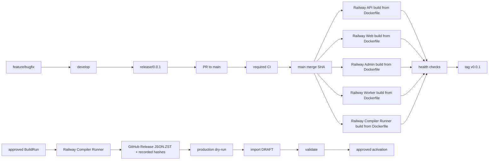

# CI/CD、Railway 与密钥

## 1. 最终发布拓扑



“GitHub 源码部署”和“Docker”不是二选一：Railway service 的 source 连接 GitHub 分支，检测到 commit 后读取仓库内 Dockerfile 构建镜像。PostgreSQL、Redis 是独立 Railway services，不打包进应用 Docker image，也不由代码仓库上传。

目标文件：

```text
apps/api/Dockerfile
apps/web/Dockerfile
apps/admin/Dockerfile
apps/worker/Dockerfile
services/lexicon-compiler-runner/Dockerfile
services/lexicon-importer/Dockerfile
railway.api.json
railway.web.json
railway.admin.json
railway.worker.json
railway.compiler-runner.json
railway.importer.json
```

API/Web/Admin/Worker/Compiler Runner/Importer 使用 immutable build context 和 multi-stage image；运行镜像不包含 devDependencies、本地 `.work`、source dump、`img/`、`img.zip` 或未被项目输入声明的文件。User Web 与 Admin 是不同 service/domain；Worker 与 Compiler Runner 没有 public business route，只暴露 Railway 私网 health；Importer 只按受保护 Job 启动。

## 2. 分支和环境

| Git ref                    | GitHub/Railway environment   | 行为                                                           |
| -------------------------- | ---------------------------- | -------------------------------------------------------------- |
| `feature/*`, `bugfix/*` PR | CI only，可选 PR environment | 无 production secret/DB                                        |
| `develop`                  | staging                      | CI 通过后自动部署 staging API/Web/Admin/Worker/Compiler Runner |
| `release/*`                | release candidate            | CI + 可选隔离验收；不直接部署 production                       |
| `main`                     | production                   | 只接受 `release/*`/`hotfix/*` PR；CI 通过后自动部署            |
| tag `v*`                   | release record               | 指向已部署并 smoke-tested 的 main SHA，不重新构建另一份代码    |

`main` 和 `develop` 启用 branch protection：禁止 direct push，required review，required status checks，conversation resolved，禁止 force push/delete。production Railway services 只监听 `main`。

第一版流程：从 `develop` 切 `release/0.0.1`，通过 PR 合到 `main`，部署和 smoke test 后打 `v0.0.1`，再将 release 修复合回 `develop`。

## 3. 应用 CI

CI 在 PR 与 `develop/main/release/**` push 运行，默认 `permissions: contents: read`，job 需要额外权限时单独提升。固定门禁见 [测试与验收](./testing.md)。

必须遵守：

- third-party actions 固定到完整 commit SHA，并由 Dependabot/Renovate 管理更新；
- `pull_request_target` 不 checkout/执行不可信 PR 代码；
- CI 只用占位 AI key 和临时 Postgres/Redis；
- PR 用 Turbo `--affected` 缩短反馈，`develop/main/release/**` 使用 `pnpm ci:full` 完成全量 package/contract 门禁；
- migration 总是在 fresh DB 执行；
- API/Web/Admin/Worker/Compiler Runner/Importer Docker image 在 CI 真正 build；长期服务跑 health/readiness smoke，Importer 跑离线 validate smoke；
- `lexicon-contracts` schema/generated types 保持 clean，compiler fixture 和 importer mapping registry 对同一 artifact contract 通过；
- concurrency 按 workflow + ref 取消过时 CI，但 production deploy 不取消进行中的 migration；
- build 输出 SBOM/image digest，secret scan 覆盖完整 Git 历史和 artifact。

## 4. Railway 自动 CD

### 4.1 API/Web/Admin/Worker/Compiler Runner

推荐使用 Railway GitHub integration，不在 GitHub Actions 执行 `railway up` 上传应用目录：

1. API/Web/Admin/Worker/Compiler Runner service source 连接同一 GitHub repo。
2. staging trigger branch 为 `develop`，production 为 `main`。
3. 每个 service 指定自己的 Dockerfile path 和 watch paths。
4. 启用 Railway **Wait for CI**；required GitHub checks 成功后才创建 deployment。
5. 只有 API pre-deploy command 执行一次 `prisma migrate deploy`；其他 service 不竞争执行 migration。migration 必须适用于同一次 rolling deployment。
6. API `/health/ready`、Web/Admin `/health`、Worker 与 Compiler Runner 的私网 `/ready` 通过后 deployment 才成功。
7. 各 service 独立部署；同一 `APP_VERSION/GIT_SHA` 通过 deployment manifest 关联。跨服务 contract 先在 release candidate 证明新旧相邻 deployment 可共同运行。
8. Web 使用自己的同源 `/api` gateway；Admin 在独立域名使用自己的同源 `/api/admin` gateway 和 ADMIN cookie audience。浏览器 bundle 不持有内部 API URL、Railway token 或 provider key。

这样生产部署的 source commit 就是合入 `main` 的精确 SHA，Railway Deployments 页面可查看 build/deploy logs、状态和 rollback。GitHub Actions 不需要 account-wide Railway token 完成普通应用 CD。

### 4.2 数据库

- PostgreSQL 只接受 Railway private network 和明确运维路径连接。
- `DATABASE_URL` 使用 Railway reference variable 注入 API/importer；不复制到 GitHub secret。
- migration 与数据内容导入分离。API pre-deploy 不运行 compiler/importer，也不激活词典。
- destructive migration 只在 staging 演练后的 release window 执行；本次绿地切换仍要有 snapshot/restore 验证。

## 5. 词典内容流水线

内容发布不跟随每次 `main` push，分成四个受审计 workflow。

### 5.1 Build artifact

Admin 先创建带 immutable manifest/profile/commit/model policy/budget 的 `BuildRun` 与 `LEXICON_BUILD` Job。受保护流程输入 `buildRunId + approvalDigest`；长计算在 Railway Compiler Runner，GitHub Actions 不长期占用 runner。流程：

1. GitHub checkout 精确 ref、安装 locked dependencies，并用 Turbo task graph 完成 compiler/contract fixture、pilot 证明和预算/manifest approval 校验；
2. 审批后允许对应 `LEXICON_BUILD` 进入可 claim 状态；Compiler Runner 下载并校验 source checksum，有道只读取受控 artifact location；
3. Runner 调用纯 `@sylis/lexicon-compiler`，使用对象存储 checkpoint/cache，持续写 BackgroundJob progress/cost/heartbeat；
4. Runner validate schema、references、rights、quality 和 deterministic rebuild sample；预算耗尽或门禁失败不产生成功 result；
5. Runner 流式生成唯一数据文件 `sylis-lexicon-v1.json.zst`，记录压缩文件 SHA-256、字节数和解压后 content hash，并上传不可变临时存储；
6. 独立受保护 publish job 校验 completed Job、approval digest、artifact/hash/quality report 后，将 `.json.zst` 发布到 GitHub Release；不重新 build，也不生成第二个数据文件。

GitHub Release asset 是唯一 import input。release/tag/asset 名包含 content identity，发布后权限策略禁止覆盖或替换；consumer 仍必须用独立记录的 expected compressed-file hash 和内部 content hash 校验，不能把 GitHub Release 当作天然不可变存储。临时 raw/cache/checkpoint 和解压副本不公开。

### 5.2 Dry-run

输入 GitHub Release/tag + expected hash，只下载/流式验证 artifact 并计算 import plan。不得创建 release row 或 staging 数据。输出 counts、空间估算、版本 diff 和预计阶段。

### 5.3 Import and validate

受保护 job 使用 project-scoped `RAILWAY_TOKEN` 调用一次性 importer service。importer：

- 没有 AI key；
- 只拿 production DB 和只读 artifact URL/短期凭证；
- COPY 到 staging，构建 DRAFT，输出可观测进度；
- 完成全局验证后按 `DRAFT -> VALIDATING -> VALIDATED` 推进 release；
- 永不自动 activation。

### 5.4 Activate

activation 是单独 environment-protected job，输入 `releaseId + artifactHash + confirmation`。它重新读取状态/hash/restriction，单事务写 `LexiconReleaseActivation` 并切换 `Lexicon.activeReleaseId`，然后执行 API smoke test。rollback workflow 接受上一个 VALIDATED release ID，走相同审计路径；release 本身不存在 ACTIVE status。

## 6. GitHub environments

建议创建：

| Environment                   | Protection                                              | 保存内容                                                                             |
| ----------------------------- | ------------------------------------------------------- | ------------------------------------------------------------------------------------ |
| `sylis / staging`             | develop/release branch restriction                      | staging-only deploy/config secrets                                                   |
| `sylis / lexicon-build`       | manual dispatch、budget approval                        | build authorization/publish credential；AI/source secret 留 Railway sealed variables |
| `sylis / production-import`   | main/tag restriction、required reviewer、no self-review | project-scoped Railway token                                                         |
| `sylis / production-activate` | required reviewer、no self-review、concurrency 1        | activation-scoped Railway token/endpoint                                             |

如果当前 GitHub plan/repository visibility 不支持 required reviewers，流程不能假装已受保护：保留显式 typed confirmation、branch restriction、concurrency、artifact hash 校验，并在启用可用 plan 后打开 required reviewers。

## 7. 密钥职责矩阵

| Secret/variable        | Local                     | CI               | Compiler Runner                | API                  | Worker                    | Web/Admin | Importer                    |
| ---------------------- | ------------------------- | ---------------- | ------------------------------ | -------------------- | ------------------------- | --------- | --------------------------- |
| `LEXICON_AI_API_KEY`   | developer compiler key    | placeholder only | build-specific sealed key      | 不提供               | 不提供                    | 不提供    | 不提供                      |
| `LEXICON_AI_CACHE_KEY` | developer cache key       | placeholder only | build-specific sealed key      | 不提供               | 不提供                    | 不提供    | 不提供                      |
| `RUNTIME_AI_API_KEY`   | developer runtime key     | placeholder only | 不提供                         | 不提供               | staging/production scoped | 不提供    | 不提供                      |
| `DATABASE_URL`         | local DB                  | ephemeral DB     | Job/progress reference         | Railway reference    | Railway reference         | 不提供    | production import reference |
| `REDIS_URL`            | local Redis               | ephemeral Redis  | 可选 wake，不是真相            | Railway reference    | Railway reference         | 不提供    | 通常不提供                  |
| object storage token   | local fixture             | fake/minimal     | source/checkpoint/output scope | 不提供               | handler-specific          | 不提供    | artifact-read only          |
| `SESSION_TOKEN_PEPPER` | local placeholder         | CI placeholder   | 不提供                         | environment-specific | 不提供                    | 不提供    | 不提供                      |
| `CSRF_SIGNING_KEY`     | local placeholder         | CI placeholder   | 不提供                         | environment-specific | 不提供                    | 不提供    | 不提供                      |
| mail credentials       | local/test                | fake SMTP        | 不提供                         | environment-specific | 通常不提供                | 不提供    | 不提供                      |
| field-encryption KEK   | local test key            | ephemeral key    | 不提供                         | KMS/reference only   | KMS/reference only        | 不提供    | 不提供                      |
| `RAILWAY_TOKEN`        | operator only when needed | 不提供           | 不提供                         | 不提供               | 不提供                    | 不提供    | project/environment scoped  |

Compiler Runner 与 runtime Worker 即使都使用 DeepSeek，也必须使用不同 key、预算和审计。API 不持有运行时 AI key；纯 compiler library 不读取生产 DB，Runner 的数据库权限只限 Job/BuildRun/progress，不允许直接写正式词典 release；Importer 不调用 AI。

非敏感 ID（project/environment/service ID）可放 GitHub environment variables；token、URL credentials 和业务 key 必须放 secrets 或 Railway sealed variables。任何 `VITE_*` 变量都会进入浏览器 bundle，因此绝不放密钥。

## 8. DeepSeek 配置

固定变量 contract：

```text
LEXICON_AI_PROVIDER=deepseek
LEXICON_AI_BASE_URL=https://api.deepseek.com
LEXICON_AI_STRICT_BASE_URL=https://api.deepseek.com/beta
LEXICON_AI_MODEL=<validated-model-id>
LEXICON_AI_API_KEY=<secret>
LEXICON_AI_CACHE_KEY=<32-byte hex-or-base64 secret>
LEXICON_AI_BUDGET_USD=<per-run hard limit>
LEXICON_AI_CONCURRENCY=<1..32>
LEXICON_AI_INPUT_USD_PER_MILLION=<pricing snapshot>
LEXICON_AI_OUTPUT_USD_PER_MILLION=<pricing snapshot>
LEXICON_AI_CACHE_HIT_USD_PER_MILLION=<optional pricing snapshot>

RUNTIME_AI_PROVIDER=deepseek
RUNTIME_AI_BASE_URL=https://api.deepseek.com
RUNTIME_AI_STRICT_BASE_URL=https://api.deepseek.com/beta
RUNTIME_AI_MODEL=<validated-model-id>
RUNTIME_AI_API_KEY=<different-secret>
RUNTIME_AI_MONTHLY_BUDGET_USD=<hard limit>
```

Compiler Runner 和 Worker 分别校验自己的变量，API 不接收任何 AI key。本地 compiler CLI 只在显式 AI pilot 时读取开发者变量。模型名、schema、prompt、thinking mode 和价格 snapshot 都进入 run/invocation metadata。发布前执行 capability probe；provider 更新不能在不改变 metadata 的情况下静默改变已缓存结果。

## 9. 最小权限与日志

- Railway 自动应用部署依赖 GitHub App repo scope；不用个人 CLI session。
- importer token 只限 Sylis project/environment，不用 account/workspace token。
- GitHub `GITHUB_TOKEN` 每个 job 只授予必要权限；release upload 才临时 `contents: write`。
- workflow 不把 secrets 放 command arguments、artifact、cache key、matrix、step output 或 PR comment。
- 日志过滤 Authorization、cookie、connection string、AI key、raw restricted source 和用户原始答案。
- import/compiler logs 输出 progress 和 hash，不输出 source payload 或 prompt 中的受限全文。
- production DB 不开放公网；本地调试用 staging fixture，不下载生产 dump。

## 10. 轮换、撤销和事件响应

1. 每个 secret 有 owner、purpose、scope、created/rotated/expiresAt 记录。
2. runtime AI、compiler AI、Railway、session/CSRF、field-encryption、mailer 分开轮换，不改源码。
3. key 一旦出现在聊天、issue、日志、终端录屏或 Git history，按已泄露处理：先撤销/轮换，再清理传播面和审计使用记录。
4. provider key 设预算/告警；异常用量先禁用该 key，不停用无关服务。
5. Railway token 撤销后验证 importer workflow 明确失败且 API/Web/Admin/Worker native CD 不受影响。
6. 至少每季度审计未使用 secret、GitHub App scope、environment protection 和 Railway member 权限。

## 11. 上线验收

- main merge SHA、API/Web/Admin/Worker/Compiler Runner image digest、Railway deployment ID 可互相追踪。
- Railway Wait for CI 实际阻止失败 commit 部署，并在 Deployments 中保留日志。
- production migration、所有长期服务 health/readiness 和逐服务 rollback 在 staging 演练成功。
- artifact GitHub Release hash 与 DRAFT/active release hash 一致。
- Importer 没有 AI key；纯 compiler 没有 production DB；Compiler Runner 不能写 release；Web/Admin bundle 没有 secrets。
- activation/rollback 各只有一个并发执行者并有 actor、reason、before/after release。
- 仓库、Git history、Actions logs、Docker layers 和公开 JSON 通过 secret scan。

## 12. 采用依据

- [Railway GitHub autodeploy 与 Wait for CI](https://docs.railway.com/deployments/github-autodeploys)
- [Railway service source 与 Dockerfile](https://docs.railway.com/services)
- [Railway CLI project token](https://docs.railway.com/cli/deploying)
- [Railway deployment states 和 logs](https://docs.railway.com/deployments/reference)
- [GitHub deployments and environments](https://docs.github.com/en/actions/reference/workflows-and-actions/deployments-and-environments)
- [GitHub Actions secure use](https://docs.github.com/en/actions/reference/security/secure-use)
- [GitHub Actions secrets](https://docs.github.com/en/actions/reference/security/secrets)
- [OWASP Secrets Management Cheat Sheet](https://cheatsheetseries.owasp.org/cheatsheets/Secrets_Management_Cheat_Sheet.html)
