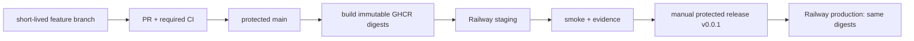

# CI/CD、Railway 与密钥

## 1. 分支与环境

Sylis 使用 trunk-based delivery：



- 删除长期 `develop` 和 `release/*` 工作流；普通变更从短期 feature/bugfix 分支通过 PR 合入 `main`。
- `main` 禁止 direct push/force push/delete，要求 review、required checks 和 conversation resolved。
- green `main` 自动部署 staging。
- production 只能由手工受保护 release workflow 部署，首个版本为 `v0.0.1`。
- `v0.0.1` 要求一个 maintainer 显式批准；release manifest 支持未来配置更高 quorum。

## 2. Build once, promote by digest

GitHub Actions 为同一 commit 构建十二个 image：

```text
sylis-web
sylis-admin
sylis-api
sylis-admin-api
sylis-agent-api
sylis-model-gateway
sylis-agent-executor
sylis-agent-evaluator
sylis-asset-processor
sylis-automation-executor
sylis-lexicon-builder
sylis-lexicon-publisher
```

镜像推到 private GHCR，并记录每个 `sha256:` digest、commit、Dockerfile hash、SBOM/provenance 和 CI run。staging 按 digest 部署并执行 smoke；release workflow 只读取该不可变 manifest，把相同 digest 提升到 production，绝不 checkout 后重建。

GitHub Release/tag 在批准后创建并设为 immutable；tag `v0.0.1` 绑定已经通过 staging 的 main commit。浮动 `latest`、branch tag 或 Railway 重新 build 不能作为 production identity。

## 3. GitHub Actions

建议 workflow 职责：

| Workflow                   | Trigger            | 结果                                                                                                        |
| -------------------------- | ------------------ | ----------------------------------------------------------------------------------------------------------- |
| `ci.yml`                   | PR、main push      | lint/typecheck/test/build/contract/docs 的稳定 required summary                                             |
| `staging.yml`              | main CI 成功       | 构建十二个 image、推 GHCR、部署 staging、smoke、写 deployment manifest                                      |
| `release.yml`              | workflow_dispatch  | 校验 green staging manifest、maintainer approval、创建 immutable release、按 digest 部署 production、smoke  |
| `lexicon-pilot.yml`        | manual             | 固定 source/model/prompt 的 200 词 pilot；不部署应用                                                        |
| `lexicon-build.yml`        | manual after pilot | 请求 Railway Lexicon Builder 全量 BuildRun；不自动发布/激活                                                 |
| `agent-release.yml`        | manual Candidate   | validators -> isolated Eval -> independent Judge -> approval -> staging -> same immutable release promotion |
| `production-synthetic.yml` | hourly/manual      | checkout 当前线上 SHA，执行认证只读与可回收 Notebook probe，始终清理并保存诊断证据                          |

PR 使用 Turbo affected 反馈；main/release 使用全量门禁。required workflow 不用 workflow-level path filter 造成“被跳过即成功”，最终 summary job 以 `if: always()` 聚合所有必需结果。

普通 PR/main CI 使用 fake model adapter 和固定 fixture，不调用付费模型、不读取业务密钥、不写 Railway 数据。full DeepSeek generation 只能由 User 手工启动。

Required security/contract jobs 必须覆盖 permit 单次 claim、Job fencing、credential AES-GCM/AAD、KEK rewrap/revoke、secret leakage、User/ADMIN/service owner isolation、SSE `Last-Event-ID`、mutation idempotency、Agent release gate、quarantine/scan、删除 CAS 和 fake-provider streaming。真实付费 Provider 调用只属于手工 smoke/pilot，不能成为 required CI。

## 4. Railway 环境

staging 与 production 完全隔离，每个环境有：

- 十二个应用服务；
- 独立 PostgreSQL；
- 独立 Redis；
- 相互隔离的 quarantine、clean user assets、system artifacts 三类 private S3-compatible Bucket；
- 独立域名、变量、service identity、network policy 和 retention policy。

关闭所有 Railway GitHub source autodeploy。GitHub Actions 用 environment-scoped Railway project token 更新 private GHCR image digest；Railway 使用只读 GHCR pull credential。production token 只存在 GitHub protected environment，普通 CI 不可读取。

只有 Web、Admin、API、Admin API 和 Agent API 按需要公开域名；Model Gateway、Executor、Evaluator、Asset Processor、Builder、Publisher 只暴露私网 `/live` 与 `/ready`。[Railway private networking](https://docs.railway.com/private-networking) 在同一 environment 内通过加密 WireGuard mesh 和 internal DNS 连接服务，不能跨 environment，因此 service grant 与 audience 校验仍然必需，私网本身不是授权。Railway health check 与 deploy timeout 不能以“进程启动”代替 ready。

十二个镜像在单次 CI build 时接收 `SYLIS_RELEASE_VERSION` 与
`SYLIS_COMMIT_SHA`，不能由 Railway runtime 覆盖。Web/Admin 的 `/health` 与
no-store `/version.json`、四个同步后端的 `/health/ready`、六个 worker 的
`/ready` 均返回 `service/version/commitSha/status`。私网 backend 不创建公网域名；
公开 API 的 `/health/deployment/:service` 只接受固定 DeploymentService 枚举，
通过九个 `DEPLOYMENT_*_READINESS_URL` 读取内部 backend readiness，并拒绝未知
service、缺失/非法 URL、非 ready 状态和 service identity 不匹配。每个 URL 由
目标 service 的 `RAILWAY_PRIVATE_DOMAIN` 与显式 `PORT` reference variable 组合；
代码不硬编码 Railway domain 或 port。

## 5. 部署顺序

同一 manifest 内按兼容顺序部署：

1. API pre-deploy 用 `DATABASE_OWNER_URL` 执行 `0.0.1` database install：Prisma force-reset 后加载 SQL-only invariants；
2. API、Admin API、Agent API、Model Gateway；
3. Agent Executor、Agent Evaluator、Asset Processor、Automation Executor；
4. Lexicon Builder、Lexicon Publisher；
5. Web、Admin；
6. public/private health、permit/credential/file isolation 与关键 smoke。

部署后 rehearsal 读取同一 immutable manifest，并从 GitHub environment 的
`SYLIS_WEB_URL`、`SYLIS_ADMIN_URL`、`SYLIS_API_URL` 派生十二个检查地址。
任意服务缺失、版本不同、SHA 混用或 readiness 非 `ready` 都阻断 staging/release。
浏览器 smoke 随后用专用 Learner 与最小权限 Support Operator 完成 UI 登录，
只读检查今日学习、词典详情和 Admin 概览。

只有上述 production smoke 成功后，release workflow 才使用 protected environment 的独立 `DEPLOYMENT_INGEST_TOKEN` 调用 Admin 域名上唯一公开的 `/internal/v1/deployment-releases` ingress。请求固定 manifest schema/hash、十二个 GHCR digest、CI run、release workflow run、commit、approval/workflow URL 和 production URL。Admin API 以 `sylis_ci_ingestor` 专用连接在同一事务追加 `DeploymentRelease` 与 exact SecurityAuditEvent；相同 `releaseDigest` 是幂等重放，version 或 gitSha 相同但证据不同则拒绝。GitHub tag/Release 只有在该记录成功后才创建。

`0.0.1` 是空用户绿地阶段，staging/production 允许 destructive database install；仍需先验证 Prisma schema、SQL-only invariants、role grant 和 seed/reference data。五个 synthetic secret 全部存在时，installer 同时创建专用账号和一个静态 `sylis-en-zh` canary release：只包含 `bank` 的两个 sense，不调用 Provider、不生成词书、不冒充正式内容。正式 JSON artifact 激活后替换同一 Lexicon 的 active pointer。重复 API 部署会重建数据库并回到 canary，因此开始保留正式词典或 User 数据前必须先通过新 ADR 替换该策略。应用 rollback 不隐式回滚 LexiconRelease，数据 rollback 也不回写 User event。

## 6. Lexicon 发布独立

应用部署不会自动运行 Lexicon build、publish 或 activation：

1. User 在本地/fake 全量测试通过后手工触发 200 词真实模型 pilot。
2. Pilot 报告通过后，User 手工创建全量 BuildRun。
3. `lexicon-builder` 输出候选 `sylis-lexicon-v1.json.zst` 与 validation report 到 system artifacts Bucket。
4. Admin 明确选择固定 hash，创建 PublishRun。
5. `lexicon-publisher` 构建未激活 VALIDATED release。
6. Admin 独立批准 activation；active pointer 原子切换并保留 rollback target。

## 7. Secret 所有权

| Secret 类别                           | 允许读取的主体                                                                                      | 禁止出现位置                                                          |
| ------------------------------------- | --------------------------------------------------------------------------------------------------- | --------------------------------------------------------------------- |
| PostgreSQL/Redis/Bucket credential    | 对应 environment 内后端 app，按 DB role/Bucket class 最小权限拆分                                   | frontend、Artifact、日志、build arg                                   |
| Session/CSRF/signing key              | `api`                                                                                               | Admin/Agent executor、browser                                         |
| Service private key                   | 对应 backend app；public key 注册在 Identity                                                        | 共享 repo secret、其他 app                                            |
| Platform model key / OAuth token      | 仅 `model-gateway`，按环境与用途分 Profile/Revision                                                 | executor、builder、evaluator、asset processor、api、frontend、普通 CI |
| User BYOK                             | `model-gateway` envelope encryption；只在消费 permit 时短暂解密                                     | api DB、env、Redis、日志、Admin、fallback policy                      |
| Credential/Model Content KEK          | 仅 `model-gateway` 的 Railway sealed variables；类别和环境分离                                      | Admin UI、GitHub artifact、业务表、其他 app                           |
| 文件处理 key                          | `asset-processor` 仅取得明确 Bucket class/对象所需最小凭据                                          | Agent executor、frontend、未扫描对象的 download path                  |
| Railway deploy token                  | 对应 GitHub protected environment                                                                   | Railway runtime、PR workflow                                          |
| Deployment ingest token               | GitHub protected production environment 与 Railway Admin API sealed variable                        | 通用 service-token map、Admin browser、普通 CI、artifact、日志        |
| GHCR pull credential                  | Railway environment，read-only                                                                      | image layer、source、browser                                          |
| Synthetic Learner/Operator credential | Railway API pre-deploy seed 与对应 GitHub `staging`/`production`/`production-synthetic` environment | repo、image layer、日志、普通 CI、真实用户账号                        |

`SYLIS_SYNTHETIC_USER_EMAIL/PASSWORD` 与
`SYLIS_SYNTHETIC_ADMIN_EMAIL/PASSWORD/TOTP_SECRET` 必须五项成组配置。Railway
API sealed variables 在每次 `0.0.1` force reset 后重建专用账号；GitHub
environment secret 保存同一组登录值。Synthetic Operator 只有 `SUPPORT` 角色，
不持有 release、model、security 或 credential 写权限。三套 environment 使用不同
账号和秘密，轮换时必须同时更新对应 Railway API service 和 GitHub environment。
同一开关还创建不含 secret 的静态 deployment canary lexicon；它不是 AI 输出，
不读取 DeepSeek key，也不进入正式词典 artifact。

staging/production、runtime/compiler/evaluation 使用不同 Credential Profile 和预算。真实 key 不写入 `.env.example`；example 只写变量名和 placeholder。任何已在聊天、issue、日志或提交中暴露的 key 都按泄露处理并轮换，文档绝不复述其值。

Credential 与 Model Content 根 KEK 使用 Railway sealed variables 保存并保留 version。轮换先增加新版本，再由可恢复 CAS job rewrap per-record DEK，全部验证后才退役旧版本；根 KEK 的离线恢复副本保存在加密密码库。Admin 只能发起 credential profile 轮换/撤销，不能读取或替换根 KEK。

## 8. Grant 与 service identity

浏览器通过 HttpOnly cookie 持有短期、audience-restricted AccessGrant。普通只读请求可容忍约 2 分钟 revocation cache；写入、Admin、批准、release 和外部副作用必须在线检查 AuthSession/securityVersion。

内部 app 用 Ed25519 `private_key_jwt` 向 `api` 换取短期 service grant。Grant 固定 service、audience、scope、expiry 和 keyId；不使用一个永久共享 bearer token连接全部服务。

GitHub Actions 不是常驻 app，production release ingestion 使用单用途、environment-scoped Bearer secret；它不能调用 Job runtime 或其他 internal API。数据库仍以独立 `sylis_ci_ingestor` role 强制最小权限，token 泄露不会获得 Admin 数据库角色的写能力。

## 9. Supply chain 与日志

- Action 固定到可信 commit SHA；workflow 默认 `contents: read`，逐 job 提升权限。
- image 扫描、SBOM、provenance、secret scan 和 dependency policy 进入 release evidence。
- Docker context 由 `.dockerignore` 排除 `.git`、`.work`、source dump、`img/`、`img.zip`、local env 和测试产物。
- 日志禁止打印 secret、Authorization、cookie、连接串、完整 prompt/User 内容和 provider raw body。
- production deployment manifest、approval、digest 和 smoke result append-only 保存。

## 10. Release 验收

- main staging 和 production 指向同一十二个 GHCR digest。
- GitHub/Railway source autodeploy 不会绕过 protected workflow。
- PR 无业务 secret 且无付费模型调用可完成全部 required checks。
- staging/production 数据与密钥不可互访；executor 数据库 role 符合 owner 规则。
- production 失败自动停止继续提升并保留上一 manifest；rollback 仍按不可变 digest 执行。
- `v0.0.1` 的 tag、GitHub Release、manifest、approval 和 Railway deployment 可相互追踪。
- hourly synthetic 从线上 `/version.json` 取得当前 SHA 后 checkout 同一提交；
  Notebook 资源只使用 `[sylis-synthetic]` 前缀，测试内删除且 workflow
  `always()` 再做前缀清理，synthetic 与 production release 共用不可取消的
  `sylis-production-environment` concurrency。
