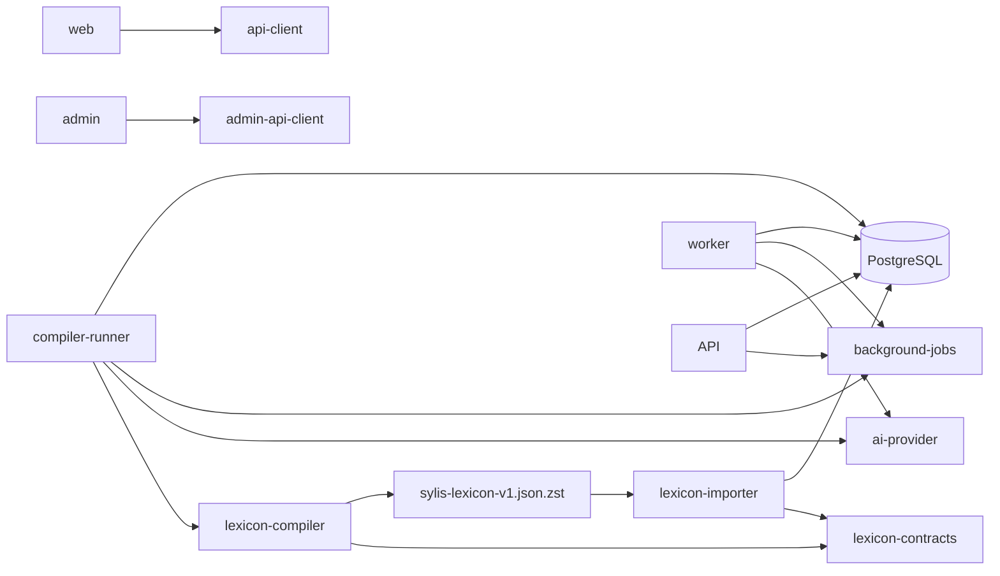

# 当前代码到目标代码的重构映射

## 1. 范围与原则

本章把当前仓库逐项映射到目标 workspace。它不是兼容计划：当前没有需要迁移的用户，旧 `Word`、旧 quiz、旧 vocabulary test 和旧 importer 在新纵向切片通过后直接删除。

实施时遵守三条边界：

1. `@sylis/lexicon-contracts` 只定义单一 artifact 的 JSON Schema、生成类型、受控词表和纯验证器。
2. `@sylis/lexicon-compiler` 只把固定来源编译成 `sylis-lexicon-v1.json.zst`（解压后为一个 JSON object），不连接 Prisma 或生产数据库。
3. `@sylis/lexicon-importer` 只消费 artifact 并构建 DRAFT release，不解析来源、不调用 AI、不自动激活。

## 2. 最终 workspace

```text
apps/
  api/
    src/modules/
      <module>/
        <module>.module.ts
        controllers/
        dto/
        services/
        repositories/
        entities/
        policies/
        events/
        index.ts
  web/
    src/
      app/
      pages/
      modules/<name>/
        model/
        api/
        store/
        components/
        index.ts
      assets/
      main.tsx
  admin/
    src/
      app/
      pages/
      modules/<name>/
        model/
        api/
        store/
        components/
        index.ts
      assets/
      main.tsx
  worker/
    src/
      health/
      runtime/
      handlers/
      adapters/
packages/
  lexicon-contracts/
    src/schema/
    src/types/
    src/vocabularies/
    src/validators/
  lexicon-compiler/
    src/sources/
    src/resolve/
    src/enrich/
    src/pedagogy/
    src/learning/
    src/export/
  api-client/
  admin-api-client/
  ai-provider/
    src/ports/
    src/contracts/
    src/deepseek/
  components/
  utils/
  database/
    prisma/schema/
      migrations/
    src/client/
  background-jobs/
  harness/
services/
  lexicon-compiler-runner/
    src/runtime/
    src/handlers/
    src/adapters/
  lexicon-importer/
    src/artifact/
    src/runtime/
    src/staging/
    src/build/
    src/validate/
    src/activate/
```

pnpm 继续负责 workspace/package 管理；Turbo 负责 package task graph、cache 和 `--affected`；集中 architecture test 执行跨 package allowlist。Frontend module 不是 workspace package，其边界由 ESLint/architecture test 执行。完整 package/task/依赖矩阵见 [Workspace 项目图与 Turbo 治理](./workspace-projects.md)，前后端精确树分别见 [前端目录与模块边界](./frontend-structure.md) 和 [后端目录与 NestJS 模块边界](./backend-structure.md)。

依赖方向固定为：



`api`、`web`、`admin` 和 `worker` 不依赖 compiler；纯 compiler 不依赖 importer/API/database，只从 `ai-provider` root contract 接收注入的 `StructuredGenerationPort`。Compiler Runner 才装配 DeepSeek、数据库、对象存储与 Railway runtime。User/Admin client 用 `openapi-typescript + openapi-fetch` 从各自 OpenAPI 3.1 contract 生成；目标 workspace 删除 `@sylis/shared`。

## 3. Workspace 包与服务映射

| 当前路径                       | 目标                               | 动作                                                                                | 完成门禁                                                      |
| ------------------------------ | ---------------------------------- | ----------------------------------------------------------------------------------- | ------------------------------------------------------------- |
| `packages/shared`              | 删除                               | HTTP DTO 迁 generated clients；artifact/Job/database/UI/纯函数迁各自 owner          | 全仓无 `@sylis/shared` import/path alias/workspace dependency |
| `packages/utils`               | `packages/utils`                   | 保留真正无领域工具；领域归一化不得塞入此包                                          | compiler/API 不通过 utils 共享领域状态                        |
| 无                             | `packages/lexicon-contracts`       | 新建；拥有 artifact v1 schema/type/vocabulary/validator                             | compiler、importer 对同一 golden artifact 得到相同验证结果    |
| 无                             | `packages/lexicon-compiler`        | 新建；迁入来源解析、合并、教学材料/题目 AI candidate 和单 JSON 输出                 | 200 词 pilot 覆盖五类 material 且可离线重建                   |
| 无                             | `packages/api-client`              | `openapi-typescript + openapi-fetch` 从 `/api/v1` snapshot 生成 User client         | generated diff clean；不含 Admin endpoint                     |
| 无                             | `packages/admin-api-client`        | 同工具从 `/api/admin/v1` snapshot 生成 Admin client                                 | generated diff clean；不被 User Web import                    |
| 无                             | `packages/ai-provider`             | 两个小型 generation port、provider-neutral contract 和 DeepSeek adapter             | Worker/compiler 用 fake provider contract test                |
| 无                             | `packages/components`              | tokens/icons/styles 与无领域 React primitives；Storybook 是 consumer                | 不依赖业务 module/API/Query                                   |
| `apps/api/prisma`              | `packages/database`                | schema/migration/client/connection 唯一 owner；repository 仍在业务 module           | fresh migration；浏览器无法依赖                               |
| 无                             | `packages/background-jobs`         | JobKind/state/progress/checkpoint/handler/control 纯 contract                       | 无 Nest/Prisma/Redis/provider 依赖                            |
| 无                             | `apps/admin`                       | 新建独立 Vite app、router、ADMIN session 和 RBAC UI                                 | role allow/deny、re-auth、审批、SSE e2e                       |
| 无                             | `apps/worker`                      | 新建 executor；从 PostgreSQL claim Job，Redis 只唤醒，执行 runtime AI/导出/来源同步 | lease/checkpoint、幂等、drain、budget kill switch             |
| 无                             | `services/lexicon-compiler-runner` | 新建 Railway executor；只 claim `LEXICON_BUILD`，调用纯 compiler 并上传 artifact    | checkpoint/progress、预算、resume、artifact hash              |
| `services/vocabulary-importer` | `services/lexicon-importer`        | 替换；只保留可证明正确的 streaming/COPY/进度思想，重写 contract                     | fresh DB 从 artifact 构建未激活的 VALIDATED release           |
| `docs/overview/refactor`       | 同路径                             | 唯一重构设计源                                                                      | VitePress build、链接和覆盖矩阵通过                           |

当前 importer 文件的归属：

| 当前文件组                                                               | 去向                                                                                   |
| ------------------------------------------------------------------------ | -------------------------------------------------------------------------------------- |
| `src/ecdict.ts`、`src/youdao.ts`、`src/youdao-import.ts`、`src/books.ts` | compiler 的 source adapter/content binding；不得留在 importer                          |
| `src/bulk-import.ts`                                                     | 仅把经过验证的 COPY、批量 SQL、checkpoint 思路迁入新 importer；旧 Word SQL 删除        |
| `src/index.ts`                                                           | 由新 artifact CLI 完全替换                                                             |
| 现有 fixture/tests                                                       | 有价值的边界输入迁到 compiler golden 或 importer integration test，断言改为新 contract |

## 4. API module 映射

| 当前 module           | 目标 module                           | 决策与依赖处理                                                                                                 |
| --------------------- | ------------------------------------- | -------------------------------------------------------------------------------------------------------------- |
| `auth`                | `identity`                            | 绿地拆分 UserEmail、credential、verification challenge、opaque AuthSession；统一 RFC 9457/rate limit           |
| `user`                | `identity`                            | `User` 同时是认证主体和所有用户事实 owner；安全子表规范化，consent 显式建模，不提供第二套 profile identity     |
| `health`              | `health`                              | 保留；增加 liveness/readiness、DB/Redis 可选依赖与 build SHA，不泄露配置                                       |
| `logger`              | platform logging                      | 保留；增加 AI key、连接串、用户答案和受限来源的结构化脱敏                                                      |
| `prisma`              | platform database + `@sylis/database` | 删除业务可见 Prisma module；Nest wrapper 只做 DI/lifecycle，repository 仍在业务 module                         |
| `redis`               | platform cache/lock                   | 保留实际被使用的 cache/lock/queue；未注册的示例文件不进入 production module/image                              |
| `words`               | `lexicon`                             | 完全替换；删除扁平 `WordDetailResDto`、GET 时 enrichment 和首义项回退；按 target/kind 查询 PedagogicalMaterial |
| `books`               | `books`                               | 重构为 stable book + immutable edition + item coverage；不再返回离线 Word blob                                 |
| `learning`            | `study` + `books`                     | 拆分 enrollment、daily plan、Objective/FSRS review 与 ExerciseAttempt；删除 Word 级状态和 planned word ID JSON |
| `quiz`                | `exercises`                           | 删除旧 AI choice 补位逻辑；新模块只读取已发布 ExerciseRevision，并通过通用 Attempt contract 服务端评分         |
| `vocabulary-test`     | `assessments`                         | 删除星级/固定词汇量估算；改为 blueprint/session/ExerciseAttempt/result                                         |
| `vocabulary-notebook` | `notebooks`                           | 重构为 typed target；解除对 `learning` repository 和 Word projection 的依赖                                    |
| `ai`                  | `ai-tutor`                            | 重写 Tutor/Grammar/Generation application contract；删除词典写入和公开 connection test                         |
| `chat`                | `ai-tutor`                            | 替换为 TutorSession/Message/ContextRef；正文加密，附件不复用 lexical audio contract                            |
| `articles`            | `reading`                             | 替换为 immutable ReadingDocument/Revision/Annotation/Target；删除 `usedWords JSON`                             |
| `reddit`              | `reddit` + `reading`                  | 来源特有 feed/metadata 留 Reddit；正文 revision、activity、saved 和查词闭环进入 Reading Core                   |
| 无                    | `jobs`                                | API 实现 enqueue/query/cancel/SSE；状态/handler contract 唯一归 `@sylis/background-jobs`                       |
| `admin-lexicon`       | `operations`                          | 扩为 build/material review/import/release/deployment/usage/support/audit，固定 Admin RBAC                      |

### 4.1 旧依赖环的拆除顺序

当前 `learning -> quiz + words`、`vocabulary-test -> learning + quiz + words`、`vocabulary-notebook -> learning + words`、`articles -> learning/WeakVocabularyAnalyzer` 是同一旧聚合。按以下顺序拆：

1. 先提供 release-pinned `lexicon` query port 和新 DTO。
2. 建立 LearningObjective/Exercise repository 与纯评分器，替换 `DailyPlanService` 内的即时 choice 生成。
3. `articles` 的弱词分析只依赖 `study` query port；notebook 只依赖 typed lexical target port。
4. 最后删除 `quiz` 和 `words` exports，并由 TypeScript import graph 证明没有残留。

### 4.2 API 平台文件

| 当前文件/机制                                   | 目标                                                                                                               |
| ----------------------------------------------- | ------------------------------------------------------------------------------------------------------------------ |
| `app.module.ts`                                 | 只注册目标 modules；删除 Words/Quiz/VocabularyTest，新增 Lexicon/Study/Exercises/Assessments/Operations            |
| `main.ts` 全局 `ValidationPipe`                 | JSON API 使用 `whitelist + forbidNonWhitelisted`；确需 multipart 的非词典 route 局部配置，不能因此全局接受未知字段 |
| `TransformInterceptor`                          | success envelope 必须写入 OpenAPI；不能二次包裹 stream/SSE/problem detail                                          |
| `HttpExceptionFilter`                           | 统一 RFC 9457，生产不返回 stack、SQL、provider body                                                                |
| Swagger 运行时 setup                            | CI 无需启动 production API 即可生成 OpenAPI；线上文档默认关闭或受保护                                              |
| `src/jobs/vocabulary-enricher.ts` 与 verify job | 删除；离线内容任务迁入 compiler，线上 API image 不包含                                                             |
| `third-party-modules`                           | 只注册 runtime 依赖；compiler AI/source client 永远不进入                                                          |

## 5. HTTP 路由迁移

| 当前路由族                                                                         | 目标路由族                                                                                 | 处理                                                                 |
| ---------------------------------------------------------------------------------- | ------------------------------------------------------------------------------------------ | -------------------------------------------------------------------- |
| `/words/search`, `/words/:wordOrId`                                                | `/lexicon/search`, `/lexicon/headwords/:id`, `/lexicon/entries/:id`, `/lexicon/senses/:id` | 一个字符串命中可返回多个 Headword/Entry；详情按稳定 ID 获取          |
| `/words/translate`                                                                 | `/lexicon/translate`                                                                       | 临时 AI/翻译结果明确标记 transient，不写 lexicon                     |
| `/books`                                                                           | `/vocabulary-books` 与 edition detail                                                      | 返回版本化书单和 coverage                                            |
| `/learning/add-book`, `/learning/current-book`                                     | `/study/enrollments`                                                                       | enrollment 固定 edition；迁 edition 使用显式 action                  |
| `/learning/stats`, `/today-progress`, `/daily-plan`, `/new-words`, `/review-words` | `/study/today`, `/study/stats`                                                             | 一次返回固定 plan + typed Objective summaries；不暴露 Word 状态机    |
| `/learning/word-status`, `/batch-word-status`                                      | `/study/attempts`, `/study/attempts/:id/responses`, `/study/reviews`                       | 显式开始/提交/评分三段；每段支持幂等 key，不再直接改 Word 状态       |
| `/learning/book-detail/:bookId`                                                    | `/vocabulary-books/:bookId/editions/:editionId`                                            | 书详情不再藏在 learning module                                       |
| `/vocabulary-tests/**`                                                             | `/assessments/blueprints`, `/assessments/sessions/**`, `/assessments/history`              | start、response、submit、result 分开；正确答案不随题目下发           |
| `/vocabulary-notebooks/**`                                                         | `/notebooks/**`                                                                            | word ID 改为 discriminated typed target                              |
| `/auth/**`, `/user`                                                                | `/api/v1/auth/**`、`/users/me/**`                                                          | opaque session、CSRF、User/Consent 新契约；不提供 profile 管理或切换 |
| `/ai/**`, `/chat/**`                                                               | `/api/v1/ai/tutor/**`、`/ai/grammar-diagnoses`、`/jobs/**`                                 | streaming/long work 走 Job+SSE；typed context；正文加密              |
| `/articles/**`                                                                     | `/api/v1/reading/**`、`/explore/ai-reading/**`                                             | immutable revision + annotation/target；生成由 Worker 执行           |
| `/reddit/**`                                                                       | `/api/v1/explore/reddit/**` + `/reading/**`                                                | experience route 与 Reading Core 分开                                |
| admin lexicon routes                                                               | `/api/admin/v1/build-runs`、`review-batches`、`import-jobs`、`lexicon-releases`            | 独立 ADMIN session/RBAC/MFA/re-auth/审批，不挂用户 API               |
| `/health`                                                                          | `/health/live`、`/health/ready`                                                            | 删除旧 alias；Railway healthcheck 使用 readiness                     |

## 6. Web 路由和页面迁移

| 当前页面/路由                                                    | 目标                                                       | 动作                                                              |
| ---------------------------------------------------------------- | ---------------------------------------------------------- | ----------------------------------------------------------------- |
| `/vocabulary-learning`                                           | `/study/today`                                             | 替换为 DailyStudyPlan/Objective 队列                              |
| `/vocabulary-practice`                                           | `/study/objectives/:objectiveId`                           | 由 exercise-player 消费 ExerciseRevision，不消费 Word + quiz blob |
| `/word-detail/:word`                                             | `/lexicon/headwords/:id`、`/lexicon/entries/:id`           | 搜索字符串先 resolve；详情按同形词/POS/Sense 分层                 |
| `/books`, `/book-detail/:id`, `/vocabulary-book`                 | `/study/books`, `/study/books/:bookId/editions/:editionId` | 合并重复书单入口，edition 固定                                    |
| `/vocabulary-test`                                               | `/study/assessments/:blueprintKey`                         | 展示测试说明和启动 action                                         |
| `/vocabulary-test-exam`                                          | `/study/assessments/sessions/:sessionId`                   | session 固定题目和选项顺序                                        |
| `/vocabulary-test-history`                                       | `/study/assessments/sessions/:sessionId/result`            | 使用新结果，不显示伪词汇量                                        |
| `/login`, `/register`, `/onboarding`, `/profile`, `/settings`    | auth + `/me/**`                                            | 新 opaque session、consent、session/device、export/deletion       |
| `/ai`, `/chat`, `/grammar-analysis`, `/cloze-reading/:articleId` | `/ai/tutor/**`、`/ai/grammar`、`/explore/ai-reading/**`    | Tutor/Grammar/Generation 分开；Job+SSE                            |
| `/articles`, `/articles/:id`                                     | `/explore/ai-reading` + Reading detail                     | 删除通用可变 Article；改 immutable Reading revision               |
| `/reddit`, `/reddit/subreddit/:name`, `/reddit/post/:id`         | `/explore/reddit/**`                                       | 来源页面保留，详情组合 Reading Core                               |
| `/reddit/saved`, `/reddit/history`                               | `/reading/saved`、`/reading/history`                       | 统一 user-owned 阅读事实                                          |
| `/explore`, `/me`                                                | 保留为四入口中的探索/我的                                  | 与背单词、AI 共同组成固定 primary navigation                      |

## 7. Web 组件与状态迁移

| 当前组件/模块                                                               | 目标                                                                                          |
| --------------------------------------------------------------------------- | --------------------------------------------------------------------------------------------- |
| `word-detail*`, `word-header`                                               | `modules/lexicon/components` 的 Headword/Entry/Sense/material；删除 `meanings[]` 扁平 adapter |
| `word-quiz-choice`, `word-quiz-recall`, `word-recognition`, `word-spelling` | 只复用视觉与键盘交互，统一进入 choice/short-text/extended-text renderer + grading flow        |
| `word-list`, `simplified-word-list`, `word-selector`, `word-search`         | 使用 HeadwordSummary + typed match/target；Form 命中不伪装独立词头                            |
| `modules/vocabulary/api/words.ts`                                           | `modules/lexicon/api`                                                                         |
| `modules/vocabulary/api/test.ts`                                            | `modules/assessments/api`                                                                     |
| `modules/learning/api`                                                      | `modules/study/api`                                                                           |
| `modules/vocabulary/api/notebook.ts`                                        | `modules/notebooks/api`                                                                       |
| Zustand chat/reddit/user stores                                             | 删除 server-data 副本；全部进入唯一 query cache，仅保留真正临时 UI state                      |
| `sync-engine/*`                                                             | 删除；0.0.1 online-first，不支持离线答案/聊天/consent 同步                                    |

`packages/shared/dto/**` 在消费者切换后整体删除。User/Admin transport type 分别由 `api-client`/`admin-api-client` 从 OpenAPI 生成；artifact 类型只来自 `lexicon-contracts`，不能混进浏览器 DTO。

## 8. 语音与音频的精确处理

当前 Web 在 `useAudio.ts`、`SoundButton.tsx`、两个 word list 组件中直接拼接有道 `dictvoice` URL，并在 vocabulary practice 使用 `speechSynthesis`；`audioConverter.ts` 是录音/WAV 处理遗留。目标处理为：

1. 删除所有直接拼第三方发音 URL和把浏览器 TTS 当词典发音的路径。
2. API 只返回 release 内有 provenance、rights、region、media type 和稳定 URL/hash 的 `FormMedia`/pronunciation projection。
3. 无可靠音频就不渲染播放按钮；v1 不做录音、上传、ASR、发音评分，也删除未使用的录音转换工具。
4. `chat.audioUrl` 若仍是用户聊天附件，保留在 chat retention/authorization 规则下，不能当词典音频复用。

## 9. Prisma 文件迁移

| 当前 schema                      | 处理                                                                                                                           |
| -------------------------------- | ------------------------------------------------------------------------------------------------------------------------------ |
| root `schema.prisma`             | 迁到 `packages/database/prisma/schema`，只保留 generator/datasource 与 multi-file 入口；不放业务 repository                    |
| `words.prisma`, `imports.prisma` | 用 release-scoped lexicon/provenance/corpus schema 替换                                                                        |
| `books.prisma`                   | 重构为 VocabularyBook/Edition/Item                                                                                             |
| `leaning.prisma`                 | 删除并由 study schema 替换；同时修复文件拼写                                                                                   |
| `quiz.prisma`                    | 删除并由 LearningObjective/Exercise schema 替换                                                                                |
| `vocabulary-test.prisma`         | 删除并由 assessment schema 替换                                                                                                |
| `vocabulary-notebook.prisma`     | 重构为 typed targets                                                                                                           |
| `users.prisma`                   | 替换为 `User` + UserEmail/PasswordCredential/AuthSession/ConsentRecord/OperatorRoleAssignment；所有 ownership 使用 `userId` FK |
| `articles.prisma`                | 替换为 reading-core；immutable revision、origin、annotation、activity、target，删除 `usedWords JSON`                           |
| `chat.prisma`                    | 替换为 ai-tutor；TutorSession/Message/ContextRef、字段级加密、模型调用与 usage 分开                                            |
| `reddit.prisma`                  | source-specific metadata 留 reddit；通用 revision/activity/saved 移到 reading-core，stats 为可重建 projection                  |

新 migration 先在空 PostgreSQL 建完整 schema；没有用户时不写旧到新数据转换脚本，也不维护双写。

## 10. 配置、Docker 与 workflow 映射

| 当前项                                                                       | 目标动作                                                                                                                                     |
| ---------------------------------------------------------------------------- | -------------------------------------------------------------------------------------------------------------------------------------------- |
| root `package.json` 为 `0.2.0`、API Swagger 为 `0.1`、Web package 为 `0.0.0` | 产品首发统一为 `0.0.1`；以 `release/0.0.1`、`v0.0.1` 和注入的 `APP_VERSION/GIT_SHA` 为事实，private package version 不再冒充部署版本         |
| `apps/api/src/config/env.validation.ts`                                      | runtime AI、DB、Redis、session/CSRF、mailer 分组校验；编译器 AI 变量不进入 API；非 AI 功能不因可选 provider 缺失无法启动                     |
| `apps/web/Dockerfile`                                                        | 保留 multi-stage；CI build + `/health` smoke；确认非 root、静态缓存和运行时 API origin contract                                              |
| 缺失的 `apps/api/Dockerfile`                                                 | 新建 multi-stage image；CI 必须真实 build/run/health                                                                                         |
| 缺失的 Admin/Worker/Compiler Runner Dockerfile                               | 新建三个独立 image；Admin health、Worker/Runner 私网 readiness 与 claim smoke                                                                |
| 缺失的 Railway service config                                                | 新建 API/Web/Admin/Worker/Compiler Runner/Importer 各自 config，固定 root/Dockerfile/watch path/health/predeploy                             |
| `.github/workflows/ci.yml`                                                   | 增加 Turbo affected、boundaries、contracts/compiler/artifact/importer、API/Admin client diff、六镜像、Playwright、docs；actions 固定完整 SHA |
| `deploy-vocabulary-importer.yml`                                             | 删除，拆为 artifact build、dry-run、import+validate、activate/rollback 四个 workflow                                                         |
| `deploy-docs.yml`                                                            | 保留文档发布；固定 action SHA，文档失败不得 `continue` 掩盖关键输出                                                                          |
| `gitflow-check.yml`                                                          | 保留并强制 `release/*`/`hotfix/* -> main`；配合 branch protection                                                                            |

GitHub Actions 从精确 commit 使用仓库 Dockerfile 构建六镜像并推送 GHCR；required CI 通过后，environment-scoped Railway token 将 API/Web/Admin/Worker/Compiler Runner/Importer 更新到不可变 digest。PostgreSQL/Redis 始终是独立 Railway service。

CI/CD 只以目标 ref 已提交的文件作为构建输入；本地未提交或未跟踪内容没有发布语义。Docker build context 通过 `.dockerignore` 排除 work/cache/raw source、环境文件和与该 service 无关的 workspace，CI 对同一 commit 构建与 Railway 等价的镜像。

## 11. 实施批次与删除门禁

| 批次 | 产物                                                         | 删除门禁                                                                  |
| ---- | ------------------------------------------------------------ | ------------------------------------------------------------------------- |
| A    | pnpm/Turbo graph、contracts、compiler、Compiler Runner pilot | boundaries、schema、双 hash、引用、题库质量、resume/progress 通过         |
| B    | Identity/User、User/Admin shell、Job contract/Worker         | session/CSRF/consent/RBAC/审批/幂等/SSE 通过                              |
| C    | `@sylis/database`、importer、fresh DB release                | fresh migration、dry-run 零写入、COPY、validation/rollback 通过           |
| D    | lexicon/books/study/exercises API/Web                        | FSRS/评分/daily plan 通过后删除 words/learning/quiz                       |
| E    | assessments/notebooks API/Web                                | session/result/typed target 通过后删除 test/notebook 旧模型               |
| F    | Reading Core/Reddit/Tutor/Grammar/AI Reading                 | import graph 无旧 Word/Article/Chat DTO；Job/budget/retention 测试通过    |
| G    | 全产品 staging/release/production                            | 六镜像、required CI、digest CD、内容流、secret scan、双 rollback 演练通过 |

每个删除动作都要求 `rg`/TypeScript import graph、Prisma validate、API contract 和 Web build 同时证明无消费者。不能先删模型再依赖线上报错找遗漏。
