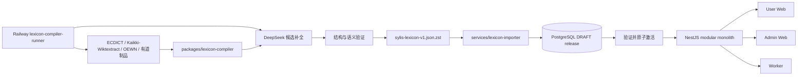

# Sylis 绿地重构总览

> 状态：目标设计。项目当前没有需要兼容的生产用户，因此本目录定义最终结构，不为旧 `Word`、旧题库或旧学习状态保留双写和兼容层。

本目录是 Sylis `0.0.1` 全产品重构的唯一设计入口，覆盖身份与独立用户、词典、词书、学习、题库、测评、Notebook、AI 导师、语法、AI 阅读、Reddit、User Web、Admin、Worker、数据编译、导入和 Railway 发布。旧的 `/guide/lexicon-architecture` 只保留跳转入口；实现时以本目录的分层文档为准。

## 1. 最终目标

将来源数据和线上应用彻底解耦：



最终制品只有一个逻辑 JSON 文件。它包含可公开复用的词典事实、来源证据、词书 edition、学习目标、PedagogicalMaterial、可复用题库和组卷蓝图，不包含用户、ExerciseAttempt、复习状态、答题会话、密钥或运行日志。

## 2. 文档地图

| 目录             | 文档                                                                    | 回答的问题                                             |
| ---------------- | ----------------------------------------------------------------------- | ------------------------------------------------------ |
| `architecture`   | [目标系统架构](./architecture/system.md)                                | package、service、API、数据库怎样分工                  |
| `architecture`   | [Bounded Contexts](./architecture/bounded-contexts.md)                  | 六个上下文的所有权、port、事务和事件边界               |
| `architecture`   | [算法注册表](./architecture/algorithms.md)                              | identity、搜索、FSRS、组题、阅读、AI 和进度算法        |
| `architecture`   | [BackgroundJob 与 Worker](./architecture/background-jobs.md)            | 唯一 Job 状态机、lease、checkpoint 和执行协议          |
| `architecture`   | [标准与设计依据](./architecture/standards.md)                           | 五套词典模型及其他规范分别解决什么                     |
| `data`           | [关系表结构](./data/relational-schema.md)                               | 最终 Prisma/PostgreSQL 表、约束和索引                  |
| `data`           | [标准 JSON](./data/standard-json.md)                                    | 单一 JSON 的完整结构、ID 和版本契约                    |
| `data`           | [Artifact/数据库映射](./data/artifact-database-mapping.md)              | JSON 每个数组怎样写入目标表，哪些表不应公开            |
| `data`           | [来源、证据与权利](./data/provenance.md)                                | 多来源怎样合并、追踪、撤回和复用                       |
| `pipeline`       | [Lexicon Compiler](./pipeline/lexicon-compiler.md)                      | 独立 package 怎样生成 JSON                             |
| `pipeline`       | [AI enrichment](./pipeline/ai-enrichment.md)                            | AI 生成什么、怎样校验、怎样限费重试                    |
| `pipeline`       | [导入与 release](./pipeline/import-release.md)                          | JSON 怎样高效导入和原子发布                            |
| `product`        | [学习、题库与测试](./product/learning-assessment.md)                    | FSRS、题目、选项、组卷及旧题复用                       |
| `product`        | [身份与独立用户](./product/identity-user.md)                            | User、session、consent 与 RBAC                         |
| `product`        | [Reading Core 与内容体验](./product/reading-experiences.md)             | AI 阅读、Reddit 如何共享能力但保留各自体验             |
| `product`        | [在线 AI 导师](./product/ai-tutor.md)                                   | Tutor、Grammar、Generation、provider、Job 和预算       |
| `product`        | [独立 Admin](./product/admin.md)                                        | 后台 IA、固定权限、高风险审批和运维进度                |
| `product`        | [API 重构](./product/api.md)                                            | REST 资源、DTO、错误和一致性                           |
| `product`        | [Web 重构](./product/web.md)                                            | 页面、状态、查询和学习交互怎样调整                     |
| `delivery`       | [迁移与删除](./delivery/migration.md)                                   | 旧模型怎样一次性替换                                   |
| `delivery`       | [测试与验收](./delivery/testing.md)                                     | 如何证明结构、数据和流程正确                           |
| `delivery`       | [CI/CD、Railway 与密钥](./delivery/cicd-security.md)                    | 如何从 release 分支安全自动发布                        |
| `implementation` | [当前代码重构映射](./implementation/workspace-refactor.md)              | 当前 module、路由、页面、schema、workflow 分别怎样处理 |
| `implementation` | [前端目录与模块边界](./implementation/frontend-structure.md)            | User/Admin 的 pages/modules/components/state 怎样组织  |
| `implementation` | [后端目录与 NestJS 模块边界](./implementation/backend-structure.md)     | API/Worker/Runner/Importer 怎样分工和依赖              |
| `implementation` | [Workspace 项目图与 Turbo 治理](./implementation/workspace-projects.md) | pnpm/Turbo、package graph、task、cache 和 exports      |
| `implementation` | [要求覆盖矩阵](./implementation/coverage-matrix.md)                     | 怎样证明所有要求都有权威章节和验收方式                 |

## 3. 不可变决策

1. PostgreSQL 是线上事实源；标准 JSON 是离线构建和交换制品，不是 API 页面模型。
2. `Headword -> LexicalEntry -> LexicalForm / LexicalSense -> LexicalConcept` 是词典主轴。词形不是同义词，词性不同不是同一个 Entry，多义词不拍平。
3. 所有正式内容属于不可变 `LexiconRelease`；激活只切换 `Lexicon.activeReleaseId`。
4. 来源先进入 immutable source record 和 typed candidate，任何 importer 或 AI 都不能直接决定正式关系。
5. `packages/lexicon-compiler` 不依赖 NestJS、Prisma repository 或生产数据库。
6. 线上 GET 请求纯读取，不因缺字段触发 AI 或数据库写入。
7. `LearningObjective` 细化到 Sense、Form、Collocation、Frame 或 Example，只定义学习目标，不保存题面/答案；不同目标拥有独立 FSRS 状态。
8. `ExerciseTaskKind`、`EvidenceKind`、response kind/cardinality/placement 与 grading mode 分开；题目内容不可变且可复用，validation level 控制 practice/formative/summative 资格。
9. 学习和测试共用 append-only `ExerciseAttempt` 作答事实；只有 STUDY attempt 可通过 ReviewEvent 更新 FSRS。
10. AI 只生成候选。音标、真实出处、频率和词源等事实没有来源时不得由模型补成正式事实。
11. 应用发布和词典内容发布是两条流水线；部署新代码不会自动重建或激活词典。
12. 在线系统采用模块化 NestJS 单体；长任务由独立 Worker 执行，离线 Compiler 与一次性 Importer 不进入用户请求路径。
13. `User` 是唯一登录主体和学习/阅读/AI 事实所有者，所有用户事实只使用 `userId`；不建立 Household、LearnerProfile 或 GuardianRelationship，浏览器只使用服务端 opaque session cookie。
14. User Web 一次性改版并保持“背单词 / AI / 探索 / 我的”四个主入口；Admin 是独立应用、域名、bundle 和 ADMIN session。
15. 0.0.1 使用 Objective-level FSRS 和确定性规则，不发布 IRT/CAT、CEFR 或词汇量估算结论。
16. 公开纳入有道和永久保留可识别原文是明确记录但尚未满足外部条件的 production blockers，不能由代码或运营 override 绕过。
17. `BackgroundJob` 是唯一执行状态机；PostgreSQL 保存真相，Redis 只负责唤醒 executor。
18. pnpm 是唯一 package manager；Turbo 负责任务图、cache 与 `--affected`，精确跨 package 边界由 architecture tests 执行，app 内 module 不拆成 workspace package。
19. User/Admin 前端使用 `app/pages/modules/assets`；跨应用 UI 归 `@sylis/components`，跨 runtime 纯函数归 `@sylis/utils`。
20. API 使用 NestJS module-first 结构；Prisma 归 `@sylis/database`，Job contract 归 `@sylis/background-jobs`，删除 `@sylis/shared`。
21. 长时间全量构建由 `services/lexicon-compiler-runner` 在 Railway 执行；纯 compiler library 不接生产数据库或 Railway。
22. 本目录是实现终态的唯一设计源；严格按 Phase 0-7 推进，在阶段边界运行完整测试矩阵，局部诊断或单项测试不构成完成证据。

## 4. 目标 workspace

```text
apps/
  api/                         模块化单体、User/Admin API、session 与只读词典查询
  web/                         online-first User Web，四个主入口
  admin/                       独立运营后台与 ADMIN session
  worker/                      runtime AI、导出、同步和后台 Job
packages/
  lexicon-contracts/           Artifact Schema、类型、受控词表和纯验证器
  lexicon-compiler/            来源归一化、合并、AI candidate、验证、JSON 输出
  api-client/                  User OpenAPI 生成客户端
  admin-api-client/            Admin OpenAPI 生成客户端
  ai-provider/                 DeepSeek adapter 后的 provider port
  components/                  tokens/icons/styles 与无领域 React primitives
  utils/                       跨 runtime 纯函数
  database/                    Prisma schema/migration/client/connection 唯一 owner
  background-jobs/             实现无关的 Job 状态、进度、checkpoint 与 handler contract
  harness/                     agent harness 工具与文档，不进入产品 runtime
services/
  lexicon-compiler-runner/     Railway `LEXICON_BUILD` executor，装配 AI/存储/进度
  lexicon-importer/            只消费标准 JSON，COPY 到 staging，构建 release
docs/overview/refactor/        本设计文档包
```

现有 `services/vocabulary-importer` 在迁移完成后删除；其可复用的下载、校验、COPY、进度和幂等逻辑移入新 importer，来源解析移入 compiler。

## 5. 完成定义

重构只有同时满足以下条件才算完成：

- 单一 `.json.zst` 对 200 词 pilot 和全量数据均通过流式解压、JSON Schema、引用完整性、内容 profile、compressed hash 和 content hash 验证。
- Artifact 与数据库逐实体映射双向完备，新增数组不可能被 importer 静默忽略。
- 新数据库从空库只靠 migration 和标准 JSON 可重建同一个 active release。
- API、User Web、Admin、Worker、学习、词书、题库、测试、Reading 和 AI 不再引用旧 `Word`/`Meaning`/`Article`/`Chat` 混合结构。
- 同一个过去分词能被准确判定为仅 Form、独立 Entry、两者都是或待确认。
- 同义、反义、词组、词根/构词、例句、Frame 和题目均绑定正确层级与 Sense。
- 通俗讲解、构词讲解、文化背景、助记和微故事以 PedagogicalMaterial 发布；事实引用闭合，AI 创作不污染词典 provenance。
- CI 在无真实业务密钥的环境完成 schema、migration、unit、integration、双 API contract、Worker、User/Admin Web 和文档构建。
- production 只从受保护的 release 流程部署；词典激活有显式审批、审计和回滚指针。
