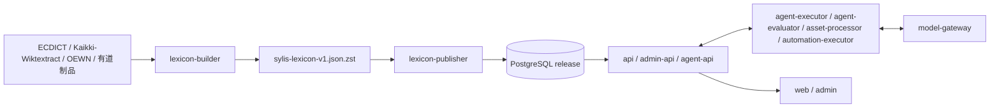

# Sylis `0.0.1` 绿地重构

> 状态：`0.0.1` 实现基线。当前没有需要兼容的生产 User，因此直接建立最终结构，不保留旧 Word、Card、Chat、DTO、路由、双写层或旧数据库迁移链。

## 1. 最终系统

Sylis 由在线学习产品、Learning Agent、离线 Lexicon 数据面和受保护交付面组成：



词典 Artifact 是一个可公开复用的完整逻辑 JSON 文件，包含词典事实、来源证据、词书 edition、学习目标、PedagogicalMaterial、可复用练习和组卷蓝图；不包含 User、Attempt、复习状态、Agent 内容、密钥、Job 或日志。

## 2. 文档地图

| 范围           | 文档                                                                           | 权威内容                                                      |
| -------------- | ------------------------------------------------------------------------------ | ------------------------------------------------------------- |
| Architecture   | [目标系统](./architecture/system.md)                                           | 十二个应用、数据面和顶层所有权                                |
| Architecture   | [Learning Agent](./architecture/learning-agent-system.md)                      | Run、Capability、工具、记忆、权限和安全                       |
| Architecture   | [Agent 会话 Block](./architecture/agent-conversation-blocks.md)                | Notion-inspired typed Block、流式生命周期与前端投影           |
| Research       | [Agent Runtime 参考实现调研](./architecture/agent-runtime-harness-research.md) | DeepSeek Harness、Codex 与 Sylis runtime 差距；仅作为决策证据 |
| Architecture   | [Model Gateway](./architecture/model-gateway.md)                               | 路由、permit、调用、Provider adapter 与 usage                 |
| Architecture   | [凭证管理](./architecture/credential-management.md)                            | Platform/BYOK envelope encryption、轮换与 Sub2API 边界        |
| Architecture   | [文件与模型交换](./architecture/agent-files-and-exchanges.md)                  | 上传、quarantine、正文、consent、Artifact 和删除              |
| Architecture   | [Bounded Contexts](./architecture/bounded-contexts.md)                         | 八个上下文与集成契约                                          |
| Architecture   | [Job 协议](./architecture/background-jobs.md)                                  | Job/JobAttempt、lease、fencing、retry 与进度                  |
| Architecture   | [算法注册表](./architecture/algorithms.md)                                     | identity、搜索、FSRS、组题、阅读和 AI 算法                    |
| Architecture   | [标准依据](./architecture/standards.md)                                        | LMF、TEI、OntoLex、WN-LMF 等设计依据                          |
| Data           | [关系模型](./data/relational-schema.md)                                        | PostgreSQL 表组、约束和索引                                   |
| Data           | [标准 JSON](./data/standard-json.md)                                           | 单一 Artifact 的字段、ID 与版本契约                           |
| Data           | [Artifact/数据库映射](./data/artifact-database-mapping.md)                     | JSON 数组到 release 表的完备映射                              |
| Data           | [来源与证据](./data/provenance.md)                                             | 多来源合并、证据、撤回和复用                                  |
| Pipeline       | [Lexicon Compiler](./pipeline/lexicon-compiler.md)                             | 独立 package 生成标准 JSON                                    |
| Pipeline       | [AI enrichment](./pipeline/ai-enrichment.md)                                   | 候选生成、校验、预算和人工门禁                                |
| Pipeline       | [发布 LexiconRelease](./pipeline/import-release.md)                            | Artifact preflight、COPY、validation 和 activation            |
| Product        | [学习、练习与测评](./product/learning-assessment.md)                           | FSRS、13 类任务、响应、组卷和复用                             |
| Product        | [Learning Agent](./product/learning-agent.md)                                  | workspace、交互、Artifact 与批准体验                          |
| Product        | [身份与独立 User](./product/identity-user.md)                                  | Session、Consent、MFA、Grant 与 RBAC；BYOK 只引用凭证架构     |
| Product        | [Reading](./product/reading-experiences.md)                                    | Reading Core 与不同来源体验                                   |
| Product        | [Admin](./product/admin.md)                                                    | 运营信息架构、审核和发布                                      |
| Product        | [API](./product/api.md)                                                        | REST 资源、DTO、错误和一致性                                  |
| Product        | [Web](./product/web.md)                                                        | 路由、状态和 Learning Agent 入口                              |
| Implementation | [Workspace](./implementation/workspace-projects.md)                            | pnpm/Turbo、app/package graph 与 build                        |
| Implementation | [后端结构](./implementation/backend-structure.md)                              | 十个 backend app 的模块和依赖                                 |
| Implementation | [前端结构](./implementation/frontend-structure.md)                             | Web/Admin 目录、路由和 state                                  |
| Delivery       | [迁移顺序](./delivery/migration.md)                                            | 一次性重构的依赖顺序与最终门禁                                |
| Delivery       | [测试](./delivery/testing.md)                                                  | 如何证明结构、数据和行为正确                                  |
| Delivery       | [CI/CD 与 Railway](./delivery/cicd-security.md)                                | main/staging、release/production、digest 和密钥               |

## 3. 已锁定决策

1. PostgreSQL 是在线事实源；标准 JSON 是离线构建、交换和空库重建制品。
2. `Headword -> LexicalEntry -> Form / Sense -> Concept` 是词典主轴；词形、词性和多义不会拍平成 Word。
3. 正式 Lexicon/Objective/Material/Exercise 都是 release-scoped immutable revision；activation 只切 active pointer。
4. 来源和 AI 先进入 typed candidate；AI 不能伪造来源型事实或直接写正式内容。
5. LearningObjective 细化到 Sense、Form、Collocation、Frame 或 Example；Exercise task、evidence、response 和 grading 分开。
6. `ExerciseAttempt` 是作答事实；只有正式 STUDY 流程产生 ReviewEvent 并更新 FSRS。
7. Learning Agent 是通用 Agent；Tutor 只是 Capability。它生成 Message、Artifact 或 Proposal，不直接写正式词典、题库、测评或学习状态。
8. `AgentRun` 表达领域流程，`Job/JobAttempt` 表达执行激活；WAITING 不占用 Job。
9. `AgentRunStep` 表达一次逻辑 ModelInvocation、完整 ordered output 和其全部 action；Provider transport retry 只新增 ModelInvocationAttempt，每个 ToolCall 独立终止，不建立原子成功的 ToolBatch。
10. Learning Agent 是服务端 Agent；`@sylis/agent-runtime` 是框架无关纯 TypeScript 深模块，由 Executor 装配且不依赖 Cordis、NestJS、数据库或 Provider SDK。浏览器只提交 command 并消费 Session SSE。
11. User 可见聊天使用 `AgentMessage -> AgentMessageBlock` 的 closed typed tree；ModelContentBlock、MessageBlock 和 ArtifactDocument 不共享模型，历史聊天不可原地编辑，Artifact revision 承担可继续编辑的长内容。
12. PostgreSQL 保存 Agent/Job 真相，Redis 只传 wakeup/delta；executor 使用 fencing token 且不能直接写领域表。
13. `api` 独占 User、认证凭据、AuthSession 和 Grant；Model Gateway 独占 ProviderRoute、Platform/BYOK Credential、Invocation/Attempt/Exchange 和 usage。
14. 平台额度和 BYOK 同时支持；Run 固定 exact route/credential revision，每次调用消费一次性 permit，BYOK 失败绝不静默回退。
15. 基础聊天保留 User message/final answer；optional full exchange 需要 consent。删除立即隐藏并在 30 天内 hard purge，Admin/support 看不到 exchange 正文。
16. 文件使用 quarantine -> scan -> clean 流程；OCR/index 可自动，vision/embedding 按需授权；历史只引用精确 ContentAssetRevision。
17. `apps/**` 只放独立部署产物；最终为两个 frontend 和十个 backend。工程 harness 位于 `tools/engineering-harness`。
18. pnpm + Turborepo 是唯一 monorepo 工具；不使用 Nx、tsup、tsdown，TypeScript import 省略 `.js`。
19. `@sylis/components` 只含 UI primitives；`@sylis/utils` 只含跨 runtime、无 I/O 的纯函数。
20. 词典构建只输出 `sylis-lexicon-v1.json.zst`；Builder 产生候选，Publisher 只校验/导入，Admin 显式 activation。
21. 应用发布和词典发布是两条流水线；部署代码不会自动重建或激活词典。
22. 短期 feature branch 合入 protected `main`；green main 自动部署 staging，受保护手工 release 从 `v0.0.1` 开始并把同一 digest 提升到 production。
23. 常规 CI 无付费模型调用；完整 DeepSeek 词典生成只能由 User 在 200 词 pilot 后手动触发。

## 4. 目标 workspace

```text
apps/
  frontends/
    web/
    admin/
  backends/
    api/
    admin-api/
    agent-api/
    model-gateway/
    agent-executor/
    agent-evaluator/
    asset-processor/
    automation-executor/
    lexicon-builder/
    lexicon-publisher/
packages/
  api-client/
  agent-contracts/
  agent-runtime/
  components/
  content-crypto/
  database/
  job-contracts/
  job-runtime/
  lexicon-artifact/
  lexicon-compiler/
  test-support/
  utils/
tools/
  engineering-harness/
```

## 5. 完成定义

- 一个 `.json.zst` 在 200 词 pilot 与全量数据均通过 schema、引用、rights、profile、compressed hash 和 content hash 验证。
- Artifact 与数据库逐实体映射完备；空库只靠 Prisma schema + SQL-only invariants + Artifact 可得到同一 active release。
- 过去分词可被确定为 Form、独立 Entry、两者都是或 unresolved；同义、反义、词组、构词、例句和 Frame 绑定正确 Sense/层级。
- Web/Admin/API/Agent/Executor/Lexicon 应用不再引用旧 Word/Card/Chat/BackgroundJob/Worker 结构。
- 七个 Agent Capability、13 个 ExerciseTaskKind 和四类 v1 response renderer 有完整 contract 与体验。
- Model Gateway permit/route/credential 固定、envelope encryption/rewrap/revoke、SSE 恢复和文件 quarantine/purge 有自动化证据。
- CI 在没有业务密钥和付费模型调用时完成全量静态、单元、集成、契约、构建和文档校验。
- staging/production 环境隔离；production 使用 staging 已验证的相同 GHCR digest，并有单次显式 maintainer approval。
