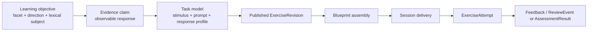
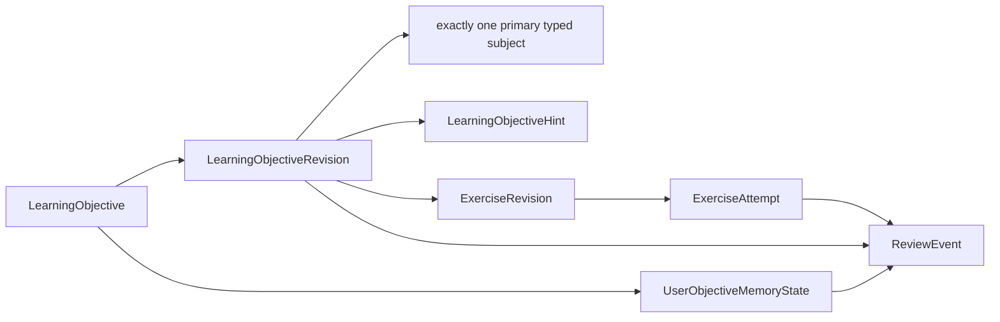
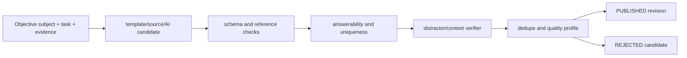
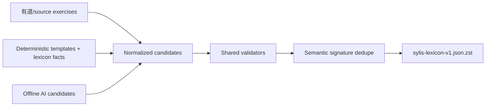
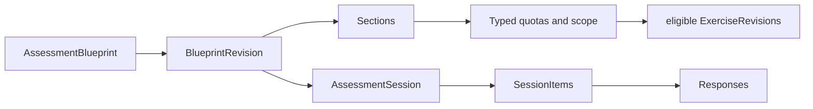

# 学习、题库与测试

## 1. 八个不同概念

| 概念                       | 回答                                   | 生命周期                             |
| -------------------------- | -------------------------------------- | ------------------------------------ |
| `LearningObjective`        | 用户要掌握哪个最小知识目标             | stable identity + release revision   |
| `PedagogicalMaterial`      | 怎样解释、助记或情境化一个明确目标     | stable identity + immutable revision |
| `AssessmentStimulus`       | 哪段可复用语境/例句/材料提供作答依据   | stable identity + immutable revision |
| `ExerciseItem`             | 用哪道可复用题取得该目标的学习证据     | stable identity + immutable revision |
| `ExerciseAttempt`          | 用户实际看到了什么、怎样作答、结果如何 | append-only 用户事实                 |
| `AssessmentBlueprint`      | 一套测试怎样分区、筛选和平衡题目       | stable rules + immutable revision    |
| `AssessmentSession`        | 某个用户实际收到了哪些题及其顺序       | 用户运行时快照                       |
| `UserObjectiveMemoryState` | 用户对该目标的当前 FSRS 调度状态       | 可由 ReviewEvent 确定性重放          |

这些对象不能合成一张“题目表”。Objective 是学习目标；PedagogicalMaterial 是可独立消费的教学材料；Stimulus/Exercise 是取得证据的发布内容；Attempt/Session/Review 是用户事实；Blueprint 是选题规则。`Card` 只允许作为 FSRS 库 adapter 内部的算法类型，不进入数据库、Artifact、API 或产品领域语言。

[QTI 3 information model](https://developers.imsglobal.org/sites/default/files/spec/qti/v3/info/index.html) 把 item 定义为可交换的最小测评对象，内部包含呈现、interaction、response、scoring 和 feedback；test 再用 test part/section 组织 item。Sylis 采用这种边界，但 v1 不宣称兼容 QTI XML，也只允许每个 ExerciseRevision 一个 response config 和一个 primary learning target。

## 2. 设计依据

- [QTI 3.0.1 Best Practices](https://www.imsglobal.org/spec/qti/v3p0/impl) 支持 item、stimulus、response declaration、correct response、feedback、section、selection 和 ordering 分离；Sylis 采用信息边界，不复制其 XML。
- [ETS 对 Evidence-Centered Design 的应用](https://www.ets.org/Media/Research/pdf/RM-19-01.pdf) 将测评拆为 proficiency、evidence、task 和 assembly 问题：测什么、观察什么行为、用什么任务取得证据、需要多少证据。
- [QTI Usage Data](https://www.imsglobal.org/sites/default/files/spec/qti/v3/ud-bind/index.html) 将 item statistics 与 item content 分开，因为统计依赖 population/context。
- [Nation 的词汇知识框架](https://www.taylorfrancis.com/chapters/edit/10.4324/9780429291586-2/different-aspects-vocabulary-knowledge-paul-nation) 将“知道一个词”分成 form、meaning、use 九个方面，并分别区分 receptive/productive；这比只测中英互选更完整。
- [CEFR Companion Volume](https://rm.coe.int/cefr-companion-volume-with-new-descriptors-2018/1680787989.pdf) 强调词汇控制包含在语境中选择适当表达，并随能力提高更多依赖 collocation 和 lexical chunks；因此搭配与使用限制不能只做详情页装饰。
- [词汇学习 Web 实验](https://pmc.ncbi.nlm.nih.gov/articles/PMC8638698/) 显示 spacing、testing 与 corrective feedback 应共同进入产品设计，而不是只增加题量。
- [Task-induced involvement 元分析](https://onlinelibrary.wiley.com/doi/10.1111/lang.12444) 显示需要学习者评价词与语境是否匹配的任务通常比被动接触带来更多学习收益。
- [接受与产出任务研究](https://doi.org/10.1177/13621688221077028) 显示产出任务更能推动 productive mastery；[recognition/recall 对照研究](https://doi.org/10.1177/21582440241242604) 也说明选择题不能单独作为掌握证据。
- [二语完形干扰项研究](https://aclanthology.org/2020.bea-1.10/) 显示干扰项除了表面特征，还需要检查其在完整语境中的适配性。
- [Open Spaced Repetition](https://github.com/open-spaced-repetition) 提供维护中的 FSRS 实现和评测生态；Sylis 不继续手写近似 SM-2。

这些依据不意味着任何单一题型适合所有阶段。首次接触、主动回忆、语境辨义、搭配/句型产出和 summative assessment 使用不同模板和门禁。

### 2.1 题目组织主链



| ECD 问题           | Sylis 对象                                                                              | 不变量                                                               |
| ------------------ | --------------------------------------------------------------------------------------- | -------------------------------------------------------------------- |
| 测什么             | `LearningObjectiveRevision.knowledgeFacet + retrievalDirection + typed primary subject` | 一个 Objective 只有一个可解释目标                                    |
| 什么行为算证据     | `ExerciseRevision.evidenceKind + typed correct response/rubric`                         | recognition、recall、context discrimination 不能混成一个 correctness |
| 用什么任务取得     | `exerciseTaskKind` + Stimulus + prompt                                                  | task 是认知任务，不是 UI 组件                                        |
| 怎样提交作答       | response kind + cardinality + placement + grading mode                                  | 响应类型、数量、呈现位置和评分方式互不混用                           |
| 需要多少、怎样平衡 | Blueprint revision + sections + typed quotas                                            | 先满足 hard coverage，再做随机/加权选择                              |
| 实际给了什么       | ExerciseAttempt + presented choices                                                     | 完整快照可重放，不依赖之后题库变化                                   |
| 如何影响记忆       | ReviewEvent + FSRS state                                                                | summative score 与学习调度事件分开                                   |

这解释了为什么不能只有一张 `questions` 表，也不能用 `CHOICE/SINGLE` 代表“测了词义”：同一个选择响应可以测拼写识别、义项辨析、搭配或 register，证据含义完全不同。

### 2.2 词汇知识维度

`knowledgeFacet` 使用以下受控值，`retrievalDirection` 为 `RECEPTIVE` 或 `PRODUCTIVE`：

| facet                      | 需要的正式数据                        | 可观察证据示例                         |
| -------------------------- | ------------------------------------- | -------------------------------------- |
| `FORM_SPOKEN`              | 来源音频/发音表示                     | 听音辨形；v1 不做产音评分              |
| `FORM_WRITTEN`             | canonical/inflected Form              | 见义拼写、语境填正确词形               |
| `FORM_WORD_PARTS`          | morphology/word formation             | 识别 affix、组合派生形式、解释构词角色 |
| `MEANING_FORM_MEANING`     | Sense definition/translation          | form→meaning 或 meaning→form 提取      |
| `MEANING_CONCEPT_REFERENT` | precise Sense/Concept/example         | 多义词在语境中选择正确 Sense           |
| `MEANING_ASSOCIATIONS`     | Sense/Concept relations               | 同义、反义、上下位关系辨析             |
| `USE_GRAMMATICAL_FUNCTION` | POS、FormFeature、Frame               | 时态/词形/补语结构的约束填空           |
| `USE_COLLOCATION`          | SenseCollocation/observations         | 搭配 partner 提取和 contextual cloze   |
| `USE_CONSTRAINTS`          | register/domain/region/temporal usage | 在场景中选择得体表达或识别不当用法     |

不是每个 facet 对每个 Entry/Sense 都适用。compiler 先判断 `PRESENT/MISSING/NOT_APPLICABLE/REJECTED`，只有支撑 Objective 和至少一种可靠 Exercise 的正式数据足够时才发布可调度目标。AI 不能为了让九格全满伪造事实。

## 3. LearningObjective：最小学习目标



| 表                                    | 字段                                                                                              | 规则                                                       |
| ------------------------------------- | ------------------------------------------------------------------------------------------------- | ---------------------------------------------------------- |
| `LearningObjective`                   | id、headwordId、objectiveKey、createdAt、retiredAt                                                | stable identity；不存题面、答案或呈现方式                  |
| `LearningObjectiveRevision`           | id、objectiveId、releaseId、knowledgeFacet、retrievalDirection、contentHash、status、provenanceId | 发布后不可变；facet/direction 进入 identity 与 coverage    |
| `LearningObjectiveSenseSubject`       | learningObjectiveRevisionId、releaseId、senseId、subjectRole                                      | meaning/concept/association 目标                           |
| `LearningObjectiveFormSubject`        | learningObjectiveRevisionId、releaseId、formId、subjectRole                                       | spelling、inflection、pronunciation 目标                   |
| `LearningObjectiveCollocationSubject` | learningObjectiveRevisionId、releaseId、collocationId、subjectRole                                | collocation 目标                                           |
| `LearningObjectiveFrameSubject`       | learningObjectiveRevisionId、releaseId、frameId、subjectRole                                      | grammatical/usage frame 目标                               |
| `LearningObjectiveExampleSubject`     | learningObjectiveRevisionId、releaseId、senseExampleId、subjectRole                               | context/example 目标                                       |
| `LearningObjectiveHint`               | learningObjectiveRevisionId、kind、languageTag、text、displayOrder、provenanceId                  | 答题时渐进展开的短提示；不承载大段讲解、故事或答错专属反馈 |

跨五类 subject 由 deferred constraint trigger 保证每 revision 恰好一个 `PRIMARY`，可有多个 `SUPPORTING`。目标类型不再另存一个可与 facet/direction 冲突的 `kind` 字段。

同一 Sense 的 receptive meaning 与 productive meaning 是两个 Objective；同一 Form 的 spelling 与 morphology 也是不同 Objective。它们可以引用同一词典事实和例句，但不共享 `UserObjectiveMemoryState`。

## 4. PedagogicalMaterial：词典事实之外的教学层

PedagogicalMaterial 解释正式词典事实，但不能成为定义、词源、形态或语料事实的反向证据。它既可在词典详情独立展示，也可被 Stimulus 引用；不能把 DictionaryByGPT4 风格的整篇 Markdown 塞入一个 `content` 字段。

| 表                                  | 字段                                                                                                                                    | 规则                                                                      |
| ----------------------------------- | --------------------------------------------------------------------------------------------------------------------------------------- | ------------------------------------------------------------------------- |
| `PedagogicalMaterial`               | id、materialKey、createdAt、retiredAt                                                                                                   | stable identity                                                           |
| `PedagogicalMaterialRevision`       | id、materialId、releaseId、materialKind、learningLanguageTag、supportLanguageTag、audienceProfileKey、contentHash、status、provenanceId | immutable；kind 固定为下表五类                                            |
| typed `PedagogicalMaterial*Target`  | revisionId、targetRole、Entry/Sense/Form/Morpheme/WordFormation/Collocation/Objective FK                                                | 每 revision 恰好一个 PRIMARY；可有 SUPPORTING                             |
| typed `PedagogicalMaterial*Block`   | id、revisionId、blockKind、blockRole、languageTag/reference、displayOrder                                                               | TEXT/EXAMPLE/MEDIA 分表；双语文本不拼成一段                               |
| `PedagogicalMaterialLexicalMention` | blockId、startOffset、endOffset、typed lexical target                                                                                   | offset 以版本化 Unicode profile 校验；故事中的目标形式必须显式标注        |
| `PedagogicalMaterialBlockCitation`  | blockId、contentEvidenceId                                                                                                              | 事实 block 逐块引用 provenance evidence；创作 block 仍保留 GENERATED 来源 |

`materialKind`：

| kind                     | 目标与资格                                                                                        |
| ------------------------ | ------------------------------------------------------------------------------------------------- |
| `LEARNER_EXPLANATION`    | 绑定具体 Sense，用学习者语言解释已经发布的定义、usage 和近邻义项差异                              |
| `MORPHOLOGY_WALKTHROUGH` | 只解释正式 Morpheme、segment、inflection 和 WordFormation graph                                   |
| `CULTURAL_CONTEXT`       | 绑定 Entry/Sense；每个事实 block 都必须有来源，AI 只能重述、组织，不能从模型记忆创建历史事实      |
| `MNEMONIC`               | 绑定 Objective 或词汇 target；明确 GENERATED，不得伪装成真实词源或构词规则                        |
| `MICRO_STORY`            | 绑定明确 Sense/Objective；原文与译文分 block，目标形式和义项用 mention 标注，可作为练习上下文复用 |

完整度分别记录 `PRESENT/MISSING/NOT_APPLICABLE/REJECTED`。缺可靠词源时 Cultural Context 是 `NOT_APPLICABLE`；AI 生成失败是 `REJECTED`；不能用空字符串或“暂无数据”伪装。

## 5. 共享 Stimulus

题干不是 passage。多个题可能复用一段文章或同一词典例句，所以共享材料独立版本化：

| 表                           | 字段                                                                            | 规则                                             |
| ---------------------------- | ------------------------------------------------------------------------------- | ------------------------------------------------ |
| `AssessmentStimulus`         | id、stimulusKey、createdAt、retiredAt                                           | stable identity                                  |
| `AssessmentStimulusRevision` | id、stimulusId、releaseId、kind、languageTag、contentHash、status、provenanceId | immutable；PLAIN_TEXT/LEXICON_EXAMPLE/后续 MEDIA |
| `StimulusTextBlock`          | revisionId、blockKey、languageTag、text、displayOrder                           | 消毒纯文本；同 revision order 唯一               |
| `StimulusExampleBlock`       | revisionId、releaseId、senseExampleId、displayOrder                             | 真实例句使用强 FK                                |
| `StimulusMaterialBlock`      | revisionId、pedagogicalMaterialRevisionId、displayOrder                         | 复用已发布教学材料；不复制故事或讲解正文         |
| `ExerciseStimulusRef`        | exerciseRevisionId、stimulusRevisionId、displayOrder                            | 同 release；允许多题共享                         |

简单词义题可以没有 stimulus，只使用 `renderedPrompt`。需要语境才能唯一作答的题必须引用 stimulus；共享 passage 修改会产生新 StimulusRevision，并使引用它的正式题生成新 ExerciseRevision。

## 6. Exercise item 的完整组成

```text
identity/revision
  + primary LearningObjectiveRevision
  + prompt/instructions
  + zero or more stimulus refs
  + exactly one typed response config
  + typed correct response/scoring
  + feedback
  + provenance/generator metadata
  + authored cold-start difficulty tier
```

| 表                    | 字段                                                                                                                                                                                                                                                                                                                                                             | 规则                                                                 |
| --------------------- | ---------------------------------------------------------------------------------------------------------------------------------------------------------------------------------------------------------------------------------------------------------------------------------------------------------------------------------------------------------------- | -------------------------------------------------------------------- |
| `ExerciseItem`        | id、learningObjectiveId、exerciseKey、createdAt、retiredAt                                                                                                                                                                                                                                                                                                       | `(learningObjectiveId, exerciseKey)` 唯一                            |
| `ExerciseRevision`    | id、itemId、learningObjectiveRevisionId、releaseId、exerciseTaskKind、evidenceKind、responseKind、responseCardinality、responsePlacement、gradingMode、validationLevel、promptLanguageTag、renderedPrompt、instructions、shuffleChoices、maxScore、authoredDifficultyTier、templateVersion、generatorVersion、verifierVersion、contentHash、status、provenanceId | 与 ObjectiveRevision 同 release；task/evidence/response/grading 分开 |
| typed response config | revisionId + choice/short-text/extended-text/no-capture config                                                                                                                                                                                                                                                                                                   | 每 revision 恰好一行且 kind 匹配；NO_CAPTURE 无正文/录音             |
| typed response table  | revisionId + choice/text/rubric answer                                                                                                                                                                                                                                                                                                                           | server-side scoring truth                                            |
| `ExerciseFeedback`    | revision、outcome/choice、languageTag、text、displayOrder                                                                                                                                                                                                                                                                                                        | CORRECT/INCORRECT/PARTIAL/ANY 或 option-specific                     |

`authoredDifficultyTier` 只表达由规则、来源或内容审核确定的冷启动层级，并携带 provenance；它不是实测题目难度、IRT 参数或用户能力估计。

首期 `evidenceKind`：`RECOGNITION`、`CUED_RECALL`、`CONTEXTUAL_DISCRIMINATION`、`CONSTRAINED_PRODUCTION`、`FREE_PRODUCTION`。`exerciseTaskKind` 回答“做什么认知任务”；response 四维回答“提交什么、几个、放在哪里、怎样评分”。同一种 response profile 可以服务不同 task/evidence，但必须通过受控组合矩阵。

`validationLevel` 是递进资格：

- `PRACTICE_ONLY`：只用于学习；允许 reveal、自评或 AI 辅助反馈。
- `FORMATIVE_VERIFIED`：答案与反馈已验证，可用于形成性检查，但不用于高风险分数。
- `SUMMATIVE_VERIFIED`：题目、答案、刺激材料、评分和歧义门禁均通过，可进入 diagnostic/placement/checkpoint。

`SELF_REPORT`、开放翻译、自由造句以及以 AI 判断为唯一评分依据的题不得标记为 `SUMMATIVE_VERIFIED`。

## 7. 应准备的题型

### 7.1 ExerciseTaskKind 与允许的响应

| `exerciseTaskKind`                 | 用户任务                                          | primary facet                    | v1 允许的 response profile                              |
| ---------------------------------- | ------------------------------------------------- | -------------------------------- | ------------------------------------------------------- |
| `FORM_MEANING_MAPPING`             | 看词选义/回忆词义；看义选词/拼词                  | `MEANING_FORM_MEANING`           | CHOICE/SINGLE；SHORT_TEXT/SINGLE；可 SELF_REPORT        |
| `SPOKEN_FORM_MAPPING`              | 听音选词或听写                                    | `FORM_SPOKEN`                    | CHOICE/SINGLE；SHORT_TEXT/SINGLE                        |
| `SPOKEN_FORM_PRODUCTION`           | 看到词形后朗读，揭示可靠发音/IPA 后自评           | `FORM_SPOKEN`                    | NO_CAPTURE/SINGLE/BLOCK + SELF_REPORT                   |
| `CONTEXTUAL_SENSE_INTERPRETATION`  | 根据例句或语境识别、解释目标词的具体义项          | `MEANING_CONCEPT_REFERENT`       | CHOICE/SINGLE；SHORT_TEXT/SINGLE + SELF_REPORT          |
| `CONTEXTUAL_FORM_COMPLETION`       | 在语境中填写 canonical/inflected form             | `FORM_WRITTEN`                   | SHORT_TEXT/SINGLE/INLINE                                |
| `COLLOCATION_RECALL`               | 选择或填写搭配 partner                            | `USE_COLLOCATION`                | CHOICE/SINGLE；SHORT_TEXT/SINGLE BLOCK/INLINE           |
| `FRAME_COMPLETION`                 | 补全介词、补语、marker 或句型                     | `USE_GRAMMATICAL_FUNCTION`       | CHOICE/SINGLE；SHORT_TEXT/SINGLE BLOCK/INLINE           |
| `SEMANTIC_RELATION_DISCRIMINATION` | Sense 级同义、反义、上下位关系辨析                | `MEANING_ASSOCIATIONS`           | CHOICE/SINGLE 或 MULTIPLE                               |
| `MORPHEME_ANALYSIS`                | 识别词根、前缀、后缀和构词作用                    | `FORM_WORD_PARTS`                | CHOICE/SINGLE 或 MULTIPLE                               |
| `WORD_FORMATION`                   | 生成派生词或正确屈折形式                          | `FORM_WORD_PARTS`/`FORM_WRITTEN` | SHORT_TEXT/SINGLE BLOCK/INLINE                          |
| `USAGE_CONSTRAINT_DISCRIMINATION`  | 判断 register/domain/region/temporal 场景是否合适 | `USE_CONSTRAINTS`                | CHOICE/SINGLE 或 MULTIPLE                               |
| `SENTENCE_TRANSLATION`             | 使用目标词完成受约束翻译                          | 按 primary Objective             | EXTENDED_TEXT/SINGLE/BLOCK + SELF_REPORT 或 AI_ASSISTED |
| `SENTENCE_PRODUCTION`              | 使用目标词自主造句                                | 按 primary Objective             | EXTENDED_TEXT/SINGLE/BLOCK + SELF_REPORT 或 AI_ASSISTED |

不是每个词强制生成 13 种题。compiler 只为 Objective subject 有足够可靠定义、翻译、例句、发音、搭配、Frame、Relation 或 Morphology 的 task 生成候选；缺依据时标记 coverage `MISSING/NOT_APPLICABLE/REJECTED`，不能用 AI 填满题数。`SPOKEN_FORM_PRODUCTION` 只做 reveal + self-report：不录音、不上传、不调用 ASR、不自动给发音打分；没有可公开的可靠音频/IPA 时不生成。

### 7.2 九维题目 coverage

| facet                    | 优先 task                                        | 干扰项/答案依据                           | 发布前置条件                                 |
| ------------------------ | ------------------------------------------------ | ----------------------------------------- | -------------------------------------------- |
| FORM_SPOKEN              | audio→written mapping；spoken reveal/self-report | 同 POS/近似音形的真实 Forms；可靠音频/IPA | 音频有 provenance/rights；无可靠发音不生成   |
| FORM_WRITTEN             | meaning/context→text entry                       | accepted canonical/inflected forms        | exact FormFeature 和 normalization policy    |
| FORM_WORD_PARTS          | segment/affix match、派生选择                    | Morpheme/WordFormation graph              | 分段 offset、role 和 formation target 已验证 |
| MEANING_FORM_MEANING     | form→definition/translation；反向 recall         | target Sense 的 definition/translation    | 义项边界明确；合法近义答案列全               |
| MEANING_CONCEPT_REFERENT | contextual Sense choice                          | 同 Entry 或相近 Concept 的其他 Senses     | stimulus 能唯一消歧且不泄题                  |
| MEANING_ASSOCIATIONS     | synonym/antonym/hypernym relation choice         | typed Sense/Concept relation              | relation level/方向/证据正确                 |
| USE_GRAMMATICAL_FUNCTION | inflection/frame cloze                           | FormFeature/SyntacticFrame                | 每个 gap 只有显式 accepted responses         |
| USE_COLLOCATION          | partner recall/context cloze                     | SenseCollocation + observation            | 搭配绑定具体 Sense，非自由随机短语           |
| USE_CONSTRAINTS          | register/domain/region appropriateness           | SenseUsage + scenario                     | constraint 来源可靠，场景不制造刻板结论      |

完整 release 应报告 facet × direction × task × response profile × source 的 coverage，但不设“每个词固定 N 道题”。质量 profile 按目标适用性设最小 coverage，例如 STUDY_READY 的核心多义词至少有 form-meaning 与 contextual Sense 题；有可靠 Collocation 的 Sense 才要求搭配题。

### 7.3 v1 response dimensions

| 维度                  | 受控值                                       | 含义                                                      |
| --------------------- | -------------------------------------------- | --------------------------------------------------------- |
| `responseKind`        | `CHOICE/SHORT_TEXT/EXTENDED_TEXT/NO_CAPTURE` | 响应的数据形状；NO_CAPTURE 只保存 reveal 后的 self-report |
| `responseCardinality` | `SINGLE/MULTIPLE`                            | 响应元素数量；MULTIPLE 首期只允许 CHOICE                  |
| `responsePlacement`   | `BLOCK/INLINE`                               | 独立作答区或嵌入 stimulus；INLINE 首期只允许 SHORT_TEXT   |
| `gradingMode`         | `EXACT/WEIGHTED/SELF_REPORT/AI_ASSISTED`     | 服务端精确判分、加权、用户自评或只用于练习的 AI 辅助反馈  |

每个 revision 恰好一行 typed response config：Choice 配置 min/max selections；ShortText 配置 normalization 和 `REQUIRED/OPTIONAL` capture policy；ExtendedText 配置语言、字符/词数边界与 rubric；NoCapture 不接收正文，只允许 `SINGLE/BLOCK + SELF_REPORT + PRACTICE_ONLY`，且必须通过 `ExerciseStimulusRef(role=REVEAL)` 引用揭示内容。`SELF_REPORT` 可以不持久化输入正文，但必须在 reveal 后保存用户 outcome；`AI_ASSISTED` 不能充当 summative truth。

`MATCHING`、`TOKEN_ASSEMBLY` 和 `AUDIO_RECORDING` 以后用新 response kind + typed tables 实现，不在 v1 放无版本 payload JSON。`NO_CAPTURE` 明确不是录音：音频播放是 stimulus modality，不需要新建音频 response 或上传对象。

## 8. Choice、答案与 feedback

| 表                            | 字段                                                                                    | 规则                                                        |
| ----------------------------- | --------------------------------------------------------------------------------------- | ----------------------------------------------------------- |
| `ExerciseChoice`              | id、revisionId、choiceKey、languageTag、text、authorOrder、distractorKind、provenanceId | revision 内 normalized unique                               |
| typed `ExerciseChoice*Target` | choice + Headword/Entry/Form/Sense/Collocation ID                                       | 至多一个 lexical target；也允许纯文本 choice                |
| `ExerciseCorrectChoice`       | revisionId、choiceId、weight                                                            | choice 必须属于同 revision；不存 position/index             |
| `ExerciseAcceptedText`        | revisionId、languageTag、text、normalizedText、weight                                   | normalization policy 来自 response config；合法别名逐行保存 |
| `ExerciseFeedback`            | revision、outcome/choice、text                                                          | 解释具体混淆，不只显示“错误”                                |
| `ExerciseRubricCriterion`     | revision、criterionKey、description、maxScore、displayOrder                             | 用于 EXTENDED_TEXT 的 SELF_REPORT/AI_ASSISTED 反馈          |

运行时 shuffle 只改变 `ExerciseAttemptPresentedChoice.presentationOrder`。正确答案永远通过 choice ID 或 typed accepted response 判定。

## 9. 生成、验证和发布



每题至少验证：

1. target、方向和 response profile 明确；题干只测一个 primary target。
2. stimulus 提供所需信息且不泄露答案。
3. correct response 完整；不存在未列出的同义正确答案/拼写变体。
4. 干扰项必须错误、合理、互异，并在完整语境中语法适配。
5. 选项长度、格式、词性、冠词或标点不能暗示正确项。
6. feedback 解释该 choice 为何错并指回正确 Sense/Form/Frame。
7. source、template、generator、verifier 和 content hash 可追溯。

AI 同时生成 candidate prompt、答案 aliases、干扰项种类/内部 rationale、反馈和 `authoredDifficultyTier` 建议；独立 verifier 使用正式 lexicon facts 检查。内部 rationale 不必进入公开 artifact，但 validator decision 必须保留。AI 自报 confidence 不是发布凭证。

### 9.1 三种题目来源的合并



1. 可验证来源题保留原题面/出处证据，但仍须重新 resolve Objective subject、task、答案和每个 choice。
2. 确定性模板优先负责答案可从结构事实直接推导的 spelling、inflection、relation、collocation 题。
3. AI 适合生成自然场景、改写 prompt、候选干扰项和纠正反馈；正式答案首先来自 lexicon facts。
4. 三路都进入同一 candidate schema、质量门禁和 semantic signature；相同题只发布一个 revision并合并 evidence。
5. 最终发布题目全部进入单一 JSON；importer 只投影，不再次生成或“智能修复”。

### 9.2 AI 选项生成规则

- 先从目标 Sense/Form/Collocation/Frame 得到 typed correct response，再写 prompt 和 options。
- 候选干扰项池先由正式词典图按语言、POS、形态槽位、频率带和学习范围过滤，AI 只能排序、改写或解释候选。
- 每个 choice 保留 `distractorKind` 和可选 typed lexical target；validator 对完整 stimulus 做语法适配与语义错误性检查。
- 如果另一个 choice 在任一合理读法下也正确，整题拒绝，而不是把 verifier confidence 调低后发布。
- “以上都不是/以上都是”、荒谬选项、长度/格式泄题、只靠罕见拼写差异的陷阱不进入 v1。

## 10. 去重、revision 和复用

semantic signature：

```text
responseKind + responseCardinality + responsePlacement + gradingMode
+ exerciseTaskKind
+ evidenceKind
+ knowledgeFacet + retrievalDirection
+ stable Objective primary subject identity
+ normalized prompt and referenced stimulus hashes
+ sorted normalized correct responses
```

option 顺序、source book 和显示 ID 不参与。相同 signature：

- source-backed 与 AI 重复时保留 source-backed content，合并 evidence；
- 多来源相同题只建一个 revision，保留多条 evidence；
- wording、答案、stimulus 或任一干扰项实质变化都创建新 revision；
- 同一 target 的近重复题可保留，但 selection 视为 siblings，避免同一 session 连续出现。

题目可以被多个复习队列、book checkpoint 和 assessment session 引用；不能把题目复制进每个词书。

## 11. 旧题与有道题

| 旧来源                               | 决策                                                                                                    |
| ------------------------------------ | ------------------------------------------------------------------------------------------------------- |
| `WordPracticeQuestion` source-backed | 转 candidate；target 能到 Sense/Form/Collocation/Frame、答案唯一、选项有效、provenance 完整才 promotion |
| `WordPracticeQuestion` AI            | 不原样迁移；按新 schema 重生成                                                                          |
| `QuizQuestion/QuizChoice*`           | 不迁移；没有稳定题干 revision/provenance，答案只到 Word，缺选项时还会随机替换                           |
| 有道 raw `exam`/练习                 | compiler 重新解析；是优先 source-backed candidate，不直接写正式题表                                     |
| `VocabularyTest/Answer`              | 当前无用户，删除；新 session 模型接管                                                                   |

“已有题可复用”只表示内容通过新门禁后复用，不表示继续运行旧 schema。

## 12. Assessment blueprint：怎样组题



| 表                                 | 字段                                                                                                                                    | 规则                                                  |
| ---------------------------------- | --------------------------------------------------------------------------------------------------------------------------------------- | ----------------------------------------------------- |
| `AssessmentBlueprint`              | id、key、purpose、createdAt、retiredAt                                                                                                  | PRACTICE/BOOK_CHECKPOINT/DIAGNOSTIC/PLACEMENT         |
| `AssessmentBlueprintRevision`      | blueprintId、releaseId、version、title、navigationMode、feedbackMode、timeLimitSeconds、lookbackDays、contentHash、status、provenanceId | immutable；固定 lexicon release                       |
| `AssessmentSection`                | revisionId、parentSectionId、title、displayOrder、questionCount                                                                         | recursive、无环；共同 pedagogic objective             |
| `AssessmentSectionTaskQuota`       | section、exerciseTaskKind、min/max                                                                                                      | 平衡 mapping/context/collocation/production task      |
| `AssessmentSectionFacetQuota`      | section、knowledgeFacet、retrievalDirection、min/max                                                                                    | 对齐词汇知识 coverage，不让一次测试只测中英互选       |
| `AssessmentSectionEvidenceQuota`   | section、evidenceKind、min/max                                                                                                          | 平衡 recognition、recall、context/production evidence |
| `AssessmentSectionResponseQuota`   | section、responseKind、min/max                                                                                                          | 防止全是选择题                                        |
| `AssessmentSectionDifficultyQuota` | section、authoredDifficultyTier、min/max                                                                                                | 只按创作分层组题，不冒充校准难度                      |
| `AssessmentSectionBookScope`       | section、bookEditionId                                                                                                                  | checkpoint scope                                      |
| `AssessmentSectionPinnedItem`      | section、exerciseRevisionId、displayOrder                                                                                               | curated fixed test 才使用                             |

选题固定顺序：

1. 只取同 release、PUBLISHED 且满足 blueprint 所需 `validationLevel` 的 revisions。
2. 排除已 retired、rights restricted、target/response profile 不匹配和 lookback 内已暴露的题。
3. 应用 facet/direction/task/evidence/response/difficulty/scope hard quotas；同一 summative section 默认每 Objective 最多一题。
4. 排除共享 stimulus/相同 signature 的近重复 siblings，除非 section 明确允许。
5. 在剩余 eligible pool 内按 `authoredDifficultyTier`、目标 coverage 和 deterministic seed 加权。
6. 一个事务写定 session items，并为每个 item 创建 `PRESENTED` ASSESSMENT attempt、section、max score 和 choice order。

题库不足时返回明确的 blueprint unsatisfied error 和缺口报告；不静默减少题数、跨 release 抽题或请求 AI 即时生成。

## 13. Session、Attempt 与评分

学习复习和正式测试共用一套不可变作答事实，避免 `ReviewEvent` 与 `AssessmentResponse` 各自复制 choice/text 结构：

| 表                               | 字段                                                                                                                                                                                                                                        | 规则                                                                                  |
| -------------------------------- | ------------------------------------------------------------------------------------------------------------------------------------------------------------------------------------------------------------------------------------------- | ------------------------------------------------------------------------------------- |
| `AssessmentSession`              | userId、blueprintRevisionId、releaseId、status、selectionSeed、selectionAlgorithmVersion、exposureSnapshotAt、startedAt、submittedAt、expiresAt、scoringVersion                                                                             | 固定 blueprint/release/算法                                                           |
| `AssessmentSessionItem`          | sessionId、exerciseRevisionId、presentationOrder、sectionId、maxScore、selectionReasonCode                                                                                                                                                  | `(session,presentationOrder)` 唯一                                                    |
| `ExerciseAttempt`                | id、userId、exerciseRevisionId、contextKind、dailyPlanItemId?、assessmentSessionItemId?、attemptNo、status、outcome、score、maxScore、hintUsed、revealUsed、inputMode、durationMs、scoringVersion、idempotencyKey、presentedAt、submittedAt | STUDY/ASSESSMENT 二选一；PRESENTED 只可终结为 SUBMITTED/ABANDONED/EXPIRED；终态不可变 |
| `ExerciseAttemptPresentedChoice` | attemptId、choiceId、presentationOrder                                                                                                                                                                                                      | 固定实际展示顺序；choice 属于同 ExerciseRevision                                      |
| `ExerciseAttemptSelectedChoice`  | attemptId、choiceId                                                                                                                                                                                                                         | selected choice 必须存在于 presented choices                                          |
| `ExerciseAttemptTextArtifact`    | attemptId、encryptedText、keyVersion、retentionPolicy、consentScope                                                                                                                                                                         | 捕获 SHORT/EXTENDED_TEXT 时建立；完整留存受 owner、加密、读取审计和上线法律门禁约束   |
| `ExerciseAttemptSelfReport`      | attemptId、reportedOutcome、reportedAt                                                                                                                                                                                                      | 仅保存本次 SELF_REPORT 作答的用户判断；一个 attempt 至多一行                          |
| `AssessmentResult`               | sessionId、rawScore、maxScore、domainBreakdown、resultVersion                                                                                                                                                                               | 只聚合 ASSESSMENT attempts；不输出能力/词汇量/CEFR 估计                               |

每个 Attempt 恰好关联一个 `DailyStudyPlanItem` 或一个 `AssessmentSessionItem`。创建 Attempt 时由服务器选择/固定 ExerciseRevision 与 presented choice order，并返回不含答案的题目；提交时客户端只发送 attempt ID 和 typed response，不提交 `answerWordId`、`correctIndex` 或 `isCorrect`。服务器从 immutable revision 判分并以 compare-and-set 将 Attempt 终结，重复提交按 idempotency contract 返回同一结果。`ExerciseAttemptSelfReport.reportedOutcome` 是用户对该次练习答案的判断；它不是稍后提交给 FSRS 的 recall rating，不能直接创建 `ReviewEvent` 或更新 `UserObjectiveMemoryState`。

## 14. 复习时怎样挑题

FSRS 负责挑“现在复习哪个 Objective”，不负责决定题库内容。API adapter 可以把 `UserObjectiveMemoryState` 转成 FSRS 库内部 `Card` 类型，但不得把该算法类型暴露为领域对象。对一个 due Objective：

1. 根据学习阶段选择 response policy：新卡先有上下文，成熟卡增加主动回忆和迁移题。
2. 从同 ObjectiveRevision 的 PUBLISHED exercises 中排除近期重复 revision/sibling。
3. 在可用 task/evidence/response profile 间交替 receptive/productive/context，不用随机题掩盖目标。
4. 传统正反面回忆必须是已发布的 `SHORT_TEXT + OPTIONAL + SELF_REPORT` Exercise；没有合格 Exercise 的 Objective 不进入计划，也不在请求中调用 AI。
5. Web 显式 `POST` 创建 STUDY attempt 并获得固定题目；提交响应终结 attempt；用户看到反馈后再提交 rating，由事务创建 ReviewEvent 并更新 FSRS 快照。

`DailyStudyPlan` 保存 user、localDate、timezone、book enrollment 和状态；`DailyStudyPlanItem` 保存 objective/objectiveRevision、NEW/REVIEW、position、completion。删除旧 planned word ID JSON。

## 15. 首版难度边界

0.0.1 只保存 `authoredDifficultyTier` 和不可变 Attempt 事实，不建立题目使用聚合、校准、IRT 或 CAT 表。测评只报告 blueprint 明确定义的 raw/domain score，不输出 CEFR、词汇量或能力估计。未来统计从 Attempt 派生，必须通过新 ADR、独立 schema migration、隐私审查和统计门禁，不能回写已发布 ExerciseRevision。

## 16. FSRS 用户状态

| 表                         | 字段                                                                                                                     | 规则                                                              |
| -------------------------- | ------------------------------------------------------------------------------------------------------------------------ | ----------------------------------------------------------------- |
| `FSRSParameterSet`         | algorithmVersion、parameters、desiredRetention、maximumInterval、contentHash                                             | immutable；parameters JSON 通过版本 schema                        |
| `UserObjectiveMemoryState` | userId、objectiveId、currentRevisionId、parameterSetId、state、due、stability、difficulty、reps、lapses、lastReviewAt    | `(userId,objectiveId)` 唯一；当前快照可由事件重放                 |
| `ReviewEvent`              | userObjectiveMemoryStateId、attemptId、learningObjectiveRevisionId、parameterSetId、schedulerVersion、rating、reviewedAt | append-only；attempt 必须是同 objective revision 的 STUDY attempt |
| `ReviewStateSnapshot`      | reviewEventId、phase、due、stability、difficulty、elapsedDays、scheduledDays、reps、lapses、stateCode                    | BEFORE/AFTER 各一条                                               |

rating 与 correctness 分开：用户可答对但费力评为 HARD，也可 reveal 后得到 `REVEALED` outcome。状态必须能从 parameter set 和 review events 确定性重放。

## 17. 产品原则

- 首次学习先展示足够上下文，再逐步进入主动提取。
- 多义词最常用的 Sense 分卡并逐步解锁，不一次测试所有释义。
- 作答后提供纠正反馈；错选时说明对应 Sense/混淆点。
- receptive 与 productive 分开调度；认识不等于能拼写或使用。
- 同一事实可以有多种 Exercise，但一次评分快照只属于一个 Objective subject。
- AI 批量生成候选题，不在用户请求链路中生成正式题。
- 语音 v1 删除录音、上传、识别和评分；只保留可靠来源音频播放。
- Practice blueprint 可以偏向 due Objective 与纠正反馈；diagnostic/placement blueprint 必须冻结构念、coverage、validation level 和停止规则，两者不能共用一套“随机抽题”策略。
- 题库内容可跨词书、复习队列和测试复用；用户 exposure/session/response 永远单独保存，不能复制进公开 artifact。
